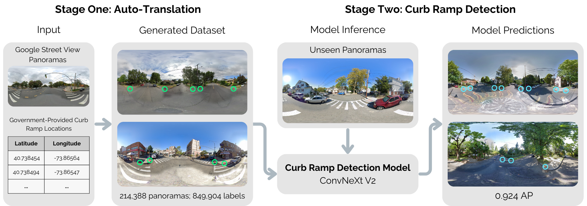

<p align="center">

  <h1 align="center">RampNet: A Two-Stage Pipeline for Bootstrapping Curb Ramp Detection in Streetscape Images from Open Government Metadata</h1>
  <p align="center">
    John S. O'Meara, 
    Jared Hwang,
    Zeyu Wang,
    Michael Saugstad,
    Jon E. Froehlich
    <br><br>
    University of Washington
  </p>
  <h3 align="center"><a href="https://github.com/ProjectSidewalk/RampNet">💻 Code</a> / <a href="https://arxiv.org/abs/2508.09415">📄 Paper</a> / <a href="https://colab.research.google.com/drive/1TOtScud5ac2McXJmg1n_YkOoZBchdn3w?usp=sharing">🛠️ Demo</a> / <a href="https://huggingface.co/datasets/projectsidewalk/rampnet-dataset">🗃️ Dataset</a> 
  / <a href="https://cv4a11y.github.io/ICCV2025/index.html">🏨 ICCV'25 Workshop</a></h3>
  <div align="center"></div>
</p>
<p align="center">
  <a href="">
    
  </a>
</p>
<p>
<strong>RampNet</strong> is a two-stage pipeline that addresses the scarcity of curb ramp detection datasets by using government location data to automatically generate over 210,000 annotated Google Street View panoramas. This new dataset is then used to train a state-of-the-art curb ramp detection model that significantly outperforms previous efforts. In this repo, we provide code for training and testing our system.
</p>
<br>

## Citation
If you use our code, dataset, or build on ideas in our paper, please cite us as:

```bibtex
@inproceedings{omeara2025rampnet,
  author    = {John S. O'Meara and Jared Hwang and Zeyu Wang and Michael Saugstad and Jon E. Froehlich},
  title     = {{RampNet: A Two-Stage Pipeline for Bootstrapping Curb Ramp Detection in Streetscape Images from Open Government Metadata}},
  booktitle = {{ICCV'25 Workshop on Vision Foundation Models and Generative AI for Accessibility: Challenges and Opportunities (ICCV 2025 Workshop)}},
  year      = {2025},
  doi       = {https://doi.org/10.48550/arXiv.2508.09415},
  url       = {https://cv4a11y.github.io/ICCV2025/index.html},
  note      = {DOI: forthcoming}
}
```

## Curb Ramp Detection Example
*For a step-by-step walkthrough, see our [Google Colab notebook](https://colab.research.google.com/drive/1TOtScud5ac2McXJmg1n_YkOoZBchdn3w?usp=sharing), which includes a visualization in addition to the code below.*

For basic usage of our detection model, you do not need to be working within the RampNet project directory or use any custom libraries. However, we strongly recommend using a GPU. See code example below:
```py
import torch
from transformers import AutoModel
from PIL import Image
import numpy as np
from torchvision import transforms
from skimage.feature import peak_local_max

IMAGE_PATH = "example.jpg"
DEVICE = torch.device("cuda" if torch.cuda.is_available() else "cpu")

model = AutoModel.from_pretrained("projectsidewalk/rampnet-model", trust_remote_code=True).to(DEVICE).eval()

preprocess = transforms.Compose([
    transforms.Resize((2048, 4096), interpolation=transforms.InterpolationMode.BILINEAR),
    transforms.ToTensor(),
    transforms.Normalize(mean=[0.485, 0.456, 0.406], std=[0.229, 0.224, 0.225])
])

img = Image.open(IMAGE_PATH).convert("RGB")
img_tensor = preprocess(img).unsqueeze(0).to(DEVICE)

with torch.no_grad():
    heatmap = model(img_tensor).squeeze().cpu().numpy()

peaks = peak_local_max(np.clip(heatmap, 0, 1), min_distance=10, threshold_abs=0.5)
scale_w = img.width / heatmap.shape[1]
scale_h = img.height / heatmap.shape[0]
coordinates = [(int(c * scale_w), int(r * scale_h)) for r, c in peaks]

# Coordinates of detected curb ramps
print(coordinates)
```

| Predicted Heatmap   | Extracted Points |
| -------- | ------- |
|   |     |

### [Google Colab Notebook](https://colab.research.google.com/drive/1TOtScud5ac2McXJmg1n_YkOoZBchdn3w?usp=sharing)

---
We now describe how to generate the dataset (Stage 1) and train the model (Stage 2). We also describe how to evaluate both of these stages.

## Environment Setup
Please install CUDA 11.8. Then run the following commands to create the conda environment:
```bash
conda env create -f environment.yml
conda activate sidewalkcv2
```

## Dataset Setup

Before reproducing our results, certain datasets will need to be downloaded.

- City curb ramp location data. We use NYC, Bend, and Portland.
  - In `stage_one/dataset_generation/location_data`, there should be three files
    - [`bend.geojson`](https://bend-data-portal-bendoregon.hub.arcgis.com/datasets/bendoregon::curb-ramps/about)
    - [`nyc.csv`](https://data.cityofnewyork.us/Transportation/Pedestrian-Ramp-Locations/ufzp-rrqu/about_data) (using csv here as NYC uses different file format than geojson)
    - [`portland.geojson`](https://gis-pdx.opendata.arcgis.com/datasets/PDX::curb-ramps/about)
  - These files can either be downloaded from our paper's supplemental material, or from the government websites that have been hyperlinked.
- City Street Data. We use this when generating null panos (picking a random street until we find one with no curb ramp nearby)
  - In `stage_one/dataset_generation/street_data`, there should be three files
    - [`Bend - Streets.geojson`](https://data.bendoregon.gov/datasets/c303eb99c9a242149b95d5055589e251_0/explore?location=43.954066%2C-121.026242%2C8.03)
    - [`New York - Streets.geojson`](https://nycmaps-nyc.hub.arcgis.com/maps/82854419a16044aaa75a038b3706235b/about)
    - [`Portland - Streets.geojson`](https://gis-pdx.opendata.arcgis.com/datasets/9248407180c94efb9ddc675b0cc53826_68/explore)
- We also need `cityboundaries.geojson` file in `stage_one/dataset_generation` for negative pano generation. It included in this repo - no download needed.
- The tiny set of manually labeled crops can be downloaded [here](https://huggingface.co/datasets/projectsidewalk/rampnet-crop-model-dataset). The `test`, `train`, and `val` folders belong in `stage_one/crop_model/ps_and_manual_model/dataset_1`
- Manual annotations for evaluation of both stages (included in this repo, no download needed). Note that while we include the manual annotations in this repo, the images themselves are not included because they are assumed to be included in the dataset that will be generated.

If you only wish to setup for Stage 2, then you can download our Stage 1-generated dataset [here](https://huggingface.co/datasets/projectsidewalk/rampnet-dataset) or using the `download_dataset.py` script in the project directory.

## Stage 1: Dataset Generation
We detail how to reproduce our Stage 1 results. Please ensure you have downloaded all the necessary files before proceeding with this step.

### Getting the Crop Model Ready
The crop model is the model that takes in a crop that faces a curb ramp and localized where the curb ramp is within that crop. It is crucial to our auto-translation technique and must be trained before we can proceed with dataset generation.

In `stage_one/crop_model/ps_model`, we will initiate our first round of training. In `stage_one/crop_model/ps_and_manual_model`, we will follow up with a final round that trains on manual data.

In `stage_one/crop_model/ps_model/data`, run `download_data.py`. This will take a very long time. You should have a resulting directory called `dataset_1`. Run `./splititup.sh dataset_1` to split the dataset into its test, train, and val splits.

In `stage_one/crop_model/ps_model/model`, run `train.py`. This will take a very long time. In the code, the number of epochs is set to 100 for comprehensiveness, but we suggest training for no more than 25 epochs. You should have a resulting file called `best_model.pth`.

Now, we will transition into the second round of training on manual data. Copy `best_model.pth` from the aforementioned process into `stage_one/crop_model/ps_and_manual_model`. Instead of `best_model.pth`, rename it to `ps_model.pth` in this folder.

In `stage_one/crop_model/ps_and_manual_model`, run `train.py`. This will take a very long time. In the code, the number of epochs is set to 100 for comprehensiveness, but we suggest training for no more than 25 epochs. You should have a resulting file called `best_model.pth`. This is what we will use to auto-translate government location data to pixel coordinates in street view panoramas.

_(Optional step)_ If you want to evaluate the crop model, use `evaluate.py`.

### Preparing for Auto-Translation

In this section, we will exclusively work in the `stage_one/dataset_generation` folder.

First, run `combine_location_data.py`. You will get a resulting `all_locations.csv` file.

Next, run `generate_dataset_meta.py`. This will probably take a long time. You will get a resulting `dataset.jsonl` file. **IMPORTANT:** This `dataset.jsonl` file does not yet contain null panos. The next step describes how we infuse our dataset with null panos.

Next, run `generate_negative_panos.py`. This will probably take a long time. You will get a resulting `negativepanos.jsonl` file. It is up to your discretion on how many of these null panos you want to include in your dataset. We did 20% in our paper. Create a `finaldataset.jsonl` file that contains lines from both the aforementioned `dataset.jsonl` file and the `negativepanos.jsonl` file. If you want 20% of the panos to be null panos, then 20% of the lines in `finaldataset.jsonl` should be from the `negativepanos.jsonl` file.

### Auto-Translating Government Location Data to Pixel Coordinates

We now must download the GSV panoramas and convert government location data to pixel coordinates. Run the `download_dataset.py` file. This will take a very long time as there is hundreds of thousands of panos that need to be downloaded. In the end, we should have a `dataset` folder that is created at the root of the `RampNet` project folder.

### Splitting the Generated Dataset

As discussed in our paper, this splitting step must be performed carefully to avoid data leakage. Specifically, we must ensure that no panoramas used for manual evaluation are included in the training or validation splits. While this does not affect dataset evaluation (since it is conducted independently of the splits), it could compromise model evaluation in Stage 2.

Users also must take care to avoid including the same curb ramps in different panoramas/viewpoints. We have build a custom script called `split_dataset.py` that takes care of this. After running it, you will have a folder called `dataset_split` next to the original `dataset` folder. Delete the old dataset folder and rename `dataset_split` to `dataset`.

**IMPORTANT:** If you plan to use this generated dataset for training the next stage and intend to rely on the same manual labels we created, _do not_ use the `split_dataset.py` script as-is. Because it performs a random split, there is a risk of data leakage. Specifically, panoramas selected for manual evaluation could end up in the training or validation sets. In such cases, you must use a modified version of the script that explicitly excludes these manually evaluated panoramas from the training and validation splits. There is a variable in `split_dataset.py` called `CONSIDER_MANUAL` that should be set to `True` if you are planning on doing this.

### Evaluating the Results

Run `evaluate.py` in `stage_one/dataset_evaluation`:

```
Precision (TP / (TP + FP)): 0.9403
Recall    (TP / Total GT):  0.9245
```

## Stage 2: Curb Ramp Detection
We detail how to reproduce our Stage 2 results.

You can either start where you left off in Stage 1, with the dataset fully generated, or you can skip that process and download our full dataset [here](https://huggingface.co/datasets/projectsidewalk/rampnet-dataset) or using the `download_dataset.py` script in the project directory.

### Training

Run `train.py` in `stage_two`. This will take a very long time (> 24 hours). We trained on 16x NVIDIA L40s GPUs on a slurm cluster. We train for only one epoch but you may increase this if you desire. The model is saved at `best_model.pth`.

### Evaluating the Results

There are two metrics that you can evaluate against. You can evaluate against (1) the test split of the generated dataset or (2) the manually annotated panoramas. We place more emphasis on the latter due to it being less prone to errors and it being directly from a human source instead of machine-derived. To switch between these benchmarks, modify the `EVALUATE_ON_MANUAL_DATASET` variable in `evaluate.py` in the `stage_two` folder.

After running `evaluate.py` (which will take some time), you should have results printed in the console and in the `evaluation_results` directory. Note that the repo has the `evaluation_results` included from our past runs, so if `evaluation_results` is present, it doesn't necessarily mean evaluation was successful - it might just be the folder that was included in the github repo. This directory will contain the precision vs recall and precision & recall vs model confidence curves.


Please make sure to delete `evaluate_cache` between subsequent runs of `evaluate.py` if you are changing something in the script (e.g. the `EVALUATE_ON_MANUAL_DATASET` variable).
