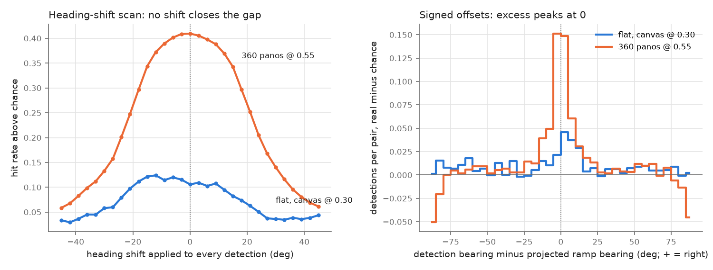
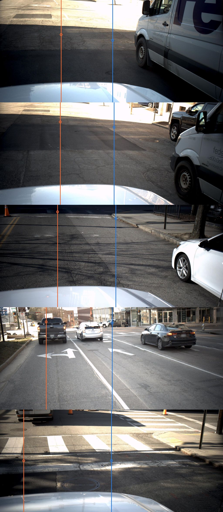

# Bearing-geometry audit of the flat-photo hit test ([#218](https://github.com/ProjectSidewalk/RampNet/issues/218), PR #227)

Code: `scripts/analysis/bearing_audit_218.py` (all numbers), `scripts/analysis/bearing_audit_figure_218.py`
(figures), `tests/test_bearing_audit_218.py`. Outputs: `analysis_out/perspective_photos_218/bearing_audit/summary.json`
and `offsets.csv`. Run 2026-09-30 on a desktop CPU from committed files only; no GPU, no network, no model.

## Question

PR #227 (`docs/perspective_photos_218.md`) scores RampNet on Richmond's flat Mapillary photos with a
height-free bearing test: a detection hits an in-view pool ramp when its bearing, read through the
photo's SfM pose and camera model, is within atan(5 m / range) of the ramp's bearing. The canvas arm
hits 0.199 of the 292 in-view (image, ramp) pairs at 0.30, against a swap null of 0.093; the 360
panos hit 0.627 of the same ramps at 0.55.

In #227's example figures, the projected bearing of several missed ramps lands in the roadway, while a
visible ramp sits 27–30° to the right and the model fires on it. That pattern would also come from an
instrument error: the wrong heading field (`compass_angle` vs `computed_compass_angle`), a flipped
image x axis, a focal or FOV error, a wrong camera position. If the geometry were wrong, #227's
headline would understate the model. This audit tests that.

## Verdict

**No systematic instrument error was found. The headline stands.** The flat-photo misses are, in the
large majority, images on which the model does not fire.

- **No global correction of the geometry closes the gap.** Of nine corrections set without looking at
  hits, none changes the canvas arm's above-chance rate at 0.30 by more than +0.009, and every CI
  includes 0. Mirroring the image x axis costs −0.057 [−0.126, +0.004].
- **No re-mapping of detection bearings can reach the panos, for the in-view set as scored.** Each
  detection claims at most one ramp. Even if every detection ≥ 0.30 were moved onto an in-view ramp,
  the canvas arm would hit at most **89 of 292 pairs (0.305)**; at 0.55, 0.195. The panos hit 0.627.
  This bound holds the in-view set fixed. A pose fix that shrank the denominator (dropping pairs the
  photo cannot show) could raise the rate past it; that is #227 §7's visual in-view pass.
- **The pano control is clean.** The flat path's ENU bearing code, applied to each pano's pose,
  reproduces the labeler's projected column `x_proj` to 0.03° (max). The panos' offset excess is centred at
  +0.01° [−0.61, +0.68], and their heading-shift scan peaks at exactly 0°.
- **HERO11 frames show a real on-bearing excess, so the geometry is right on that camera. They do
  not match the panos.** I chose this camera split after looking: five camera groups were broken out,
  and this is the best one. HERO11 frames are 100° wide and fire 1.7 times per image, against 0.0–0.3
  for the other cameras. #227's pooled swap null draws its donors mostly from those other cameras, so
  it understates HERO11's floor. **On the same 36 ramps at 0.55, by the same hit test, HERO11 hits
  0.574 of its pairs (39 / 68) and the panos hit 0.726 of their 372 captures.** Above chance, HERO11
  is +0.245 [0.125, 0.388] over a count-matched swap floor and the panos are +0.531 [0.430, 0.627]
  over their rotation null. Those two floors are different nulls on different units (§3a), so the raw
  pair is the cleaner comparison. HERO11's CI is clustered on only 7 sequences and is probably too
  narrow. HERO11 supplies 43 of the 58 canvas hits at 0.30, so #227's above-chance headline rests
  mostly on one camera model. At 0.30 and 0.55, every other camera is at or below its chance floor.
  At 0.10, moto x4 is above its count-matched floor, +0.146 (ramp-clustered CI [0.007, 0.354],
  sequence-clustered [0.063, 0.160] on 3 sequences); see §3a.
- **What is real: per-image heading error on some frames.** For one camera group (Mapillary make/model
  "none", 248 frames, 20 sequences), the SfM heading sits a median 20° clockwise of the device-GPS
  direction of travel. In three of the drawn misses, the heading correction moves the off-bearing
  detection onto the ramp. Correcting it moves the headline by less than 0.01 (§5, §6).

| canvas_level, bearing test | as scored (#227) | heading outvoted, 10° rule (corrected) |
|---|---|---|
| @ 0.30: hit rate | 0.199 [0.125, 0.287], 58 / 292 | 0.197 [0.122, 0.290], 58 / 295 |
| @ 0.30: swap null | 0.093 | 0.082 |
| @ 0.30: above chance | **0.106 [0.031, 0.196]** | **0.115 [0.041, 0.208]** |
| @ 0.55: hit rate | 0.147 [0.086, 0.223] | 0.146 [0.086, 0.222] |
| @ 0.55: above chance | 0.083 [0.022, 0.157] | 0.094 [0.036, 0.167] |
| @ 0.30: count-matched null | 0.138 | 0.126 |
| @ 0.30: above count-matched | **0.061 [0.020, 0.110]** | **0.070 [0.028, 0.126]** |
| @ 0.55: above count-matched | 0.050 [0.016, 0.089] | 0.051 [0.019, 0.091] |

The corrected column re-runs #227's scorer from scratch (in-view set, positives, swap-null donors and
claims all recomputed) with the heading of every frame turned to the mean of the direction of travel
and the device compass, where those two agree within 10° and both differ from the SfM heading by
10–60° (291 of 1,353 frames). The rule was fixed before scoring it. The 15° rule gives 0.102 [0.025,
0.195] at 0.30, and dropping the 10 frames whose SfM heading is more than 60° from both device headings
gives 0.110 [0.033, 0.205]. Above the count-matched floor those are 0.059 and 0.067. The intervals
are not paired with #227's, because the pair sets differ. The count-matched value as scored (0.061)
equals #227's; its CI differs slightly from #227's [0.016, 0.110] because the bootstrap draws differ.
**#227's numbers do not need to change.**



*Left:* every detection's bearing turned by a constant. Flat canvas @ 0.30 above its swap null, panos
@ 0.55 above their rotation null (the pano floor held at its unshifted value). The flat curve has a
broad plateau from −15° to +9°; its maximum at −12° is +0.018 [−0.016, +0.054] above the as-scored
value, and it was chosen on the same pairs. *Right:* detection bearing minus projected ramp bearing,
for every height-gated detection near an in-view ramp, real minus swap-null (flat) or rotation-null
(pano), per pair.

## 1. What #227's geometry does (read end to end)

- **Heading field.** `image_geometry` uses `computed_compass_angle` for the ramp's angle from the
  heading and the full `computed_rotation` (angle-axis, world-to-camera, OpenCV axes) to project ramps
  and to unproject detections. On all 1,353 frames the heading implied by `computed_rotation` equals
  `computed_compass_angle` to 1e-11° (#227 §2), so the two fields agree.
- **Position.** `computed_geometry` (`images.csv` lat/lng equal the census's computed lat/lng to 0.0 m).
- **Camera.** Mapillary's Brown model `[f, k1, k2]`, f normalised by max(w, h), principal point at
  the image centre. All 1,353 thumbnails have the aspect ratio of the original; all have
  `exif_orientation` 1, so no thumbnail is rotated relative to its intrinsics.
- **Detection to bearing.** For the canvas arms the stored photo pixel is the exact pixel the canvas
  sampled; `det_world` unprojects it and rotates it to ENU with the same `R_wc`. A ramp and a detection
  at the same pixel therefore get the same bearing by construction. The audit's identity re-score
  reproduces #227's 58 / 292 hits and its 0.0928 null exactly.

So the code path is self-consistent. What it cannot check is whether Mapillary's pose and intrinsics
are right for a given frame. The rest of this doc tests that against the data.

## 2. Correction scan

Each correction is applied to every positive image's detections and to its swap-null donors. The in-view
set is held as scored, apart from the full re-scores in the verdict table. "Gain" is the change in above-chance
rate against the identity, with a paired ramp-cluster bootstrap CI (2,000 reps, seed 218).

**How the corrections were chosen.** All nine are in the first commit of the script, which holds no
outputs. So they were fixed before the committed scoring. The history cannot show that no
exploratory run came first; quick runs were used while writing the script. The unnamed-camera −20° was
read off the same frames' heading-vs-travel numbers (§5), not off hits. **Multiplicity:** 9
corrections × 3 thresholds × 2 arms, plus the shift, mirror-shift and focal scans. No pre-set
correction's CI lies above 0.

| correction | canvas @ 0.30 gain | canvas @ 0.55 gain | stretch @ 0.30 gain |
|---|---|---|---|
| mirror image x (u → w − 1 − u) | −0.057 [−0.126, +0.004] | −0.055 [−0.112, −0.002] | −0.052 [−0.122, +0.012] |
| device `compass_angle` as heading | +0.001 [−0.034, +0.035] | +0.008 [−0.015, +0.031] | −0.016 [−0.059, +0.025] |
| device GPS (`raw_lat/lng`) as position | −0.011 [−0.049, +0.026] | −0.021 [−0.055, +0.008] | −0.019 [−0.052, +0.010] |
| direction of travel as heading, where available | −0.005 [−0.040, +0.030] | +0.006 [−0.015, +0.029] | −0.010 [−0.052, +0.030] |
| ... only where within 45° of SfM | −0.001 [−0.030, +0.031] | +0.005 [−0.016, +0.028] | +0.003 [−0.035, +0.036] |
| SfM heading outvoted, 10° rule | +0.009 [−0.008, +0.029] | +0.007 [−0.000, +0.017] | −0.001 [−0.016, +0.014] |
| SfM heading outvoted, 15° rule | +0.001 [−0.014, +0.016] | +0.003 [−0.007, +0.014] | −0.002 [−0.020, +0.013] |
| unnamed cameras only: direction of travel | +0.006 [−0.011, +0.026] | +0.000 [−0.011, +0.012] | −0.001 [−0.016, +0.014] |
| unnamed cameras only: heading −20° | +0.006 [−0.012, +0.026] | −0.001 [−0.012, +0.011] | −0.000 [−0.017, +0.015] |
| best constant heading shift (chosen on these pairs) | −12°: +0.018 [−0.016, +0.054] | −3°: +0.010 [−0.006, +0.027] | −3°: +0.010 [−0.008, +0.028] |
| best focal scale (chosen on these pairs) | ×1.4: +0.028 [+0.001, +0.058] | ×1.4: +0.009 [−0.011, +0.029] | ×0.8: +0.017 [−0.015, +0.049] |

- **Mirror** is the only correction with a consistent effect: it is negative at all three thresholds
  and on both arms. Its CI excludes 0 only at 0.55 (canvas). The stronger evidence that the x →
  bearing sign is right is §3: the offset excess peaks at 0°, not at a mirrored position.
- **Focal.** The ×1.4 scale at 0.30 is the best of 11 scales on the same pairs, so its lower bound of
  +0.001 does not survive the selection. It does not replicate: at 0.10 the best scale is ×1.05
  (+0.009 [−0.005, +0.026]), and the stretch prefers ×0.8. Over 0.6–1.6 the canvas @ 0.30
  above-chance rate stays between 0.074 and 0.134. The thirds read (§3) points the same way as ×1.4 at
  0.30 but not at 0.10. **A focal error of up to tens of percent is not excluded by this data, but no
  focal error recovers more than 3 points.**
- At 0.10 (every stored peak, sub-threshold included) nothing gains more than +0.009 either.

## 3. Signed-offset excess

For every in-view pair, the signed offset (detection bearing − ramp bearing, + = right) of every
detection that passes the height gate, within ±90°. The same is computed for the swap-null donors, and
the excess is real minus null. An instrument error would show as an excess peaked away from 0, or
centred on opposite sides in the left and right thirds of the frame.

| canvas_level | real / null detections | excess within ±10° | 10–40° | 40–90° | centre of excess within ±15° | ... within ±30° |
|---|---|---|---|---|---|---|
| @ 0.30, all 292 pairs | 170 / 71.9 | 33.4 | 24.6 | 40.2 | +2.5° [−0.9, +7.9] | +3.4° [−1.9, +15.9] |
| @ 0.10, all 292 pairs | 302 / 148.4 | 56.3 | 48.6 | 48.8 | +0.8° [−1.7, +3.5] | +2.0° [−1.8, +8.1] |
| @ 0.30, GoPro HERO11 (68 pairs), pooled null | 138 / 22.4 | 39.3 | 33.1 | 43.2 | +1.2° [−1.1, +4.1] | +0.9° [−2.1, +4.5] |
| ... HERO11, count-matched null | 138 / 110.8 | 21.6 | −1.9 | 7.5 | – | – |
| ... HERO11, within-camera null | 138 / 102.7 | 18.6 | 1.0 | 15.8 | – | – |
| panos @ 0.55 (2,440 captures) | 3,951 / 2,699 | 1,001 | 373 | −122 | **+0.01° [−0.61, +0.68]** | +0.12° [−1.18, +1.37] |
| @ 0.30, ramp in left third of frame (58) | 32 / 14.4 | 8.0 | −0.3 | 9.9 | −4.6° [−10.4, −0.0] | −6.8° [−26.6, +1.0] |
| @ 0.30, centre third (108) | 81 / 22.2 | 17.0 | 17.5 | 24.4 | +2.8° [−0.5, +5.9] | +6.1° [−0.1, +12.3] |
| @ 0.30, right third (126) | 57 / 35.3 | 8.5 | 7.4 | 5.9 | +7.7° [−0.7, +44.8] | +3.9° [−5.2, +47.3] |
| @ 0.10, left third | 49 / 28.9 | 8.4 | 3.3 | 8.5 | −3.4° [−10.7, +3.8] | +0.0° [−18.0, +9.5] |
| @ 0.10, right third | 113 / 71.5 | 21.7 | 9.6 | 10.3 | +2.2° [−1.7, +11.6] | +0.9° [−4.4, +24.7] |

(5° bins; the bin-level histograms are in `offsets.csv`. The flat excess tables count detections
whose donor-null counts are averaged over 20 draws, so they are not integers.)

- **The flat excess peaks within ±5° of the projected bearing (the 0–5° bin), as the panos' does
  (the −5–0° bin, with 0–5° almost as high).** It is not displaced to ±27°.
- **The excess has a long flat tail, 40–90° off.** On the panos that tail is negative; on the flat
  photos it holds 40 of the 98 excess detections at 0.30. These are detections in images that hold a
  pool ramp, but far from it. They are consistent with ramps that are not in the pool, or GT/pose error
  of tens of degrees on some frames; they are not a constant offset.
- **Thirds.** At 0.30 the left third centres left and the right third right, which is the sign a focal
  that is too short would give. The CIs are wide, the right third's upper bound is 45°, and at 0.10
  the pattern mostly goes away. Read with the focal scan (§2): not established.
- By camera, only HERO11 has a positive excess at 0.30 (+116 against the pooled null). VIRB (+0.3),
  GoPro Max (−9.3), moto x4 (−0.7) and the unnamed cameras (−5.9) have none. With no excess, there is
  no offset to read.
- **HERO11's excess survives the stricter nulls, and it sits at the projected bearing.** Against the
  count-matched and within-camera nulls, the excess within ±10° is +21.6 and +18.6, against −1.9 and
  +1.0 at 10–40°, and it peaks in the 0–5° bin. That is the evidence that HERO11's heading, sign and
  focal are right. (The rows come from `per_camera["GoPro HERO11 Black"].nulls[*].offset_excess`.)

### 3a. Per camera, under three chance floors

Added after the PR #232 review (B1). The camera split was chosen after looking: five camera groups
with ≥ 25 pairs were broken out, and HERO11 is the one that stood out. Read it as a description of
where #227's signal comes from, not as a tested hypothesis.

| camera (canvas_level) | HFOV, median | detections ≥ 0.30 / positive image | positive images firing | in-view ramps / image | median abs angle from heading | hits @ 0.30 |
|---|---|---|---|---|---|---|
| GoPro HERO11 Black | 99.9° | 1.72 | 81% | 1.45 | 30.0° | 43 / 68 |
| unnamed | 75.8° | 0.25 | 25% | 1.11 | 16.2° | 7 / 61 |
| motorola moto x4 | 68.7° | 0.28 | 28% | 1.07 | 12.7° | 5 / 46 |
| GoPro Max (single lens) | 94.4° | 0.00 | 0% | 1.00 | 31.8° | 0 / 41 |
| Garmin VIRB | 71.5° | 0.23 | 20% | 1.17 | 23.0° | 1 / 35 |

HERO11 supplies 43 of the canvas arm's 58 hits at 0.30 (74%) and 39 of 43 at 0.55. Its frames are
5568×4872 (GoPro's 8:7 full-sensor mode), and Mapillary labels them `perspective`.

HERO11, above chance under each floor (CIs clustered by sequence; ramp-clustered CIs are in
`summary.json`). There are only 7 sequences, and a percentile bootstrap over that few clusters tends to
give intervals that are too narrow, so read these CIs as optimistic:

| null | @ 0.30: floor | @ 0.30: above | @ 0.55: floor | @ 0.55: above |
|---|---|---|---|---|
| pooled swap (#227's primary) | 0.109 | +0.524 [0.389, 0.659] | 0.087 | +0.487 [0.355, 0.657] |
| **count-matched swap** (#227's second null) | 0.403 | **+0.229 [0.118, 0.342]** | 0.329 | **+0.245 [0.125, 0.388]** |
| within-HERO11 swap | 0.463 | +0.169 [0.005, 0.320] | 0.421 | +0.153 [−0.039, 0.358] |

- **The pooled null understates a busy camera's floor.** At 12.8 m the bearing window is ±21°, about
  40% of a 100° frame, and HERO11 has 1.7 detections per frame. Pooled donors mostly come from cameras
  that rarely fire.
- **The count-matched floor is the fair one.** Its donors keep the receiver's count of detections
  ≥ 0.30 (0 / 1 / 2 / 3+), with the same buckets at every threshold, as #227 defines it. The PR review
  bucketed on the threshold in use and got +0.203 at 0.55; that choice is the difference.
- **The within-camera floor is an upper bound.** Donors from the same sequence a few metres away may
  see the receiver's own ramps.
- **Matched pano comparison, same ramps** (`pano_control.by_flat_camera_ramps`). The 36 ramps HERO11
  has in view get 372 pano captures. All 36 are in the pano set, and 6 are also in view of another
  flat camera. **Raw, at 0.55 and by the same hit test: HERO11 hits 0.574 of its 68 pairs (39), the
  panos 0.726 [0.611, 0.825] of their 372 captures.** On the 211 ramps no HERO11 frame sees, the panos
  hit 0.609, so HERO11's ramps are easier on the panos too. Above chance it is +0.245 (flat) vs +0.531
  [0.430, 0.627] (panos), but those two numbers are not like for like. The flat floor is a swap null
  (donor detections, bucketed by the receiver's count ≥ 0.30); the pano floor is a rotation null (the
  pano's own detections, rotated 90° / 180° / 270°, 0.195 here). The units also differ: 68 flat
  image–ramp pairs against 372 pano captures. Both comparisons point the same way, and the raw one is
  the cleaner.
- **Sub-threshold signal on moto x4.** At 0.30 and 0.55 every camera other than HERO11 is at or below
  its chance floor under all three nulls. At 0.10, moto x4 hits 16 of 46 pairs (0.348), +0.146 above
  its count-matched floor (ramp-clustered CI [0.007, 0.354]; sequence-clustered [0.063, 0.160], from
  3 sequences, so too narrow). Its pooled-null excess is +0.160, and its within-camera excess is
  +0.088 with both CIs including 0. The unnamed cameras (+0.093), VIRB and GoPro Max are at chance at
  0.10. Not followed up. (GoPro Max is one sequence, so its sequence-clustered CIs in `summary.json`
  are degenerate, a single value.)
- **Candidate explanations, not tested:** the wider lens puts more of the scene in each frame, the
  firing density is 6× the other cameras', and mount height, date (2024) and image quality differ.

## 4. How much a re-mapping of bearings could recover

A detection claims at most one ramp. So, for any re-mapping of detection bearings **with the in-view
set held as scored**, a positive image contributes at most min(detections ≥ thr, in-view ramps) hits.
The values are under `arms.<arm>.<thr>.ceiling_in_view_fixed` in `summary.json`.

| canvas_level | as scored | ceiling, in-view set fixed | panos |
|---|---|---|---|
| @ 0.30 | 0.199 (58 / 292) | **0.305 (89 / 292)** | 0.615 (world test, 0.30) |
| @ 0.55 | 0.147 | 0.195 | 0.627 (bearing test) |
| @ 0.10 | 0.356 | 0.616 | – |

By camera at 0.30 (claimable / in-view pairs): HERO11 54 / 68, unnamed 14 / 61, moto x4 12 / 46, VIRB
6 / 35, GoPro Max 0 / 41, iPhones 3 / 41. On 83% of missed pairs the image has no detection ≥ 0.30
anywhere (#227 §5). **Most of the flat-vs-pano gap is the model not firing, and no re-mapping of
bearings can change that.** A smaller in-view denominator could. A pose fix that drops pairs from
images that never fire would raise the rate, and so would #227 §7's visual pass. That is a question
about which ramps the photos show, not about the bearing geometry.

## 5. Independent heading check: direction of travel

The direction of travel at each frame comes from the device GPS (`raw_lat/raw_lng`) of the nearest
earlier and later frames of the same sequence that moved ≥ 2 m within 20 s (any census frame, flat or
360). It shares nothing with Mapillary's SfM. A forward-facing vehicle camera should point along it,
up to its mount yaw. Positive images, travel − SfM heading:

| camera | n | median | median abs | within 10° | > 135° |
|---|---|---|---|---|---|
| all | 242 | −6.7° | 9.1° | 52% | 4% |
| GoPro HERO11 Black | 47 | −5.8° | 5.8° | 98% | 0% |
| unnamed ("none none") | 55 | **−20.3°** | 20.3° | 9% | 0% |
| motorola moto x4 | 42 | −6.4° | 9.7° | 50% | 0% |
| Garmin VIRB | 24 | −5.1° | 14.2° | 46% | 0% |
| GoPro Max (single lens) | 41 | −0.2° | 9.3° | 54% | 24% |

- **The device `compass_angle` is often not an independent source.** It equals the GPS-track
  direction to within 1° on 94% of HERO11 frames (175), 63% of unnamed-camera frames (225) and 61% of
  GoPro Max frames (140). For VIRB (201) it is 13%, and for moto x4 (164) 23%. Overall it is 47% of
  1,221 frames (`compass_vs_travel_all_frames`, over all flat frames with a travel bearing). For the
  cameras that hold most of the outvoted frames, the "two sources agree" rule in §2 is therefore
  mostly "the GPS track disagrees with SfM".
- **HERO11:** a steady −6° (travel left of the SfM heading). That is consistent with a mount yawed
  ~6° right of the vehicle axis or a steady SfM offset; this data cannot tell which. Shifting HERO11
  detections does not help: its best shift at 0.30 is −3° (+0.018 above its as-scored rate), within noise.
- **Unnamed cameras:** the SfM heading is ~20° clockwise of the direction of travel on 20 sequences
  with different focal lengths (f 0.59–0.99). Either these cameras are aimed ~20° right of the
  vehicle axis, or SfM is off by ~20° for them. **A look at five frames** (below; four seeded draws plus
  #227's first drawn miss) does not settle it. Four show the vehicle's hood, and its crown sits near
  the frame centre, which fits a camera on the vehicle axis. But 20° moves the crown only ~200 of
  2,048 px, and I could not place it that precisely by eye. **Settling it does not matter for the headline:** the model is at chance on
  these cameras (0.115 at 0.30 against a 0.129 null). Turning their heading by −20° gains +0.006
  [−0.012, +0.026].
- **GoPro Max:** 10 frames (all 41 pairs of one sequence come from 3 ramps) sit ~180° from the
  direction of travel. These may be rear-lens frames, which is not an error. The model has no detection
  ≥ 0.30 on any positive GoPro Max frame, so they cannot change a hit count. Dropping the 10 frames whose
  SfM heading is > 60° from both device headings moves the canvas rate 0.199 → 0.202.



*Blue:* the SfM heading, projected through each frame's camera and pose (the dot is the horizon).
*Orange:* the device-GPS direction of travel. Top four: a seeded draw (`random.seed(218)`) from
unnamed-camera frames whose SfM heading is 15–26° clockwise of travel; bottom: #227's first drawn miss
(`590984823847247`, 34°). Imagery: Mapillary contributors, CC BY-SA.

## 6. The 15 misses #227 looked at

`summary.json` → `arms.canvas_level.viewed_misses` lists each with its pose fields and every stored
peak's offset. Of the 15:

- **3 are explained by per-image heading error**, as the figures suggested:
  - `590984823847247` (unnamed camera, `richmond:93`): SfM heading 34° from the direction of travel,
    and the 0.54 peak sits +27° off. Turning the heading by −34° puts it at −7°, inside the bearing
    window. It still fails the height gate, because this frame has no SfM orientation (exactly level
    pose) and the peak reads above the horizon. A heading fix alone does not make it a hit.
  - `323753172499410` (moto x4, `richmond:144`): a 0.86 peak +27° off; the travel heading (−7.7°) makes
    it a hit at 0.30.
  - `952482502230245` (moto x4, `richmond:145`): a 0.27 peak +30° off; the travel heading (−15°) makes
    it a hit at 0.10, still below 0.30.
- **12 have no detection ≥ 0.30 near the ramp under any heading tried.** Five have no peak at all,
  even at 0.10.

So the pattern in the drawn misses is real for 3 frames. The figures' candidate order favours it
(central-half, dead-ahead ramps, which a pose error puts in the road), and §2–§4 show it does not
generalise.

## 7. Caveats and what was not checked

- **Per-image pose error is not excluded, only its aggregate effect.** SfM position (median 2.7 m
  from the device GPS) and heading errors of 15–35° exist on some frames (§5, §6). They move ramps into
  and out of the in-view denominator, and no correction here fixes them frame by frame. The device-side
  corrections are noisy themselves: GPS-track bearing, mount yaw. What the audit shows is that every
  global or device-based correction tried leaves the headline within ±0.01.
- **Focal length is the weakest-tested parameter** (§2, §3). A focal error on one camera would show
  mostly in that camera's edge detections, and only HERO11 has enough detections to read. HERO11's
  own best focal scale is ×1.4 at 0.30 and ×0.95 at 0.10, i.e. noise.
- **Principal point** is assumed at the image centre and was not varied. A horizontal principal-point
  offset acts like a heading shift near the centre, which the shift scan covers.
- **Not checked:** a visual check of the 292 in-view pairs (#227 §7), lens distortion beyond k1/k2
  (HERO11 frames whose corners lie beyond the Brown model's fold, #227 §2), and SfM pitch on the 113
  level-pose frames beyond their 0 hits.
- **The HERO11 split was chosen post hoc.** It is 7 sequences of one camera model, 2024 captures
  (§3a). On the same ramps it hits 0.574 against the panos' 0.726; its excess above chance is about
  half the panos', but on a different null. Its sequence-clustered CIs rest on 7 clusters and are
  probably too narrow. Why it fires where the other cameras do not is not tested.
- The CIs resample ramps. Pairs that share a photo share detections, so they are slightly optimistic
  (#227 §3).

## 8. Reproduction

From a clean clone (committed files only; about 14 minutes on a desktop CPU, 853 s measured):

```bash
python scripts/analysis/bearing_audit_218.py           # -> analysis_out/perspective_photos_218/bearing_audit/
python scripts/analysis/bearing_audit_218.py --quick   # 5 null draws, no bootstrap (~2 min)
python scripts/analysis/bearing_audit_figure_218.py    # -> docs/figures/bearing_audit_218/bearing_audit.png
# the frame sheet needs the #218 thumbnails (perspective_photos_218.py fetch --out IMG)
python scripts/analysis/bearing_audit_figure_218.py --heading-sheet IMG
pytest -q tests/test_bearing_audit_218.py
```

Inputs: `analysis_out/perspective_photos_218/{images.csv,dets_canvas_level.jsonl,dets_stretch.jsonl}`,
`analysis_out/flat_mapillary_3d/census/{images.csv,ramps.csv}`, `analysis_out/multiview_48/captures_R25.csv`,
`benchmark/richmond_neighbourhood/records.jsonl`, `docs/figures/perspective_photos_218/figures.json`. The swap-null
donors use #227's own `swap_donors` with seed 218, so the identity rows reproduce `results.md`.
`summary.json` → `inputs_sha256` records each input's sha256 (of the LF bytes git checks out).
Wall-clock time goes to stdout only, so a re-run reproduces `summary.json` and `offsets.csv` byte for
byte (checked: two runs, identical bytes).

## 9. Cost

No model was run. CPU only, on the desktop. The first version took about 25 minutes of audit runs
(two full runs at ~10 min, quick runs at 1–2 min). The review revision took about 30 minutes (two full
runs at ~14 min, to check byte identity). Each version also took 10 minutes of pytest. Five thumbnails were copied from makelab2 for the frame
sheet. GPU-hours: 0, so there are no ledger rows.
