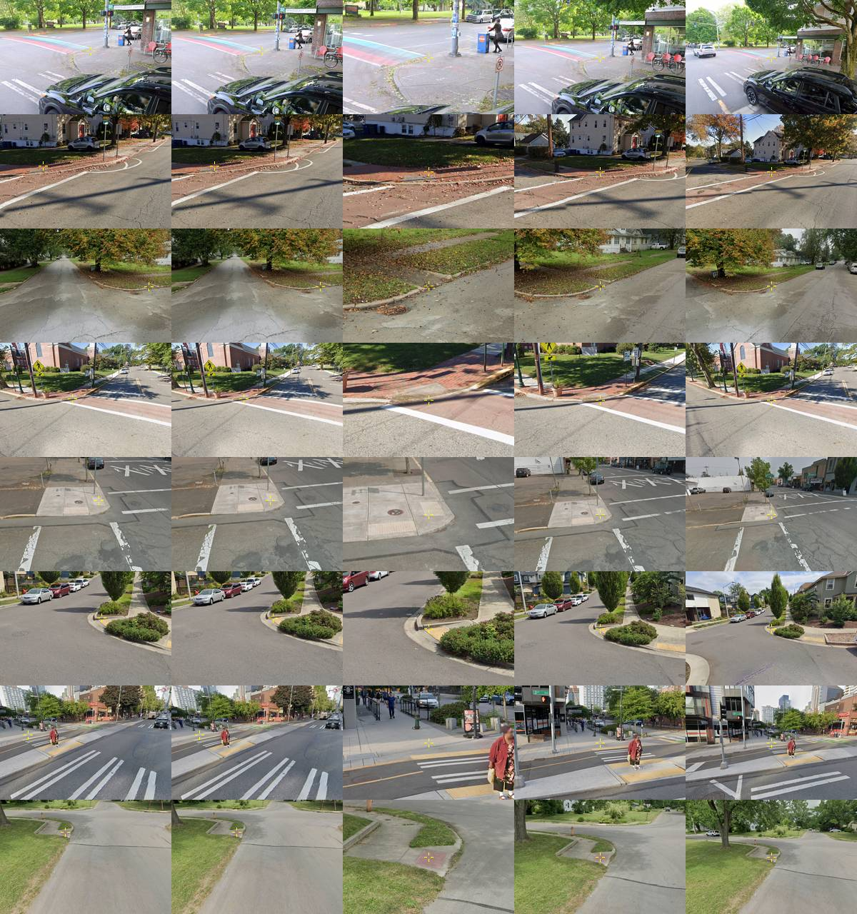

# Crop cutter: label crops from the makelab2 pano store

**Issue:** [#86](https://github.com/ProjectSidewalk/RampNet/issues/86), RampNet 2.0 plan item 2b
(`docs/rampnet2_plan.md` §4). **Run date:** 2026-09-22. **Code:** `rampnet/crops.py` (geometry),
`scripts/crop_cutter.py` (CLI), `scripts/analysis/crop_cutter_validation.py` (validation and
coverage), tests in `tests/test_crops.py`. **Committed outputs:** `docs/data/crop_cutter/`.

Production stores a crop only for labels placed since 2023-10-12 (196,556 human CurbRamp labels,
per the PR #175 audit). Items 4 (context experiment) and 5 (PU training) need crops for labels
older than that, at fields of view we choose. This cuts one for any `(city, label_id, field of
view)` from the pano archive on makelab2.

> **The pano store is an unpublished local input.** It is the Project Sidewalk scraper's archive,
> `/projects/makeabilitylab/sidewalk_panos/Panoramas` on makelab2 (58 city directories,
> `<city>/<pano_id[:2]>/<pano_id>.jpg`). Nobody outside the lab can re-cut the crops or re-derive
> the similarity numbers below. What a reader **without** the store can still check: all of
> the geometry, because every test runs on a synthetic pano and on the committed label rows
> (`pytest tests/test_crops.py`, including the replay of the 200 real validation labels into
> their viewports); the coverage input and per-row result (`coverage_input.csv`,
> `coverage.csv`); and the per-crop SHA-256 of every crop the validation run wrote
> (`cut_run/manifest_*.jsonl`), which proves a re-cut identical or not.

## 1. What a crop is

A crop is a **perspective (gnomonic) view**, rendered from the equirectangular pano, not a
rectangle cut out of it. The equirect stretches a scene horizontally by 1/cos(latitude), and a
curb ramp sits 10 to 40 degrees below the horizon, where that stretch is 1.02 to 1.31 and varies
across the crop. A gnomonic view is what a camera shows, what the Project Sidewalk viewer
shows, and what every crop in the HF tag set is. A plain equirect window (CropRunner's framing)
is available with `--projection equirect` for anyone who needs to compare against those crops.

Two ways to aim the view:

| `--fov` value | aim | label lands at | field of view | use |
|---|---|---|---|---|
| a number, e.g. `60` | straight at the label's stored `pano_x`, `pano_y` | the exact centre | that many degrees across the width | items 4 and 5 |
| `viewport` | the labeler's stored `heading`, `pitch` | `(canvas_x, canvas_y)` × 2 | the viewer's FOV for the stored `zoom` | reproducing the HF crops |

Output is 3:2 and 1440 px wide by default (`--size`, `--aspect`), the shape of production and HF
crops. The named file is `<city>__<label_id>__fov<deg>.jpg` (`fov22p5` for 22.5°,
`__viewport.jpg` for the viewport, `_eq` and `_tilt<conv>` suffixes for the options below).

### Geometry convention

Normalized pano coordinates are `X = pano_x / pano_width`, `Y = pano_y / pano_height`.

```
lon = (X - 0.5) * 360      degrees, positive to the right (clockwise)
lat = (0.5 - Y) * 180      degrees, positive up
```

The pano's centre column looks along `camera_heading`, so `lon = heading - camera_heading`.
That is exactly Project Sidewalk's `calculatePanoXYFromPov`, inverted. It is the same
convention as `scripts/model_comparison/equirect_tiling.py` (the test suite cross-checks the
two), and it is what sidewalk-panorama-tools' `CropRunner` uses: x wraps at the seam, y does
not. Everything is resolution-independent. A store JPEG at a different resolution from the
label's `pano_width` is sampled at the same normalized point; 16 of 800 validation crops came
from such a pano (`dims_match: false` in the manifest), and CropRunner would have skipped
them as a `dims_mismatch`.

The view is a roll-free pinhole camera with focal length `f = (width / 2) / tan(fov_h / 2)`
output pixels, so `fov` is always the **horizontal** angle and the vertical one follows from
the aspect (`tan(fov_v / 2) = tan(fov_h / 2) / aspect`). The viewport FOV is SidewalkWebpage's
`get3dFov(zoom)`: 89.75° at zoom 1, 53° at zoom 2, 27.68° at zoom 3, as ported in
sidewalk-panorama-tools `reports/scripts/pov_replay.py`.

```
   equirect pano (16384 x 8192)                       gnomonic crop (1440 x 960)
  +-----------------------------------------+        +---------------------------+
  |                                         |        |                           |
  |---------------- horizon ----------------|        |      label at centre      |
  |                            *  label     |  --->  |            +              |
  |                    (13740, 4754)        |        |                           |
  +-----------------------------------------+        +---------------------------+
     lon = +121.90 deg, lat = -14.46 deg              f = 2687 px for fov 30
```

**Worked example** (seattle-wa:9, the first row of the Seattle rawLabels export): pano
16384×8192, `pano_x = 13740`, `pano_y = 4754`, so `lon = (13740/16384 − 0.5) × 360 = 121.90°`
and `lat = (0.5 − 4754/8192) × 180 = −14.46°`. A `--fov 30` crop looks there with
`f = 720 / tan 15° = 2687 px`; the vertical FOV is 20.26°. The labeler's viewport was
`heading 299.32`, `pitch −17.54`, zoom 3, on a pano whose `camera_heading` is 180.37, so the
viewport view looks at `lon = 118.95°`, `lat = −17.54°` with a 27.68° FOV, and the label
projects to (866.0, 323.6) in it, against Project Sidewalk's `canvas_x, canvas_y = 433, 162`
× 2 = (866, 324). `tests/test_crops.py` pins this for synthetic rows built with Project
Sidewalk's own click math and for all 200 real validation rows.

**Sampling.** Bilinear, with x wrapping and y clamped. Before sampling, the pano is box-reduced
by the largest integer factor that keeps it at least as sharp as the view's centre (a 90° view
at 1440 px reduces a 16384-px pano 3×, 60° reduces 2×, 30° not at all), which is the
anti-aliasing. For JPEG panos the first power-of-two part of that reduction happens in the
decoder (`Image.draft`), which is most of the speed. Output JPEGs are baseline, quality 92,
4:4:4, no metadata, so their bytes are deterministic for a given Pillow/libjpeg build: the two
validation runs (before and after the version bump that added `black_frac`) wrote 800 of 800
byte-identical crops.

**Camera tilt (`--tilt`).** Project Sidewalk's click-to-pano mapping ignores the rig's pitch and
roll; the GSV viewer applies them. `--tilt <conv>` rotates the view's rays by `camera_pitch`
and `camera_roll` under one of four sign conventions (`pp`, `pm`, `mp`, `mm`: sign on pitch,
sign on roll). The default is `none`, which is the frame the stored `pano_x`/`pano_y` are in.
Section 3 measures which convention the viewer uses.

## 2. Reconciliation with prior art

| source | framing | what this cutter does about it |
|---|---|---|
| HF `sidewalk-tagger-ai-validated` crops (ASSETS'24) | 1440×960 PNG **screenshots of the labeling viewport**: the stored heading, pitch and zoom, label *off-centre* at `canvas_x/720, canvas_y/480` (the HF CSV's `normalized_x`/`normalized_y` equal those to 1e-7 on all 10,853 rows) | `--fov viewport` reproduces this framing from the stored geometry (section 3). The HF crops are not label-centred, so no centred FOV can match them pixel for pixel |
| sidewalk-tagger-ai `crop.py` | ±320 px square cut around the label from those screenshots, for the test split only | not reproduced; a consumer that wants it can crop the viewport output the same way |
| production crops since 2023-10-12 | browser canvas captures, 1440×960, no marker | same shape and size as the default output; same viewport framing |
| sidewalk-panorama-tools `CropRunner.py` (`docs/cropper.md`, sizing rule v2, 2026-08-19) | 3:2 **equirect** rectangle, width from a distance regression × 2.5 clamped to 8–90°, x wraps, y shifts instead of padding, capped at 1440 px stored | the wrap, the no-padding rule and the 3:2 aspect are kept; the equirect cut is `--projection equirect` (y shift reported as `equirect_shift_px`). The distance-adaptive width is **not** implemented: items 4 and 5 need fixed FOVs, and v2's median window, 24.9°, sits inside the 30–90° range cut here. That repo's `CLAUDE.md` says CropRunner is being replaced |
| RampNet `equirect_tiling.py` / `dump_views.py` | gnomonic views for VLM and depth runs, nearest-neighbour sampling | same axis convention and point math (cross-tested); bilinear sampling with a box pre-reduction instead of nearest-neighbour, because these crops are model inputs at up to 3× downsampling |
| `docs/crop_window_eval.md` (#114) | scores window-sizing rules against gold boxes; found `manual_labels` w/h are tactile-pad marks, not apron extents | not re-scored here: this item fixes the FOV per experiment, it does not choose one. The gold-extent results are the input to that choice (item 4) |

Which FOVs item 4 should use is item 4's decision. The validation run cut 30°, 60° and 90° as
a bracket: 90° is about the zoom-1 viewport (54 % of HF labels), 30° about zoom 3 (18 %), and
v2's distance rule lands between 8° and 90° with median 24.9°.

## 3. Validation against the HF crops

**Sample.** 200 HF validated CurbRamp labels, the first 200 in a seeded shuffle (seed 86) whose
pano is in the store (`validation_sample.csv`): seattle-wa 57, chicago-il 46, oradell-nj 26,
columbus-oh 24, newberg-or 17, cdmx 10, pittsburgh-pa 10, spgg 7, amsterdam 2, walla-walla 1;
zoom 1/2/3 = 97/50/53; 136 placed in 2021 or later, 64 before. Only these 200 HF crops were
fetched (by HTTP range from the zip, about 600 MB, never the 30 GB archive).

**Metric.** Each HF crop against the cutter's viewport crop of the same label, both converted
to grey and resized to 360×240: zero-mean normalized cross-correlation (NCC), SSIM, and the
residual translation by phase correlation, reported as an angle at the view centre. The null
pairs each viewport crop with a *different* label's HF crop from the same city.

| crop | n | NCC median | NCC p10 / p90 | NCC ≥ 0.5 | SSIM median | residual shift, median / p90 |
|---|---:|---:|---:|---:|---:|---:|
| viewport, no tilt (default) | 200 | **0.746** | 0.394 / 0.904 | 84.5 % | 0.411 | 0.87° / 3.02° |
| viewport, `--tilt mm` | 200 | **0.782** | 0.486 / 0.949 | 88.5 % | 0.455 | 0.70° / 2.17° |
| viewport, `--tilt pp` | 200 | 0.671 | 0.317 / 0.866 | 76.0 % | 0.389 | 1.36° / 5.10° |
| null: another label, same city | 199 | 0.113 | — / 0.354 | — | 0.275 | — |

By zoom (no tilt): NCC 0.803 / 0.707 / 0.676 and residual 0.84° / 1.23° / 0.74° at zoom 1 / 2 / 3.
By era: 0.754 (2021+) against 0.712 (pre-2021); residual 0.84° against 1.09°.



*Columns: the HF crop; the cutter's viewport crop; label-centred 30°, 60°, 90°. Yellow cross:
the label (canvas point in the first two, centre in the rest).*

What this says:

- **The viewport crop reproduces the HF framing.** Median NCC 0.75 against 0.11 for an
  unrelated crop of the same city, and the contact sheet is visually the same picture. The
  residual is a sub-degree to few-degree translation, which is the size of the effect
  sidewalk-panorama-tools reports as the 1–3° tilt residual.
- **The viewer applies camera pitch with a negative sign.** `mm` beats no tilt on 69 % of labels
  (median paired NCC gain +0.026) and cuts the median residual from 0.87° to 0.70°; `pp` is
  worse than no tilt on every summary. `camera_roll` is empty on every one of the 200 rows (and
  on 10,853 of 10,853 HF rows, and 0.04 % of the tag-era sample), so `mm` and `mp` are the same
  run and **the roll sign is untested**. The default stays `none` because that is the frame the
  stored `pano_x`/`pano_y` live in, and centring on the stored point without tilt is what every
  earlier crop in this ecosystem did. Whether items 4 and 5 should cut with `--tilt mm` is a
  decision for them; it is one flag.
- **What the remaining mismatch is.** The 12 labels with NCC below 0.3 include: one pano in the
  store with missing tiles stitched as black (seattle-wa:147235, 60–100 % black depending on
  FOV; the manifest's `black_frac` flags it); pre-2021 rows whose viewport is displaced in
  heading or pitch, the known legacy-era POV truncation and `camera_heading` drift (pov_replay.py
  in sidewalk-panorama-tools); and one store pano with a visible stitching break. `black_frac`
  above 1 % also fires on deep shadow in ordinary imagery (e.g. walla-walla:480 at 4 %), so
  treat it as "look at this", not as "damaged"; the damaged pano sits far above that.
- **Not measured:** whether the label-centred crops put the *ramp* at the centre. That is the
  placement question (the stored point is a click at ground contact, carrying the tilt residual
  above), sidewalk-panorama-tools #54's to answer, and it needs gold, not an HF comparison.

## 4. Store coverage

Probed 2026-09-22 by file existence on makelab2 (`coverage.json`, per-row `coverage.csv`).

| set | labels | pano in store | distinct panos | in store |
|---|---:|---:|---:|---:|
| HF validated CurbRamp (all rows matched to the audit cache) | 10,853 | **10,848 (99.95 %)** | 6,295 | 6,291 (99.94 %) |
| tag-era sample: 5,000 human CurbRamp labels placed ≥ 2018-04-29, seeded from 362,217 | 5,000 | **4,956 (99.12 %)** | 4,876 | 4,833 (99.12 %) |

HF by city: 100 % in nine cities; newberg-or 1,226 / 1,231 (99.59 %). Four of the 10,857 HF rows
have no rawLabels row today and are not in the 10,853.

Tag-era sample: GSV labels 4,954 / 4,972 (99.64 %). The misses are almost all structural: the
26 infra3d labels (zurich-infra3d 25, winterthur-infra3d 1) and 2 in la-piedad-old have no
store directory at all, because the store is the GSV scraper's. The rest are single labels in
dc (2 of 72), kaohsiung (5 of 268), seattle-wa (4 of 1,400), chicago-il, cdmx, newberg-or, spgg
and walla-walla (1 each). Labels without a production crop (placed before 2023-10-12) are
covered at 99.52 % (2,268 / 2,279), those with one at 98.79 % (2,688 / 2,721): the newest labels are the likeliest to be on a pano the scraper has not reached yet. Per-city rows for
all 51 cities in the sample are in `coverage.json`.

A file that exists is not a file that decodes. In the 200-label validation all 195 panos opened
and one was damaged (above); the whole-store decode rate is not measured.

## 5. Throughput

makelab2, CPU only, 8 worker processes, Python 3.9, numpy 1.23.5, Pillow 10.0.1 (the system
python; no conda env needed):

| run | crops | wall-clock | crops/s |
|---|---:|---:|---:|
| viewport + 30° + 60° + 90°, 1440×960 | 800 (195 panos) | 111.2 s | 7.2 |
| viewport, `--tilt pp` / `--tilt mm` | 200 each | 45.0 s / 44.0 s | 4.4 / 4.5 |
| 60° equirect window | 200 | 21.2 s | 9.5 |
| re-run of the first, nothing to do | 0 (800 skipped) | 0.6 s | — |

The first row cuts four crops per decode; a single-FOV run decodes once per crop and is slower
per crop. At 7 crops/s, item 4's 10,857 labels × 3 FOVs is about 1.3 h; item 5's ~354k labels
at one FOV is one to two days at 8 workers (a one-FOV run decodes once per crop), less with more workers (makelab2 has 48 cores but was
short of free memory on the day, ~24 GB; one full-resolution decode is ~400 MB). No GPU and no
billed compute, so there is no `compute_log.jsonl` row; the per-run summaries with host,
versions and timing are committed in `cut_run/summary_*.json`.

## 6. Manifest and resumability

One JSONL row per attempt, keyed by the output name; the latest row wins. `ok` rows carry the
pano id, the store path used, the label's `pano_x`/`pano_y`/`pano_width`/`pano_height`, the
store image's real size, the view (`yaw_deg`, `pitch_deg`, `fov_h_deg`, `fov_v_deg`, `width`,
`height`), `tilt`, the decode width and reduction factor, where the label lands in the crop
(`label_px`), `black_frac`, byte count and `sha256`. Other statuses: `missing_pano`,
`no_geometry` (label not in the geometry source, or the viewport columns are empty),
`out_of_frame` (`pano_y` outside the image; x is never out of frame), `bad_aspect` (store image
not 2:1), and `error` (a corrupt pano or failed write: the only status that makes the exit code
1). A re-run skips `ok` crops whose file exists, re-checks `missing_pano` rows and logs them
again only if their status changes, so re-running over an unchanged store appends nothing.
Floats are rounded and every file is written with `newline=""`.

## 7. Reproduce

The geometry, from a clean clone, with no store and no network:

```bash
pytest -q tests/test_crops.py
```

Everything else, in order. Step 1 needs the audit's rawLabels cache and HF index from
PR #175 (`python scripts/analysis/ps_supervision_audit.py fetch` and `... hf-index`; the
cache is the deployments' `/v3/api/rawLabels?filetype=csv` responses, so a re-fetch moves as
labels accrue). The committed `coverage_input.csv` is the frozen output of step 1, so steps 2 on
can start from it.

```bash
# 1. local: build the coverage input (HF rows + seeded 5k tag-era sample)
python scripts/analysis/crop_cutter_validation.py sample --hf-index ../audit86/analysis_out/ps_audit/hf_validated_curbramp_index.csv --raw-cache ../audit86/analysis_out/ps_audit/raw

# 2. makelab2: store coverage (stdlib only)
python3 scripts/analysis/crop_cutter_validation.py coverage --store /projects/makeabilitylab/sidewalk_panos/Panoramas --probed 2026-09-22

# 3. local: the 200-label validation sample
python scripts/analysis/crop_cutter_validation.py pick

# 4. makelab2: cut (the validation run)
S=/projects/makeabilitylab/sidewalk_panos/Panoramas
L=docs/data/crop_cutter/validation_sample.csv
O=/homes/gws/jonf/nobackup/crop_cutter/validation_v2
python3 scripts/crop_cutter.py --labels $L --store $S --fov viewport --fov 30 --fov 60 --fov 90 --out $O --workers 8 --summary $O/summary_main.json
python3 scripts/crop_cutter.py --labels $L --store $S --fov viewport --tilt pp --out $O --manifest $O/manifest_tiltpp.jsonl --workers 8 --summary $O/summary_tiltpp.json
python3 scripts/crop_cutter.py --labels $L --store $S --fov viewport --tilt mm --out $O --manifest $O/manifest_tiltmm.jsonl --workers 8 --summary $O/summary_tiltmm.json
python3 scripts/crop_cutter.py --labels $L --store $S --fov 60 --projection equirect --out $O --manifest $O/manifest_eq.jsonl --workers 8 --summary $O/summary_eq.json

# 5. local, after copying $O to analysis_out/crop_cutter/validation_v2: compare against HF
V=analysis_out/crop_cutter/validation_v2
python scripts/analysis/crop_cutter_validation.py compare --crops $V --manifest viewport=$V/manifest.jsonl --manifest viewport_tiltpp=$V/manifest_tiltpp.jsonl --manifest viewport_tiltmm=$V/manifest_tiltmm.jsonl --cut-summary $V/summary_main.json
```

Cutting for another label set only needs a `--labels` file: a CSV with `city,label_id` and the
geometry columns (as `validation_sample.csv`), or bare `city:label_id` lines plus
`--raw-cache <dir of <city>__rawLabels__*.csv>`. Audit city ids whose store directory is named
differently (`walla-walla` → `walla-walla-wa`, `la` → `la-ca`, the Taiwan cities, `columbia`,
`west-chester`) are mapped in `STORE_CITY_DIRS`; `--city-dir city=dir` overrides.

## 8. Gaps

- **The store is unpublished**, so the crops and the similarity numbers cannot be re-derived
  outside the lab (see the note at the top for what can be).
- **Roll sign untested**; `camera_roll` is empty in the data (section 3).
- **Placement of the ramp in a label-centred crop is not measured** (section 3, last bullet).
- **Whole-store decodability not measured**; existence only.
- **Only CurbRamp** labels were sampled; nothing in the cutter is label-type specific.
- **Mapillary and infra3d panos** are not in this store; those labels come back `missing_pano`.
- **The HF comparison is on 200 labels**, 64 of them from before 2021 where stored POVs are
  known to drift; the per-era split above is small-n.
