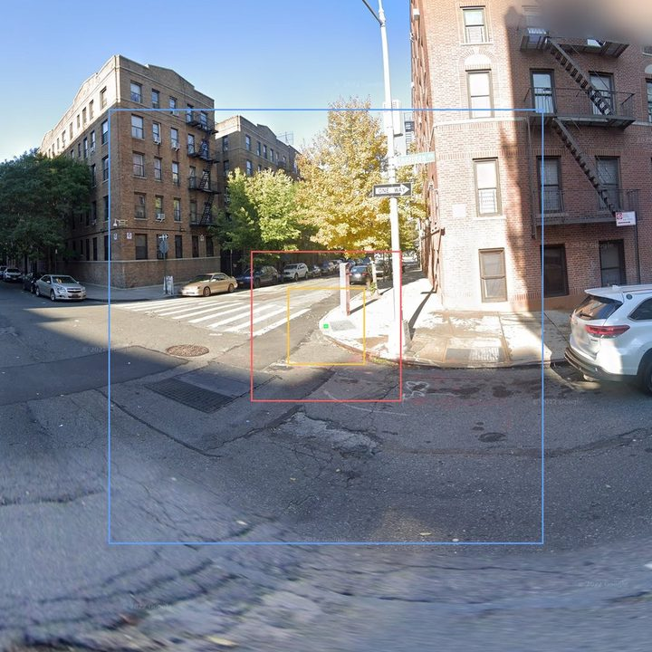
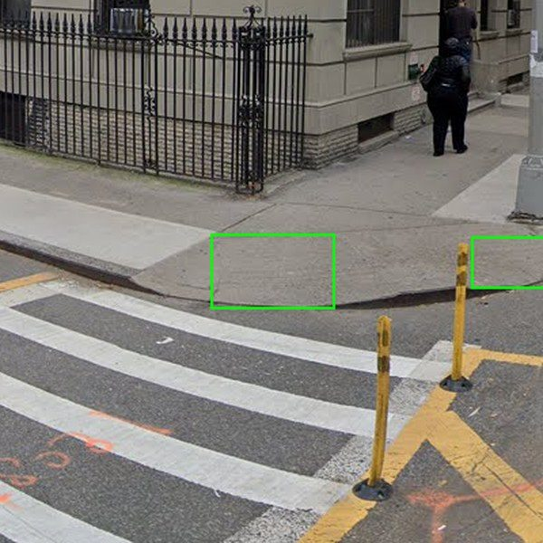
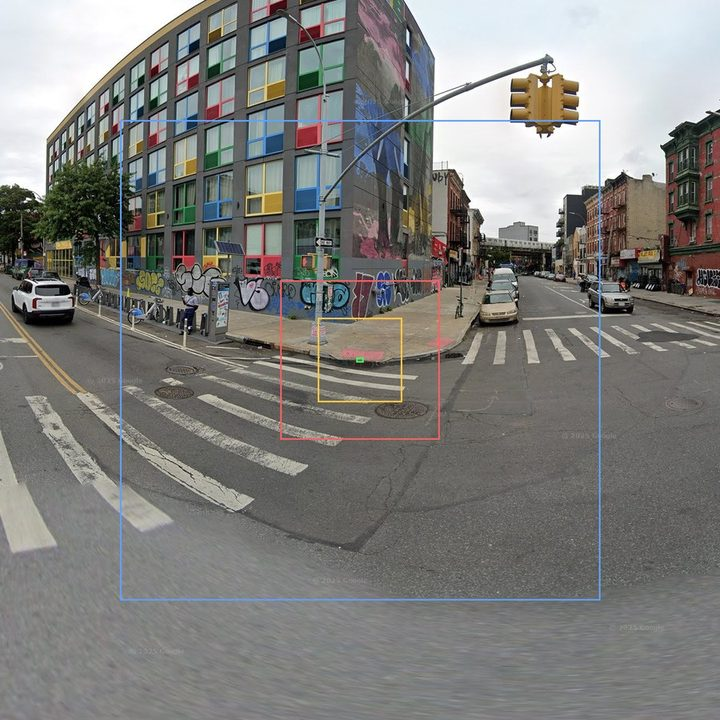

# Crop-window eval against the manual_gold boxes — and what those boxes turn out to be

**Issue:** #114. **Run date:** 2026-08-14. **Script:** `scripts/analysis/crop_window_eval.py`
(tests: `tests/test_crop_window_eval.py`). **Inputs:** `manual_labels/*.txt` (3,919 boxes on
1,000 panos) + `benchmark/manual_gold/records.jsonl` (pano dims + RampNet detections). No
imagery is needed for any number below; the committed summary with a content hash of the
per-box table is `analysis_out/crop_window_eval.json`.

```
python scripts/analysis/crop_window_eval.py                 # numbers + JSON + per-box CSV
python scripts/analysis/crop_window_eval.py --fetch-sample 40 --gallery 80   # + overlay gallery
```

This was set up to score three crop-window sizing rules (below) against "3,919 human-drawn
curb-ramp bounding boxes." The most important result is about the boxes, not the rules.

---

## Finding 1 — `manual_labels/` w/h is NOT object-extent gold

The repo has always consumed these files as center points (`rampnet/detection_eval.py`
drops w/h at parse). Issue #83 proposed the w/h as the eval set for extent work. **Measured,
they cannot serve that role.** Three independent lines of evidence:

**(a) Box sizes are far below any physical ramp's apparent size, at every distance.**
Median box max-side is 12.8 px on a 4096×2048 equirect. Against a flat-ground model
(2.5 m camera height, 1.5 m nominal ramp width — the same model `size_analysis.py` and the
YOLO pseudo-box prep use):

| depression | flat-ground dist | n | box side p50 | geometric prediction | ratio |
|---|---|---:|---:|---:|---:|
| 3–5° | ~36 m | 45 | 8.3 px | 27 px | 0.31 |
| 5–8° | ~22 m | 593 | 8.7 px | 45 px | 0.20 |
| 8–12° | ~14 m | 888 | 10.9 px | 69 px | 0.16 |
| 12–18° | ~9 m | 1,149 | 13.2 px | 105 px | 0.13 |
| 18–25° | ~6 m | 841 | 16.2 px | 154 px | 0.11 |
| 25–40° | ~4 m | 377 | 20.7 px | 249 px | 0.08 |

A 13 px object at 9 m subtends ~19 cm. Box size *does* grow with proximity — there is some
extent signal — but ~7× slower than a real ramp's apparent size.

**(b) The tightness ratio is uniform across deployments** (p50 ≈ 0.134 for the NYC,
Portland-area, and Bend clusters alike), so this is not one deployment's annotator quirk.
But it splits **by pano**: thresholding at ratio ≥ 0.4, 659 panos are all-small, 52 are
all-big, 82 mixed. Only **9.8 % of boxes (384)** are plausibly full-extent.

**(c) Visual confirmation** (fresh GSV fetches of live gold panos, boxes overlaid — the
imagery is view-only, not the bundle's canonical HF bytes):

| near-point marks (the typical case) | full-extent boxes (the ~10 % case) |
|---|---|
|  |  |
|  | |

In the typical case the green gold box is a tight mark on the detectable-warning pad / curb
tip; the visibly larger ramp apron around it is unboxed. In the minority case the box
covers the full apron. (Overlay colors: green = gold box; orange = v1-norm window;
red = v1-raw; blue = geo-v1.5.)

**Consequences.**

- The center points stay exactly as trustworthy as they always were — nothing here touches
  the benchmark's point semantics.
- **#83's plan to use these boxes as the SAM2/extent eval set needs a convention audit
  first**; as-is they would score a correct full-apron mask as a huge false inflation on
  ~90 % of items.
- The ecosystem currently has **no usable curb-ramp extent gold at all.** Producing it —
  with an explicit whole-apron box rule, on manual_gold (GSV) and on richmond's benchmark
  panos (Mapillary) — is the prerequisite for validating any sizing rule or extent model.
  The eval harness here re-runs unchanged against a proper box set.

## Finding 2 — what the rules comparison can still say

Scored rules (windows placed per CropRunner's geometry: x wraps the seam, y clamps by
shifting, size capped at pano dims):

- **v1-raw** — `predict_crop_size` exactly as sidewalk-panorama-tools runs it (pixel-linear
  distance fit on native `pano_y`; constants calibrated on 6656-px-high panos).
- **v1-norm** — the resolution-normalized port planned for SidewalkWebpage's CropService
  (compute in 6656-height reference space, scale back; bit-identical at 6656).
- **geo-v1.5** — depression → flat-ground distance → 1.5 m footprint → pad so the object
  would sit at 12.5 % of the window side.

**Containment of the marked point-region is a non-problem for every rule** (≥ 97.5 %
everywhere; v1-raw and geo-v1.5 at 100 %, v1-norm's misses concentrate at 18–36 m where its
windows are smallest: 94.7 % in that stratum, detection-prompted). Given Finding 1 this
means "the crop keeps the marked spot," **not** "the crop contains the whole ramp."

**The v1 resolution defect is confirmed and quantified at this height:** at 2048-px panos
the raw formula's median window is **294 px vs 149 px normalized — 1.97×** oversized
relative to its own calibration geometry (median over detection-prompted boxes). The
inflation direction flips with pano height (manual_gold sits below the 6656 calibration
height; an 8192-height pano sits above it), which is exactly why the CropService port
normalizes.

**Context-ratio numbers against these boxes are not interpretable as object-context ratios**
(Finding 1) and are deliberately not headlined here; they live in the JSON/CSV for
re-analysis once real extent gold exists.

**Detection coverage** (production floor 0.55): 3,420 of 3,919 gold points (87.3 %) are
covered by an operational detection — those are the labels that would exist and get crops.
190 operational detections match no gold point: would-be crops of non-ramps.

## Finding 3 — the 10–15 % "context band" is an ML-consumer number, not a Gallery number

The overlay tiles make a product tension visible. Pad-to-band sizing on a *full-extent*
object model (geo-v1.5) produces enormous windows (~800 px at 4096-width — a ~70° FOV),
because "object at 12.5 % of side" around a ~100 px ramp *implies* that much context.
Meanwhile v1-norm's ~150 px window frames the ramp tightly — closer to what a training-crop
consumer wants than to a human-facing Gallery card, which (per SidewalkWebpage's own canvas
captures) shows a whole 3:2 viewport of context. The 10–15 % band came from a survey of
**ML pipelines** (sidewalk-panorama-tools' consumer-requirements report — a survey, not a
measurement); the human-facing crop's right context level has never been specified anywhere.
The acceptance test for the production CropService should set the band per consumer class,
not inherit the ML number.

---

## Round 2 — first REAL extent gold (richmond, INTERIM at 112/310 boxes, 2026-08-14)

`scripts/box_gallery.py` (#116) produced the first whole-apron extent gold: 110 boxed +
2 can't-determine ramps on 32 Mapillary panos (jonf, box rule v1; the sample is
hash-ordered, i.e. effectively random over the 310 adjudicated Richmond ramps). Scored
with `--bundle benchmark/richmond`; summary committed as
`analysis_out/crop_window_eval_richmond.json`. Two new elements vs Round 1: containment
is finally *whole-apron* containment, and the **directional road-context margin** — how
far the window extends below the box bottom (≈ the ramp–street junction), in box
heights — is reported per rule ("road p50"; "edgecut" = share of windows that clip the
street edge off).

**Detection-prompted (production-realistic), n=88:**

| rule | containment (95% CI) | ctx p50 | road p50 | side p50 |
|---|---|---:|---:|---:|
| v1-raw | 0.534 [0.43, 0.64] | 0.80 | 1.8 | 317 px |
| v1-norm | **0.295** [0.21, 0.40] | 0.96 | 1.1 | 268 px |
| geo-v1.5 | **1.000** [0.96, 1.00] | 0.24 | 6.7 | 1182 px |

**Finding 4 — the v1 formula is object-sized, not window-sized, against real extents.**
Both v1 variants produce windows about the size of the ramp itself (ctx p50 0.8–0.96),
so containment collapses, monotonically with proximity: v1-raw goes 1.00 → 0.78 → 0.48
→ 0.29 → 0.00 across the distance strata (far → <5 m); v1-norm sits at 0.28–0.60
everywhere. The Round-1 framing inverts: **the resolution normalization is correct and
still loses** — richmond's panos are mostly *below* the 6656 calibration height (5500,
2880, 2048), so normalizing shrinks windows relative to raw, and raw's calibration
defect was accidentally *hiding* the deeper problem: the 2013-era formula's output is
simply too small to contain a full apron at close/mid range. Fixing only the resolution
bug (SW#4865's port as planned) would ship the *worst* of the three rules for Richmond.

**geo-v1.5 contains everything by construction** (windows sized from geometry, padded to
a 12.5 % target), at the price of ~2× more context than the ML band (measured ctx p50
0.22, because real aprons measure ~1.2–1.3× the 1.5 m nominal) and very large windows
(p50 ~1.0–1.2 kpx). Whether that context level is "too much" is per consumer class
(Finding 3): for a human-facing Gallery card it may be about right; for a training-crop
consumer it halves effective object resolution vs a tighter window. Its ctx p10–p90
spread (0.13–0.40) at a fixed target is the flat-ground proxy error + ramp-size/
orientation variation — the gap an extent-aware rule (SAM2 box) would close.

**Sample-size answer:** at n=110 the ranking is already outside the CIs — more richmond
boxes refine strata, they won't flip the verdict. The load-bearing open question moves
to the **GSV arm** (manual_gold re-annotation): richmond's heights are ≤ 6656, where
normalization *shrinks*; GSV native panos (8192/16384) sit above it, where the raw
formula *over*-sizes instead. If full aprons bust v1 there too, the v1 baseline is dead
on both providers and the contest is geo-v1.5 (with per-consumer target ratios) vs SAM2.

Interim caveats: single annotator; box rule v1 (v2 added two clarifying bullets, no
convention change); 4 pano-height groups {5500: 18, 6144: 4, 2880: 5, 2048: 4 panos} so
richmond alone cannot separate height effects; `missed:*` items (22) score only in
gold-center mode (production cuts no crop without a detection).

## Caveats

- Flat-ground distance from depression (2.5 m camera height) is a proxy; per-pano heights
  vary (sidewalk-auto-labeler#40 measured median 2.21 m on GSV) and terrain is not flat.
  None of Finding 1 depends on the proxy's precision — a 2× distance error cannot explain a
  7× size gap that is uniform across deployments.
- 1.5 m nominal ramp width is a convention; real aprons vary ~1–3 m.
- The visual checks use fresh GSV fetches of gold pano ids (some ids have decayed); the
  bundle's canonical imagery remains the HF test split via `scripts/fetch_manual_gold.py`.
- Depression strata use the *box center's* y; detection-prompted rows use the detection's
  position for the window but the box's stratum.
