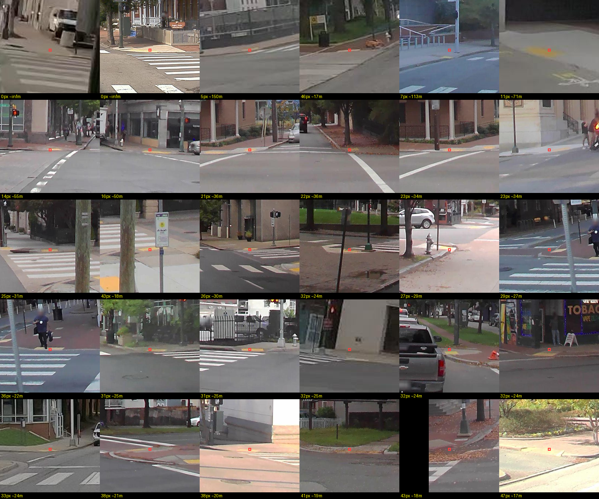

# Where RampNet's recall goes: a depth-quantified error analysis

Analysis of every curb ramp RampNet **fails to detect** on the deployment benchmark
(`benchmark/{richmond,bend}` — 637 reviewer-confirmed ramps across 234 panos, 150 missed at the
deployed operating point). Scripts: [`scripts/analysis/`](../scripts/analysis/README.md).

**Bottom line.** Recall is *distance-limited*: RampNet is reliable to ~18 m and effectively blind
past 25 m. Three levers close the gap, in increasing cost — a free operating-point change
(+7–10 pts), higher-resolution retraining (+10 pts, saturating ~0.88), and denser pano sampling
(unmeasured, plausibly the largest). Precision is **not** the problem and culling distant
detections actively hurts.

## Why this needed depth

The benchmark labels are **points, not boxes**, so a ramp's apparent size is unknown — yet "the
misses are small and far away" was the leading hypothesis. Two independent distance estimates were
used:

1. **Flat-ground geometry.** Ramps sit on the ground, so `d = camera_height / tan(depression)`,
   where depression comes from the point's latitude in the equirectangular pano.
2. **Depth Anything 3 (metric)** run on the perspective-reprojected views from
   `scripts/model_comparison/equirect_tiling.py`, with our exactly-known intrinsics.

They agree to within **6.5–8.5%** (Spearman ρ = 0.95 Bend / 0.81 Richmond). Depth additionally
rescues 4 Richmond ramps that geometry placed *above the horizon* — geometrically impossible for a
ground ramp, and a direct symptom of unleveled consumer rigs / hills. That ρ gap is itself
informative: geometry degrades exactly where the camera rig varies (Mapillary), which is the OOD
imagery we care most about.

Apparent size then follows from distance: a ramp of real width `W` at distance `d` subtends
`W/d × (4096 / 2π)` px in RampNet's 4096-px-wide input space.

## 1. Recall collapses with distance

| distance | n | recall |
|---|---|---|
| 0–8 m | 133 | 0.842 |
| 8–12 m | 173 | 0.879 |
| 12–18 m | 197 | 0.812 |
| 18–25 m | 101 | **0.564** |
| 25–40 m | 33 | **0.182** |
| **all** | 637 | 0.765 |

By apparent size: 20–32 px → 0.189, 32–50 px → 0.671, 50–80 px → 0.825, 80 px+ → 0.876. There is
simply not enough signal left in the pixels.

> **Recommendation:** report benchmark recall **stratified by distance**. "Reliable to 18 m, blind
> past 25 m" is far more actionable than a scalar 0.765.

## 2. Precision is flat with distance — do not cull

| distance | detections | precision |
|---|---|---|
| 0–8 m | 122 | 0.943 |
| 8–12 m | 132 | 0.970 |
| 12–18 m | 116 | 0.966 |
| 18–25 m | 104 | 0.962 |
| 25 m+ | 32 | **1.000** |

Culling detections beyond 18 m would **lose 132 true ramps to remove 4 false ones**, and would
*lower* precision (0.962 → 0.959). **When RampNet sees a distant ramp it is almost always right; it
just usually doesn't see it.** Far-field is a *sensitivity* problem, not a *reliability* one — which
also means lowering the threshold at range is safe.

## 3. Lever A — the operating point (free)

Inference was re-run on all 234 benchmark panos, byte-faithful to the deployment path
(resize 2048×4096, no TTA); at `(0.55, 10)` it reproduces the committed `records.jsonl` exactly.

| threshold | richmond P / R / F1 | bend P / R / F1 |
|---|---|---|
| **0.55** (deployed) | 0.964 / 0.768 / .855 | 0.980 / 0.755 / .853 |
| 0.35 | 0.921 / 0.823 / **.869** | 0.929 / 0.804 / .862 |
| 0.25 | 0.872 / 0.839 / .855 | 0.904 / 0.835 / **.868** |
| 0.15 | 0.780 / 0.868 / .821 | 0.853 / 0.850 / .851 |

- **+7–10 recall points for one changed constant.** No retraining.
- **0.55 was not even F1-optimal** — F1 peaks at 0.35/0.25, so this is an improvement even under a
  symmetric metric, before invoking any recall-first argument.
- `min_distance` 10 → 3 gains ~0.5 pt and costs precision. **Keep 10.**
- **~44% of "misses" were sub-threshold, not blind.** The model saw them and was under-confident —
  a large share of the recall gap is *calibration*, not vision.

## 4. Lever B — resolution (forecast)

Mapping each size bucket to the recall observed at double its apparent size:

| resolution | forecast recall |
|---|---|
| 1.5× | 0.765 → 0.846 (+0.081) |
| **2×** | 0.765 → **0.867 (+0.103)** |
| 3× | 0.765 → 0.875 (+0.111) |

**+10 points at 2×, saturating ~0.875** — even large, near ramps only reach 0.876, so the residual
~12% is occlusion / motion blur / odd geometry, not size. The detail genuinely exists: Richmond
panos are natively ~11000 px wide and Bend 16384 px, against a 4096 px model input.

> **Caveat:** upscaling adds no information. An honest gain requires the **retrain-at-higher-res**
> arm, not a frozen-model input-size sweep.

## 5. The levers partially overlap

| distance | thr 0.55 | thr 0.25 | thr 0.15 | gain |
|---|---|---|---|---|
| 0–8 m | 0.827 | 0.902 | 0.932 | +0.105 |
| 12–18 m | 0.817 | 0.883 | 0.914 | +0.096 |
| 18–25 m | 0.554 | 0.673 | 0.693 | **+0.139** |
| 25 m+ | 0.152 | 0.303 | 0.364 | **+0.212** |

The threshold helps at *all* distances but most at range, so it competes with resolution for the
same ramps. It does **not** solve far-field (25 m+ tops out at 0.364), and ramps still missed at
0.25 are 54% beyond 18 m. **Do not budget +10 and +10 as +20** — combined, expect roughly **0.90**.

## 6. Lever C — sampling density (unmeasured, possibly largest)

This benchmark measures **per-pano recall** — "did RampNet find this ramp *in this image*." The
deployment product needs **per-ramp recall across the run** — "did we find this ramp *anywhere*."
Those differ enormously, because a ramp invisible at 30 m is at 8 m two panos later.

Using the measured curve and 5 m pano spacing, the three nearest views alone give
`0.158 × 0.158 × 0.121 ≈ 0.3%` chance of missing a ramp in all of them.

> **This is an upper bound and assumes independent failures, which is false.** Occlusion, motion
> blur and unusual geometry persist across neighbouring views — the ramps *no* model found are
> exactly that correlated-failure population, and they set the real floor.

Two consequences: deployment recall is almost certainly far above 0.765 and **has never been
measured**; and sampling density (the auto-labeler's 5 m thinning — a *config*, not a model change)
may be the cheapest lever of all.

## Qualitative check

Thirty Richmond ramps missed by **both** RampNet and Gemini-3.1-Pro, sorted by estimated apparent
size; fixed 12° angular crops so distant ramps genuinely look small. These are unmistakably **real
ramps** — many show clear tactile domes — so the ground truth is sound. Alongside small size, the
visible secondary factors are **occlusion** (a parked pickup, hedges, poles), **motion blur** on
consumer-rig Mapillary frames, and pano stitching artifacts.

## Recommended order

1. **Change the operating point** to ~0.25–0.35, keep `min_distance=10`. Free, validated, F1-positive.
2. **Measure per-ramp deployment recall** and revisit sampling density. Cheap; possibly the biggest win.
3. **Higher-resolution retrain.** Forecast +10 pts, saturating ~0.88.
4. Beyond ~0.90: occlusion/blur robustness, or multi-view aggregation.

## Caveats

- Ground truth is anchored to the original review, so a real ramp surfaced by a lower threshold that
  the reviewer never marked scores as a **false positive**. The precision drops in §3 are therefore
  slight *over*-estimates, and low-threshold precision deserves a fresh spot-check before being quoted.
- Apparent size assumes a ~1.2 m ramp width; distance assumes ~2.5 m camera height where geometry is
  used. Both were cross-checked against DA3 metric depth.
- Two cities (one GSV/in-distribution, one Mapillary/OOD). Patterns are consistent across both, but
  this is not yet broad geographic evidence.
