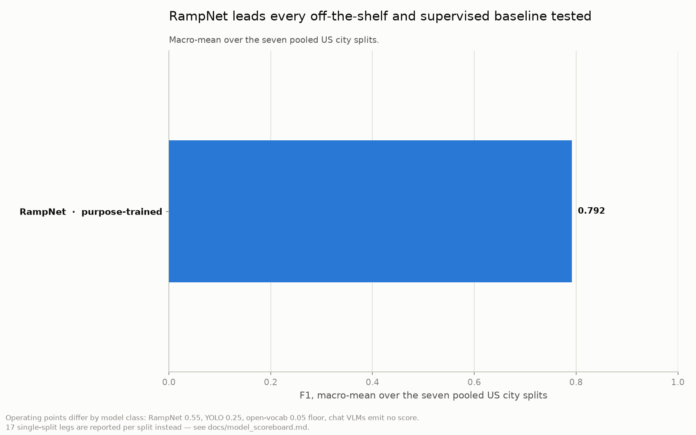
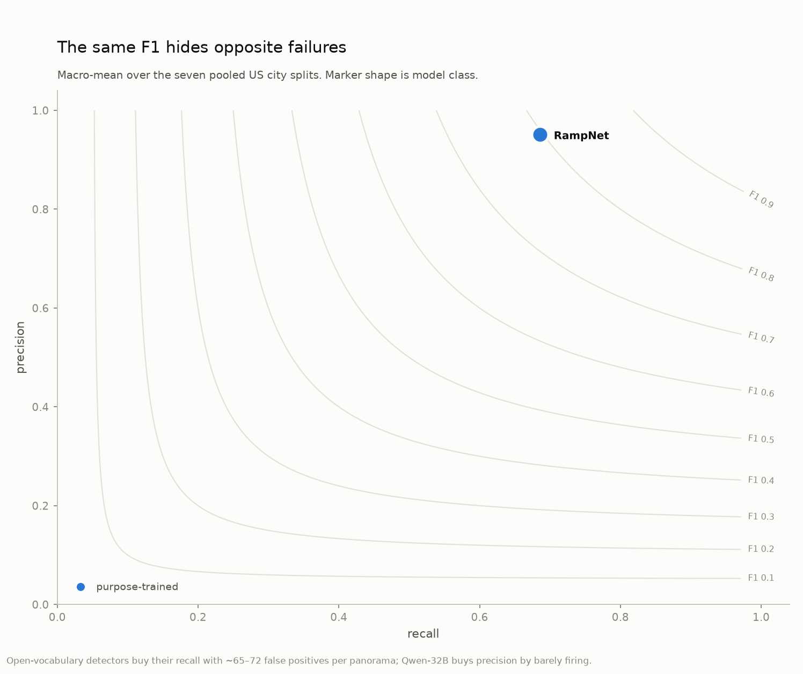
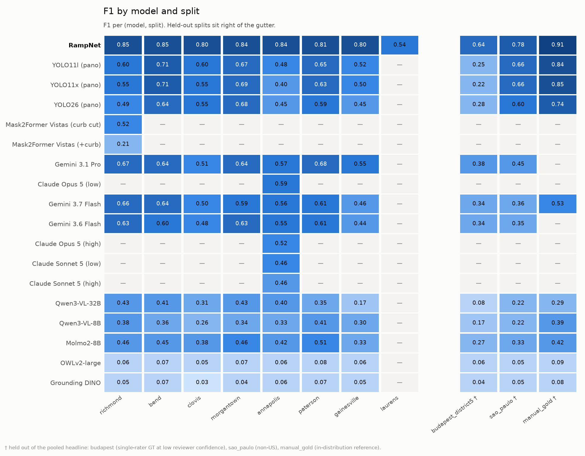
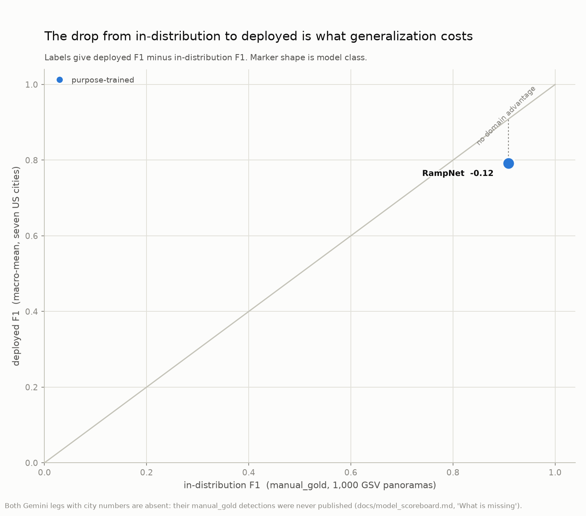
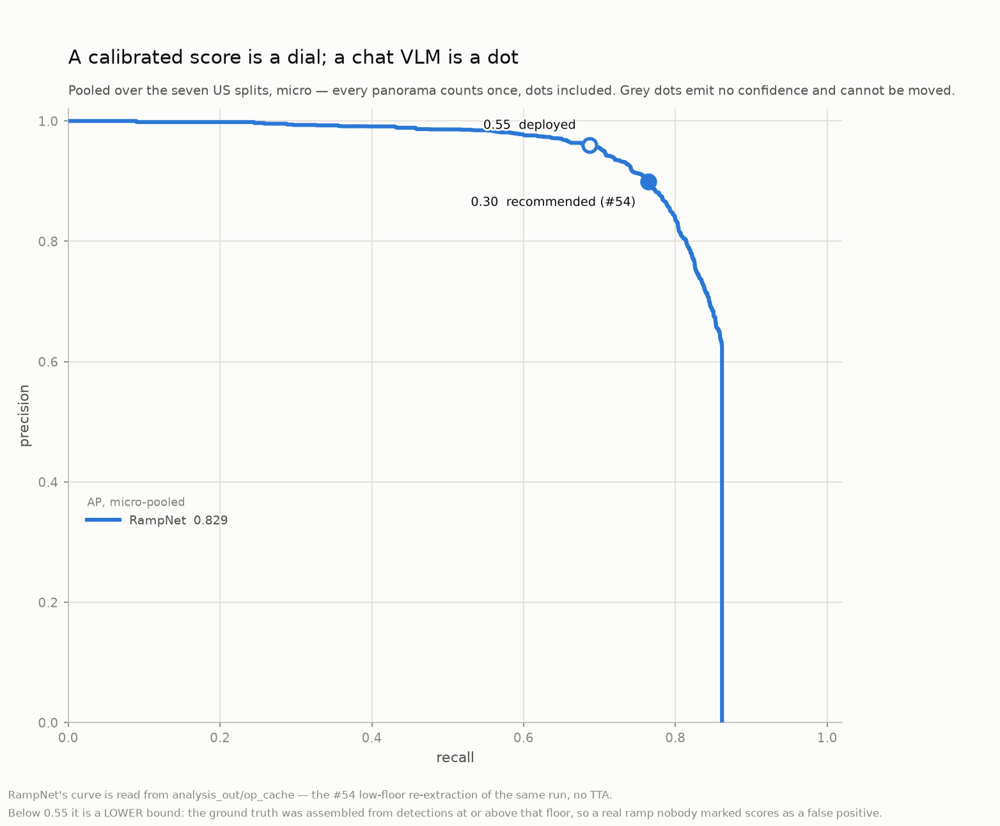

# Scoreboard: every model, one table

Eighteen model legs, ten splits, one page. This is the summary view of the curb-ramp benchmark —
**rows are models, columns are metrics** — for the question "which model is best, and by how
much".

It is the companion to [`model_comparison.md`](model_comparison.md), not a replacement.
That document is the comprehensive log: per-split tables in the order the splits were run,
the mechanism behind every number, the negative results, the caveats, the harness
self-validation. It is where you go to find out *why* Qwen-32B inverts on budapest. It is a
bad place to find out *who wins*, because that answer is spread across a dozen tables in
chronological order rather than model order. Hence this page.

Every number here is regenerated from committed data by
[`scripts/analysis/scoreboard.py`](../scripts/analysis/scoreboard.py) — no GPU, no
credentials, no network, no `.model_cache`. The tables below sit inside generated blocks and
are replaced wholesale on each run, so this page cannot quietly drift out of step with the
log it summarizes. `--check` turns that drift into a failure.

---

## The board

Macro-mean over the seven pooled US city splits, each city weighted equally.
**Read the operating-point column before comparing rows** — it is not the same for every
model, and the reasons are in "How to read this" below.

<!-- BEGIN GENERATED: headline (scripts/analysis/scoreboard.py) -->

| model | class | op | P | R | F1 | ΔF1 vs RampNet | AP (macro) | FP/pano | F1 range |
|---|---|--:|--:|--:|--:|--:|--:|--:|:-:|
| **RampNet** | purpose-trained | 0.55 | **0.951** | **0.686** | **0.792** | — | 0.829&nbsp;† | 0.1 | 0.54–0.85 |

<!-- END GENERATED: headline -->

† RampNet's AP is read from `analysis_out/op_cache/`, not from its bundle — see "Choosing an operating point" below for why, and what it fixes.



**RampNet wins by 0.219 F1**, and the gap is not a threshold artifact: it holds at every
operating point anyone has committed to, and on ground truth that never saw a RampNet review
(`manual_gold`). The three findings that only become visible once the splits are pooled:

1. **The supervised baseline and the best zero-shot VLM are a dead heat.** YOLO11l trained on
   the RampNet dataset scores **0.604**; Gemini 3.1 Pro, zero-shot with an untuned prompt,
   scores **0.608**. Issue #51 asks whether RampNet's advantage is the data or the
   architecture; pooled, the answer is that the *data alone*, handed to a generic detector,
   buys you a tie with an off-the-shelf chat model — and the remaining 0.22 F1 is what the
   keypoint architecture adds.
2. **RampNet is the only strong model that is also stable.** Its F1 spans 0.80–0.85 across the
   seven cities, a range of 0.053. Every challenger scoring above 0.1 swings between 0.148
   (Qwen-8B) and 0.313 (YOLO11x). The two open-vocabulary detectors *are* flatter (0.028,
   0.039) — because they are pinned near zero everywhere, which is consistency of a kind
   nobody wants.
3. **Precision is not the differentiator; recall is.** YOLO11x posts the highest precision on
   the board (0.969, above RampNet's 0.958) at **0.416 recall against RampNet's 0.728**. Every
   model here can be made precise. Finding the ramps is the hard part, which is why the
   project's operating-point work optimizes recall-first
   ([`operating_point.md`](operating_point.md)).



The P/R plane is where the single-number ranking stops being enough. Models sitting on the
same F1 contour fail in opposite directions: Qwen-32B and Qwen-8B score 0.356 and 0.338 —
practically tied — but 32B gets there by firing rarely at high precision and 8B by flooding.
Which one you would deploy depends entirely on whether a miss or a false positive costs more,
and F1 cannot tell you.

---

## Legs that have not run every pooled split

Six legs have run one split each, so they have no pooled mean to put in the table above —
a one-city average printed beside a seven-city one is exactly the comparison the coverage
column exists to prevent. They are reported per split instead, at the split they ran on:

<!-- BEGIN GENERATED: partial (scripts/analysis/scoreboard.py) -->

| model | class | split | P | R | F1 | AP | FP/pano | tp/fp/fn |
|---|---|---|--:|--:|--:|--:|--:|--:|
| YOLO11l (pano) | supervised baseline | `richmond` | 0.925 | 0.439 | 0.595 | 0.724 | 0.1 | 136/11/174 |
| YOLO11l (pano) | supervised baseline | `bend` | 0.964 | 0.566 | 0.713 | 0.778 | 0.1 | 185/7/142 |
| YOLO11l (pano) | supervised baseline | `clovis` | 0.916 | 0.446 | 0.600 | 0.708 | 0.1 | 87/8/108 |
| YOLO11l (pano) | supervised baseline | `morgantown` | 0.946 | 0.524 | 0.675 | 0.797 | 0.1 | 140/8/127 |
| YOLO11l (pano) | supervised baseline | `annapolis` | 0.969 | 0.320 | 0.481 | 0.619 | 0.0 | 94/3/200 |
| YOLO11l (pano) | supervised baseline | `paterson` | 0.946 | 0.491 | 0.647 | 0.793 | 0.1 | 194/11/201 |
| YOLO11l (pano) | supervised baseline | `gainesville` | 0.907 | 0.360 | 0.516 | 0.639 | 0.1 | 98/10/174 |
| YOLO11l (pano) | supervised baseline | `budapest_district5` | 0.786 | 0.147 | 0.247 | 0.443 | 0.1 | 44/12/256 |
| YOLO11l (pano) | supervised baseline | `sao_paulo` | 0.902 | 0.523 | 0.662 | 0.784 | 0.1 | 147/16/134 |
| YOLO11l (pano) | supervised baseline | `manual_gold` | 0.931 | 0.763 | 0.839 | 0.914 | 0.2 | 2992/222/927 |
| YOLO11x (pano) | supervised baseline | `richmond` | 0.952 | 0.384 | 0.547 | 0.748 | 0.0 | 119/6/191 |
| YOLO11x (pano) | supervised baseline | `bend` | 0.989 | 0.554 | 0.710 | 0.781 | 0.0 | 181/2/146 |
| YOLO11x (pano) | supervised baseline | `clovis` | 0.938 | 0.390 | 0.551 | 0.711 | 0.0 | 76/5/119 |
| YOLO11x (pano) | supervised baseline | `morgantown` | 0.993 | 0.524 | 0.686 | 0.790 | 0.0 | 140/1/127 |
| YOLO11x (pano) | supervised baseline | `annapolis` | 0.986 | 0.248 | 0.397 | 0.662 | 0.0 | 73/1/221 |
| YOLO11x (pano) | supervised baseline | `paterson` | 0.974 | 0.471 | 0.635 | 0.800 | 0.0 | 186/5/209 |
| YOLO11x (pano) | supervised baseline | `gainesville` | 0.948 | 0.338 | 0.499 | 0.616 | 0.0 | 92/5/180 |
| YOLO11x (pano) | supervised baseline | `budapest_district5` | 0.864 | 0.127 | 0.221 | 0.427 | 0.0 | 38/6/262 |
| YOLO11x (pano) | supervised baseline | `sao_paulo` | 0.923 | 0.512 | 0.659 | 0.783 | 0.1 | 144/12/137 |
| YOLO11x (pano) | supervised baseline | `manual_gold` | 0.956 | 0.767 | 0.851 | 0.931 | 0.1 | 3005/139/914 |
| YOLO26 (pano) | supervised baseline | `richmond` | 0.680 | 0.384 | 0.491 | 0.537 | 0.5 | 119/56/191 |
| YOLO26 (pano) | supervised baseline | `bend` | 0.733 | 0.563 | 0.637 | 0.661 | 0.6 | 184/67/143 |
| YOLO26 (pano) | supervised baseline | `clovis` | 0.687 | 0.462 | 0.552 | 0.596 | 0.3 | 90/41/105 |
| YOLO26 (pano) | supervised baseline | `morgantown` | 0.802 | 0.592 | 0.681 | 0.740 | 0.3 | 158/39/109 |
| YOLO26 (pano) | supervised baseline | `annapolis` | 0.758 | 0.320 | 0.450 | 0.493 | 0.2 | 94/30/200 |
| YOLO26 (pano) | supervised baseline | `paterson` | 0.786 | 0.473 | 0.591 | 0.712 | 0.4 | 187/51/208 |
| YOLO26 (pano) | supervised baseline | `gainesville` | 0.709 | 0.331 | 0.451 | 0.481 | 0.3 | 90/37/182 |
| YOLO26 (pano) | supervised baseline | `budapest_district5` | 0.639 | 0.177 | 0.277 | 0.350 | 0.2 | 53/30/247 |
| YOLO26 (pano) | supervised baseline | `sao_paulo` | 0.723 | 0.520 | 0.605 | 0.658 | 0.4 | 146/56/135 |
| YOLO26 (pano) | supervised baseline | `manual_gold` | 0.740 | 0.739 | 0.739 | 0.843 | 1.0 | 2896/1020/1023 |
| Mask2Former Vistas (curb cut) | supervised transfer | `richmond` | 0.411 | 0.697 | 0.517 | 0.513 | 2.5 | 216/309/94 |
| Mask2Former Vistas (+curb) | supervised transfer | `richmond` | 0.126 | 0.648 | 0.210 | 0.089 | 11.3 | 201/1399/109 |
| Gemini 3.1 Pro | chat VLM | `richmond` | 0.634 | 0.703 | 0.667 | – | 1.0 | 218/126/92 |
| Gemini 3.1 Pro | chat VLM | `bend` | 0.706 | 0.581 | 0.638 | – | 0.7 | 190/79/137 |
| Gemini 3.1 Pro | chat VLM | `clovis` | 0.543 | 0.487 | 0.514 | – | 0.6 | 95/80/100 |
| Gemini 3.1 Pro | chat VLM | `morgantown` | 0.679 | 0.610 | 0.643 | – | 0.6 | 163/77/104 |
| Gemini 3.1 Pro | chat VLM | `annapolis` | 0.613 | 0.527 | 0.567 | – | 0.8 | 155/98/139 |
| Gemini 3.1 Pro | chat VLM | `paterson` | 0.852 | 0.567 | 0.681 | – | 0.3 | 224/39/171 |
| Gemini 3.1 Pro | chat VLM | `gainesville` | 0.564 | 0.533 | 0.548 | – | 0.9 | 145/112/127 |
| Gemini 3.1 Pro | chat VLM | `budapest_district5` | 0.434 | 0.340 | 0.381 | – | 1.1 | 102/133/198 |
| Gemini 3.1 Pro | chat VLM | `sao_paulo` | 0.463 | 0.445 | 0.454 | – | 1.2 | 125/145/156 |
| Claude Opus 5 (low) | chat VLM | `annapolis` | 0.572 | 0.605 | 0.588 | – | 1.1 | 178/133/116 |
| Gemini 3.7 Flash | chat VLM | `richmond` | 0.744 | 0.600 | 0.664 | – | 0.5 | 186/64/124 |
| Gemini 3.7 Flash | chat VLM | `bend` | 0.713 | 0.578 | 0.639 | – | 0.7 | 189/76/138 |
| Gemini 3.7 Flash | chat VLM | `clovis` | 0.571 | 0.451 | 0.504 | – | 0.5 | 88/66/107 |
| Gemini 3.7 Flash | chat VLM | `morgantown` | 0.701 | 0.517 | 0.595 | – | 0.5 | 138/59/129 |
| Gemini 3.7 Flash | chat VLM | `annapolis` | 0.734 | 0.459 | 0.565 | – | 0.4 | 135/49/159 |
| Gemini 3.7 Flash | chat VLM | `paterson` | 0.910 | 0.458 | 0.609 | – | 0.1 | 181/18/214 |
| Gemini 3.7 Flash | chat VLM | `gainesville` | 0.511 | 0.412 | 0.456 | – | 0.9 | 112/107/160 |
| Gemini 3.7 Flash | chat VLM | `budapest_district5` | 0.484 | 0.260 | 0.338 | – | 0.7 | 78/83/222 |
| Gemini 3.7 Flash | chat VLM | `sao_paulo` | 0.561 | 0.263 | 0.358 | – | 0.5 | 74/58/207 |
| Gemini 3.7 Flash | chat VLM | `manual_gold` | 0.735 | 0.411 | 0.527 | – | 0.6 | 1612/582/2307 |
| Gemini 3.6 Flash | chat VLM | `richmond` | 0.626 | 0.642 | 0.634 | – | 1.0 | 199/119/111 |
| Gemini 3.6 Flash | chat VLM | `bend` | 0.608 | 0.587 | 0.597 | – | 1.1 | 192/124/135 |
| Gemini 3.6 Flash | chat VLM | `clovis` | 0.464 | 0.503 | 0.483 | – | 0.9 | 98/113/97 |
| Gemini 3.6 Flash | chat VLM | `morgantown` | 0.636 | 0.629 | 0.633 | – | 0.8 | 168/96/99 |
| Gemini 3.6 Flash | chat VLM | `annapolis` | 0.637 | 0.490 | 0.554 | – | 0.7 | 144/82/150 |
| Gemini 3.6 Flash | chat VLM | `paterson` | 0.744 | 0.514 | 0.608 | – | 0.6 | 203/70/192 |
| Gemini 3.6 Flash | chat VLM | `gainesville` | 0.404 | 0.478 | 0.438 | – | 1.5 | 130/192/142 |
| Gemini 3.6 Flash | chat VLM | `budapest_district5` | 0.353 | 0.320 | 0.336 | – | 1.4 | 96/176/204 |
| Gemini 3.6 Flash | chat VLM | `sao_paulo` | 0.333 | 0.359 | 0.346 | – | 1.6 | 101/202/180 |
| Claude Opus 5 (high) | chat VLM | `annapolis` | 0.430 | 0.656 | 0.520 | – | 2.0 | 193/256/101 |
| Claude Sonnet 5 (low) | chat VLM | `annapolis` | 0.589 | 0.381 | 0.463 | – | 0.6 | 112/78/182 |
| Claude Sonnet 5 (high) | chat VLM | `annapolis` | 0.506 | 0.415 | 0.456 | – | 1.0 | 122/119/172 |
| Qwen3-VL-32B | chat VLM | `richmond` | 0.760 | 0.297 | 0.427 | – | 0.2 | 92/29/218 |
| Qwen3-VL-32B | chat VLM | `bend` | 0.706 | 0.294 | 0.415 | – | 0.4 | 96/40/231 |
| Qwen3-VL-32B | chat VLM | `clovis` | 0.696 | 0.200 | 0.311 | – | 0.1 | 39/17/156 |
| Qwen3-VL-32B | chat VLM | `morgantown` | 0.675 | 0.311 | 0.426 | – | 0.3 | 83/40/184 |
| Qwen3-VL-32B | chat VLM | `annapolis` | 0.608 | 0.296 | 0.398 | – | 0.4 | 87/56/207 |
| Qwen3-VL-32B | chat VLM | `paterson` | 0.813 | 0.220 | 0.347 | – | 0.2 | 87/20/308 |
| Qwen3-VL-32B | chat VLM | `gainesville` | 0.392 | 0.107 | 0.168 | – | 0.4 | 29/45/243 |
| Qwen3-VL-32B | chat VLM | `budapest_district5` | 0.433 | 0.043 | 0.079 | – | 0.1 | 13/17/287 |
| Qwen3-VL-32B | chat VLM | `sao_paulo` | 0.506 | 0.139 | 0.218 | – | 0.3 | 39/38/242 |
| Qwen3-VL-32B | chat VLM | `manual_gold` | 0.739 | 0.177 | 0.285 | – | 0.2 | 693/245/3226 |
| Qwen3-VL-8B | chat VLM | `richmond` | 0.323 | 0.452 | 0.377 | – | 2.4 | 140/293/170 |
| Qwen3-VL-8B | chat VLM | `bend` | 0.381 | 0.339 | 0.359 | – | 1.6 | 111/180/216 |
| Qwen3-VL-8B | chat VLM | `clovis` | 0.226 | 0.297 | 0.257 | – | 1.6 | 58/199/137 |
| Qwen3-VL-8B | chat VLM | `morgantown` | 0.304 | 0.386 | 0.340 | – | 1.9 | 103/236/164 |
| Qwen3-VL-8B | chat VLM | `annapolis` | 0.304 | 0.354 | 0.327 | – | 1.9 | 104/238/190 |
| Qwen3-VL-8B | chat VLM | `paterson` | 0.460 | 0.362 | 0.405 | – | 1.3 | 143/168/252 |
| Qwen3-VL-8B | chat VLM | `gainesville` | 0.278 | 0.331 | 0.302 | – | 1.9 | 90/234/182 |
| Qwen3-VL-8B | chat VLM | `budapest_district5` | 0.184 | 0.157 | 0.169 | – | 1.7 | 47/209/253 |
| Qwen3-VL-8B | chat VLM | `sao_paulo` | 0.229 | 0.210 | 0.219 | – | 1.6 | 59/199/222 |
| Qwen3-VL-8B | chat VLM | `manual_gold` | 0.445 | 0.341 | 0.386 | – | 1.7 | 1338/1667/2581 |
| Molmo2-8B | pointing model | `richmond` | 0.410 | 0.516 | 0.457 | – | 1.9 | 160/230/150 |
| Molmo2-8B | pointing model | `bend` | 0.510 | 0.401 | 0.449 | – | 1.1 | 131/126/196 |
| Molmo2-8B | pointing model | `clovis` | 0.335 | 0.441 | 0.381 | – | 1.4 | 86/171/109 |
| Molmo2-8B | pointing model | `morgantown` | 0.466 | 0.461 | 0.463 | – | 1.1 | 123/141/144 |
| Molmo2-8B | pointing model | `annapolis` | 0.434 | 0.415 | 0.424 | – | 1.3 | 122/159/172 |
| Molmo2-8B | pointing model | `paterson` | 0.585 | 0.453 | 0.511 | – | 1.0 | 179/127/216 |
| Molmo2-8B | pointing model | `gainesville` | 0.282 | 0.393 | 0.329 | – | 2.2 | 107/272/165 |
| Molmo2-8B | pointing model | `budapest_district5` | 0.260 | 0.290 | 0.274 | – | 2.0 | 87/247/213 |
| Molmo2-8B | pointing model | `sao_paulo` | 0.319 | 0.335 | 0.326 | – | 1.6 | 94/201/187 |
| Molmo2-8B | pointing model | `manual_gold` | 0.511 | 0.360 | 0.422 | – | 1.3 | 1409/1346/2510 |
| OWLv2-large | open-vocab detector | `richmond` | 0.033 | 0.971 | 0.064 | 0.104 | 71.0 | 301/8799/9 |
| OWLv2-large | open-vocab detector | `bend` | 0.037 | 0.954 | 0.071 | 0.093 | 74.4 | 312/8187/15 |
| OWLv2-large | open-vocab detector | `clovis` | 0.025 | 0.913 | 0.049 | 0.067 | 55.3 | 178/6910/17 |
| OWLv2-large | open-vocab detector | `morgantown` | 0.037 | 0.948 | 0.071 | 0.114 | 52.9 | 253/6613/14 |
| OWLv2-large | open-vocab detector | `annapolis` | 0.032 | 0.959 | 0.063 | 0.126 | 67.6 | 282/8444/12 |
| OWLv2-large | open-vocab detector | `paterson` | 0.040 | 0.894 | 0.077 | 0.116 | 67.2 | 353/8398/42 |
| OWLv2-large | open-vocab detector | `gainesville` | 0.031 | 0.967 | 0.060 | 0.063 | 65.5 | 263/8185/9 |
| OWLv2-large | open-vocab detector | `budapest_district5` | 0.032 | 0.930 | 0.062 | 0.089 | 67.7 | 279/8467/21 |
| OWLv2-large | open-vocab detector | `sao_paulo` | 0.027 | 0.922 | 0.052 | 0.050 | 75.5 | 259/9433/22 |
| OWLv2-large | open-vocab detector | `manual_gold` | 0.046 | 0.907 | 0.088 | 0.097 | 73.4 | 3554/73441/365 |
| Grounding DINO | open-vocab detector | `richmond` | 0.028 | 0.852 | 0.053 | 0.033 | 75.2 | 264/9321/46 |
| Grounding DINO | open-vocab detector | `bend` | 0.038 | 0.850 | 0.073 | 0.049 | 63.4 | 278/6969/49 |
| Grounding DINO | open-vocab detector | `clovis` | 0.018 | 0.872 | 0.035 | 0.026 | 75.5 | 170/9432/25 |
| Grounding DINO | open-vocab detector | `morgantown` | 0.022 | 0.831 | 0.042 | 0.028 | 79.9 | 222/9991/45 |
| Grounding DINO | open-vocab detector | `annapolis` | 0.029 | 0.898 | 0.055 | 0.042 | 71.9 | 264/8992/30 |
| Grounding DINO | open-vocab detector | `paterson` | 0.036 | 0.803 | 0.068 | 0.044 | 68.4 | 317/8551/78 |
| Grounding DINO | open-vocab detector | `gainesville` | 0.028 | 0.893 | 0.055 | 0.040 | 66.6 | 243/8328/29 |
| Grounding DINO | open-vocab detector | `budapest_district5` | 0.021 | 0.787 | 0.042 | 0.025 | 86.0 | 236/10755/64 |
| Grounding DINO | open-vocab detector | `sao_paulo` | 0.025 | 0.797 | 0.049 | 0.034 | 69.4 | 224/8676/57 |
| Grounding DINO | open-vocab detector | `manual_gold` | 0.043 | 0.856 | 0.082 | 0.067 | 75.0 | 3353/74951/566 |

<!-- END GENERATED: partial -->

Two things worth carrying out of that table, both from splits where the roster's own
numbers are directly above them in `model_comparison.md`:

- **Claude Opus 5 at low effort is the strongest challenger measured on annapolis** (F1
  0.588, against gemini-3.1-pro's 0.567) — and **more thinking makes it worse** (0.520 at
  high effort). The same direction holds for Sonnet 5 (0.463 → 0.456). Effort moves the
  operating point; it does not raise the ceiling (#122).
- **Supervised transfer fixes most of the precision problem and still loses.** Mask2Former
  reading Vistas' `Curb Cut` class scores 0.517 on richmond with **12.4× OWLv2's
  precision** and no training at all — but RampNet's 0.855 on that split is 0.337 clear of
  it. The union arm (`+curb`) is a committed negative result: adding Vistas' `Curb` class
  *loses* recall while precision collapses, because `Curb` fuses adjacent ramps into one
  component (#126).

---

## Every model, every split

<!-- BEGIN GENERATED: by-split (scripts/analysis/scoreboard.py) -->

| model | rich | bend | clovis | morg | annap | pater | gaines | laurens | **pooled** | budapest † | sao_paulo † | manual_gold † |
|---|--:|--:|--:|--:|--:|--:|--:|--:|--:|--:|--:|--:|
| **RampNet** | **0.855** | **0.850** | **0.801** | **0.835** | **0.839** | **0.805** | **0.803** | **0.543** | **0.792** | **0.644** | **0.777** | **0.908** |
| YOLO11l (pano) | 0.595 | 0.713 | 0.600 | 0.675 | 0.481 | 0.647 | 0.516 | – | – | 0.247 | 0.662 | 0.839 |
| YOLO11x (pano) | 0.547 | 0.710 | 0.551 | 0.686 | 0.397 | 0.635 | 0.499 | – | – | 0.221 | 0.659 | 0.851 |
| YOLO26 (pano) | 0.491 | 0.637 | 0.552 | 0.681 | 0.450 | 0.591 | 0.451 | – | – | 0.277 | 0.605 | 0.739 |
| Mask2Former Vistas (curb cut) | 0.517 | – | – | – | – | – | – | – | – | – | – | – |
| Mask2Former Vistas (+curb) | 0.210 | – | – | – | – | – | – | – | – | – | – | – |
| Gemini 3.1 Pro | 0.667 | 0.638 | 0.514 | 0.643 | 0.567 | 0.681 | 0.548 | – | – | 0.381 | 0.454 | – |
| Claude Opus 5 (low) | – | – | – | – | 0.588 | – | – | – | – | – | – | – |
| Gemini 3.7 Flash | 0.664 | 0.639 | 0.504 | 0.595 | 0.565 | 0.609 | 0.456 | – | – | 0.338 | 0.358 | 0.527 |
| Gemini 3.6 Flash | 0.634 | 0.597 | 0.483 | 0.633 | 0.554 | 0.608 | 0.438 | – | – | 0.336 | 0.346 | – |
| Claude Opus 5 (high) | – | – | – | – | 0.520 | – | – | – | – | – | – | – |
| Claude Sonnet 5 (low) | – | – | – | – | 0.463 | – | – | – | – | – | – | – |
| Claude Sonnet 5 (high) | – | – | – | – | 0.456 | – | – | – | – | – | – | – |
| Qwen3-VL-32B | 0.427 | 0.415 | 0.311 | 0.426 | 0.398 | 0.347 | 0.168 | – | – | 0.079 | 0.218 | 0.285 |
| Qwen3-VL-8B | 0.377 | 0.359 | 0.257 | 0.340 | 0.327 | 0.405 | 0.302 | – | – | 0.169 | 0.219 | 0.386 |
| Molmo2-8B | 0.457 | 0.449 | 0.381 | 0.463 | 0.424 | 0.511 | 0.329 | – | – | 0.274 | 0.326 | 0.422 |
| OWLv2-large | 0.064 | 0.071 | 0.049 | 0.071 | 0.063 | 0.077 | 0.060 | – | – | 0.062 | 0.052 | 0.088 |
| Grounding DINO | 0.053 | 0.073 | 0.035 | 0.042 | 0.055 | 0.068 | 0.055 | – | – | 0.042 | 0.049 | 0.082 |

<!-- END GENERATED: by-split -->

† held out of the pooled column, for the reasons in the split table at the bottom. They are
shown because omitting them would be worse, not because they belong in the headline.



Three things this matrix settles that no single-number ranking can:

- **RampNet is the top score in all ten splits**, including the two it is weakest on. There is
  no city, imagery type, or ground-truth regime in this benchmark where any other model wins.
- **No single city is hardest for everyone.** clovis (2018 GoPro Fusion) is the worst pooled
  city for 5 of the 12 models, gainesville for 4, annapolis for 3. "Difficulty" here is not a
  property of the imagery alone — it is an interaction between imagery and model.
- **budapest separates the US-trained models from the zero-shot ones, in the wrong direction.**
  The three YOLO arms fall to 0.221–0.277, *below all three Gemini legs* (0.336–0.381). A
  detector trained on US curb-ramp data loses to an off-the-shelf chat model the moment the
  design vocabulary changes. RampNet drops too (0.827 → 0.644) but keeps the lead. Read this
  split with `benchmark/README.md`'s budapest caveat in hand — its GT is single-rater at low
  reviewer confidence, which is exactly why it is held out of the pooled column.

---

## In-distribution vs deployed



`manual_gold` is 1,000 GSV panoramas from RampNet's own training distribution, labelled
independently of any model. Plotting it against the deployed average separates two things
that a single F1 confuses:

- **A zero-shot model has no training distribution to be inside**, so it lands on the diagonal
  — and the seven that have a `manual_gold` cell scatter to *both* sides of it, by small
  amounts: Qwen-32B +0.07, Gemini 3.7 Flash +0.05, Molmo +0.01, OWLv2 −0.02, Grounding DINO
  −0.03, Qwen-8B −0.05. A two-sided scatter of ±0.07 with no systematic direction is the
  un-anchored-GT check from #58 coming out clean, and it is a *stronger* result than a
  one-sided one would be: these models neither gain nor lose on a split whose ground truth
  RampNet never touched, which is what "the city GT was not tilted toward what RampNet finds"
  predicts.
- **A model trained on the RampNet dataset starts above the line and falls.** How far it falls
  is the generalization penalty, and it is the whole #51 ablation in one distance: RampNet
  **−0.08**, YOLO26 **−0.19**, YOLO11l **−0.24**, YOLO11x **−0.28**.

The uncomfortable corollary, stated because it is real: **in-distribution, YOLO11x is not
behind.** Its `manual_gold` AP is **0.931** against RampNet's **0.917**, at the same 0.05
export floor — and RampNet's export used horizontal-flip TTA while YOLO's did not, so that
comparison is if anything generous to RampNet. On home turf a generic detector trained on this
dataset matches the purpose-built one. It is the 0.20 F1 it gives back on unfamiliar cities
that RampNet does not — and out of domain the AP ordering is not close either, **0.849 to
0.730** (macro-mean, the table above; micro-pooled it is 0.844 to 0.734 — see the note on the
two AP families under "Choosing an operating point").

---

## Choosing an operating point

Every row above is one point. For the models that emit a calibrated score, that point is a
choice, and the choice is RampNet's to make — it is the subject of
[#54](https://github.com/ProjectSidewalk/RampNet/issues/54) and
[#55](https://github.com/ProjectSidewalk/RampNet/issues/55), written up in
[`operating_point.md`](operating_point.md). This is the surface those points sit on:



The figure says three things a table of F1 cannot:

1. **A calibrated score is a dial; a chat VLM is a dot.** RampNet, the three YOLO arms and
   the two open detectors can be moved anywhere along their curves for free — no retraining,
   no second inference pass. The Gemini/Qwen/Molmo rows are single points because those
   models emit no confidence to threshold on. Comparing a tuned model against an untunable
   one at one threshold flatters whichever happened to land well.
2. **RampNet's curve dominates over the whole range**, not just at 0.55. At every recall the
   YOLO arms reach, RampNet is above them, and the AP ordering (0.844 vs 0.734) is the
   integral of that.
3. **The deployed point is not the F1 optimum.** RampNet sits at 0.55 (hollow marker) where
   the curve is nearly flat; #54's recommended 0.30 (filled) buys recall at a shallow
   precision cost.

> **Two AP families, and this figure uses the other one.** A PR curve is an integral over
> ranked predictions, so pooling it across splits has to be **micro** — concatenate every
> panorama, integrate once — and the legend above reports that. The headline table's AP
> column is the **macro-mean** of the per-split APs, each city weighted equally, like every
> other column in it. Same detections, same scorer; the two land a few thousandths apart
> (RampNet 0.844 micro / 0.849 macro, YOLO11x 0.734 / 0.730 — note it moves the *other* way).
> Neither is more correct. They are labelled everywhere both appear, and a comparison is only
> meaningful within one family: macro-to-macro the gap is 0.119, micro-to-micro 0.110.

<!-- BEGIN GENERATED: thresholds (scripts/analysis/scoreboard.py) -->

| peak threshold | P | R | F1 |  |
|---|--:|--:|--:|---|
| **0.55** | 0.959 | 0.686 | 0.800 | deployed today (`OPERATIONAL_CONFIDENCE`, auto-labeler) |
| **0.30** | 0.899 | 0.764 | 0.826 | recommended by #54; **not yet adopted** (labeler#20 open) |

<!-- END GENERATED: thresholds -->

Those are the **raw** numbers. Applying #55's per-split GT-completeness correction —
27.2% of the incremental false positives in `[0.30, 0.55)` are real ramps the GT missed —
`operating_point.md` reports corrected **P 0.919 / R 0.796 / F1 0.853** at 0.30, against
0.964 / 0.722 / 0.826 deployed. Corrected precision stays ≥0.88 on every US split, and
detection density rises only 1.86 → 2.23 per panorama.

**Why the scoreboard still reports 0.55.** Because that is what is deployed:
`OPERATIONAL_CONFIDENCE = 0.55` in the auto-labeler's `detectors/__init__.py`, and the
benchmark bundles are a sample of a real run at that setting. #54's recommendation has not
been adopted — [ProjectSidewalk/sidewalk-auto-labeler#20](https://github.com/ProjectSidewalk/sidewalk-auto-labeler/issues/20)
is open, and its 2026-08-04 status update raises a genuine complication: in *world* space,
after multi-view fusion across a whole city, the drop buys only +0.4 to +3.2 recall points
rather than the per-panorama +7.4, because other views were already covering for each other.
That is a deployment question about a different repo's product metric. The per-panorama
choice — which is what this benchmark measures and what this page reports — is settled, and
the table above is what settled it.

---

## How to read this

**The pool is seven cities, not ten.** The split registry is imported from
`low_floor_sweep.US_SPLITS`, the same one `miss_decomposition.py` and the operating-point
sweep use, so a split cannot be pooled here and held out there. The three held-out splits
carry their documented reasons in the table below. `model_comparison.md` states outright that
budapest's numbers "must not be pooled with the US splits or averaged into a headline"; this
page obeys that.

**Macro, not micro.** Each city contributes equally. Pooling raw counts would weight paterson
(395 GT ramps) twice as heavily as clovis (195), and folding in `manual_gold` would be far
worse — its 3,919 GT points outnumber all nine cities combined, so a pooled headline would be
59% one split that is in-distribution for exactly one model on the board.

**Operating points differ by model class, and are inherited rather than chosen here.**

| class | reported at | why |
|---|---|---|
| RampNet | peak threshold **0.55** | its deployed threshold; the city bundles are extracted at it, so this is RampNet as shipped. Its AP alone comes from the 0.05 low-floor cache — see "Choosing an operating point" |
| YOLO arms | conf **0.25** | pre-registered in the #71 protocol before any benchmark contact; per-split best-F1 sits at 0.10–0.15, which would be tuning on test |
| open-vocab detectors | **0.05 export floor** | as the log reports them; their tuned sweep points are in `model_comparison.md` and roughly triple their F1, to ~0.2 |
| chat VLMs, Molmo | **no score to threshold** | they emit boxes/points with no confidence, so their single row *is* the model — not a low threshold someone picked for them |

**AP is cross-comparable, but RampNet's comes from a second file.** The city bundles hold
RampNet's detections only down to its deployed 0.55, because they *are* a production run and
that is where production stops — so an AP computed from them integrates a curve cut off at
the operating point. Read that way RampNet's pooled AP is **0.720**, which sits *below* the
YOLO arms' 0.730 and is an artifact of the floor, not a result. `analysis_out/op_cache/` is
the #54 re-extraction of the same panoramas down to 0.05 — the floor every other scored model
is exported at — and RampNet's AP read from it is **0.849**. That is the number in the table,
marked †.

The substitution is gated on *measured* truncation, not a list of split names: it applies
only where the bundle floor sits more than 0.1 above the cache floor. `manual_gold`'s bundle
is already at 0.05, so it keeps its own AP (0.917) — there is nothing to un-truncate there,
and swapping in the cache would quietly trade that split's flip-TTA export for a no-TTA one.

**This is the one number on this page that differs from `model_comparison.md`**, so here is
the whole mapping rather than a description of it. The middle column is what the log prints;
the test asserts it against the log's committed tables, so the two documents cannot drift
apart without failing CI:

<!-- BEGIN GENERATED: ap-provenance (scripts/analysis/scoreboard.py) -->

| split | AP in `model_comparison.md` | AP here | read from | why |
|---|--:|--:|---|---|
| `richmond` | 0.763 | **0.876** | `op_cache` (0.05 floor) | truncated at the deployed 0.55 |
| `bend` | 0.754 | **0.868** | `op_cache` (0.05 floor) | truncated at the deployed 0.55 |
| `clovis` | 0.688 | **0.871** | `op_cache` (0.05 floor) | truncated at the deployed 0.55 |
| `morgantown` | 0.728 | **0.856** | `op_cache` (0.05 floor) | truncated at the deployed 0.55 |
| `annapolis` | 0.734 | **0.875** | `op_cache` (0.05 floor) | truncated at the deployed 0.55 |
| `paterson` | 0.681 | **0.748** | `op_cache` (0.05 floor) | truncated at the deployed 0.55 |
| `gainesville` | 0.691 | **0.846** | `op_cache` (0.05 floor) | truncated at the deployed 0.55 |
| `laurens` | 0.377 | **0.691** | `op_cache` (0.05 floor) | truncated at the deployed 0.55 |
| `budapest_district5` | 0.478 | **0.648** | `op_cache` (0.05 floor) | truncated at the deployed 0.55 |
| `sao_paulo` | 0.666 | **0.812** | `op_cache` (0.05 floor) | truncated at the deployed 0.55 |
| `manual_gold` | 0.917 | 0.917 | bundle — already at 0.05 | no truncation to undo; flip-TTA export |

<!-- END GENERATED: ap-provenance -->

Everything else agrees to three decimals, and that is enforced rather than claimed:
`test_every_number_matches_model_comparison` parses all ten of the log's per-split tables
and checks P, R, F1 and AP on every row it finds. A number edited in either document
without re-running fails CI.

Two things travel with that number. **P/R/F1 still come from `records.jsonl`**, the published
deployment-faithful operating point, so a single row has two sources; and **the sub-0.55 half
of the curve is a lower bound**, because the GT was assembled from detections at or above 0.55
and #55 measured that 27.2% of the incremental FPs in [0.30, 0.55) are GT-completeness
artifacts. RampNet's 0.849 is therefore itself conservative.

**Two known asymmetries in the `manual_gold` column.** RampNet's detections there were
exported with horizontal-flip TTA and at a 0.05 floor (`benchmark/manual_gold/detections_meta.json`);
the city splits used neither. Flip-TTA is worth roughly nothing out of domain but is
measurably positive in domain (#78), so RampNet's `manual_gold` row is its most flattering
number on this page.

**Everything else about the protocol is shared** — same greedy matcher, same 0.022 normalized
match radius, same derived ground truth, same perspective tiling for the VLM inputs. The
scorer is `rampnet/detection_eval.py` and the thresholding is `compare.operating_report`, both
imported rather than reimplemented, so a row here means exactly what the same row means in the
log.

---

## What is missing

Omissions are content, so they are named rather than left as blanks:

- **`gemini-3.1-pro-preview` and `gemini-3.6-flash` have no `manual_gold` row here.** Their
  city detections are published; their `manual_gold` detections are not, and are absent from
  this workstation's `.model_cache` (probed by reconstructing the cache keys — the same probe
  returns 124/124 for richmond, so the method is sound and the split is genuinely not here).
  `model_comparison.md` quotes F1 0.568 and 0.540 for them from the original run. **Those two
  numbers are currently the only ones in this comparison that cannot be re-derived from a
  clean clone.** Fixing it means locating the machine that holds that cache and running
  `export_model_cache.py --models gemini:gemini-3.6-flash,gemini:gemini-3.1-pro-preview`, or
  re-paying for the run. It is also why both are absent from the generalization figure.
- **`gemini-3.7-flash`, the YOLO arms, the Vistas arms and the Claude legs are all on this
  board but `standing=False` in the roster**, so `model_comparison.md`'s roster tables keep
  a consistent 8-model set pending each write-up. Every one of those legs has its
  detections published and verified against cache, and `gemini-3.7-flash`'s silent-panorama
  behaviour specifically was investigated under #120 (10/10 pairs identical to cache).
  Including them here is deliberate: this page's job is to show everything that has been
  measured, and `standing` governs which roster tables a leg appears in, not whether its
  numbers are real.
- **The YOLO tiles arms are absent** — still training. The three pano arms are the completed
  half of the #51 ablation; the resolution-controlled half is not done.
- **`manual_gold` has no null-recall pass** (O(n²) in panos), so the open detectors' recall
  discount is unmeasured on that split.
- **Six legs have one split each**, so they are in the partial table rather than the
  headline: the two Vistas arms (richmond) and the four Claude legs (annapolis). Extending
  either to the full pool is a run, not a code change.
- **Nothing else in the registry is missing.** The board is driven by `rampnet/roster.py`,
  and `unregistered_exports` is empty — every published detections file is claimed by a
  roster entry and scored here.

---

## Splits

<!-- BEGIN GENERATED: coverage (scripts/analysis/scoreboard.py) -->

| split | role | panos | GT ramps | note |
|---|---|--:|--:|---|
| `richmond` | pooled | 124 | 310 | US deployment city, verdict-grade GT |
| `bend` | pooled | 110 | 327 | US deployment city, verdict-grade GT |
| `clovis` | pooled | 125 | 195 | US deployment city, verdict-grade GT |
| `morgantown` | pooled | 125 | 267 | US deployment city, verdict-grade GT |
| `annapolis` | pooled | 125 | 294 | US deployment city, verdict-grade GT |
| `paterson` | pooled | 125 | 395 | US deployment city, verdict-grade GT |
| `gainesville` | pooled | 125 | 272 | US deployment city, verdict-grade GT |
| `laurens` | pooled | 94 | 249 | US deployment city, verdict-grade GT |
| `budapest_district5` | held out † | 125 | 300 | single-rater GT at low reviewer confidence (docs/model_comparison.md: do not pool) |
| `sao_paulo` | held out † | 125 | 281 | non-US city — the pooled recommendation is a US-deployment basis (GT is HIGH reviewer confidence; held out for geography, not GT quality) |
| `manual_gold` | held out † | 1000 | 3919 | in-distribution GSV + independently-labelled GT (in-domain reference, not a deployment city) |

<!-- END GENERATED: coverage -->

---

## Reproducing this page

From a clean clone, with no GPU, no credentials and no network:

```bash
pip install numpy pillow                        # the whole scoring path, nothing else
python scripts/analysis/scoreboard.py --no-figures   # tables + analysis_out/scoreboard.json
python scripts/analysis/scoreboard.py --check        # non-zero if this page or its JSON is stale

# The figures additionally need matplotlib, which lives in requirements.txt /
# environment.yml rather than requirements-dev.txt — the test suite stays plotting-free,
# the same arrangement plot_operating_point.py uses.
pip install matplotlib && python scripts/analysis/scoreboard.py

# requirements-dev.txt also works, but it installs torch, timm, transformers, datasets
# and scikit-image for the REST of the test suite — several GB this page does not need.
```

Inputs are `benchmark/<split>/{records.jsonl,verdicts.json}`, `manual_labels/`, and
`benchmark/model_detections/`. All are committed. `analysis_out/scoreboard.json` carries every
per-(model, split) cell — precision, recall, F1, AP, TP/FP/FN, panorama and GT counts — for
anything this page does not tabulate.

Files: [`scripts/analysis/scoreboard.py`](../scripts/analysis/scoreboard.py) (scoring),
[`scripts/analysis/scoreboard_render.py`](../scripts/analysis/scoreboard_render.py) (tables
and the splice), [`scripts/analysis/scoreboard_figures.py`](../scripts/analysis/scoreboard_figures.py)
(the five figures).
