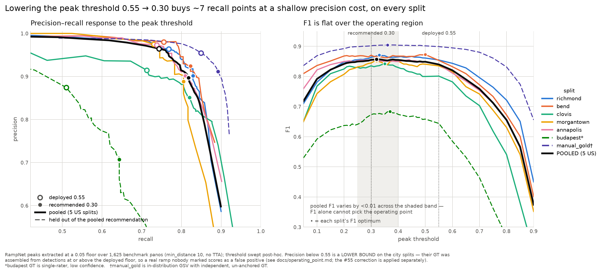
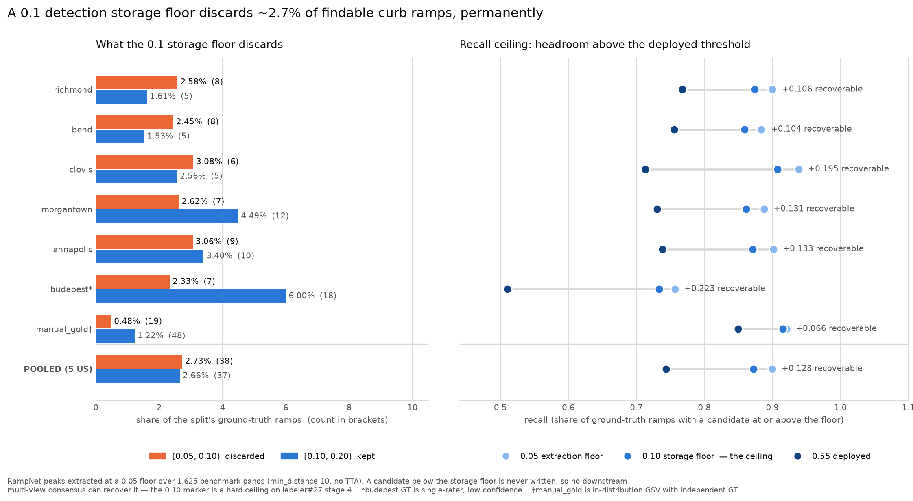
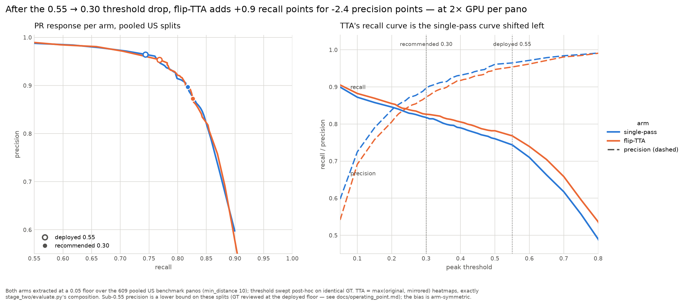

# The deployment operating point: how low should the peak threshold go?

RampNet's deployed operating point is peak extraction at `threshold_abs = 0.55`,
`min_distance = 10`. Until this analysis it had **never been characterised below 0.55** —
the committed benchmark detections stop there, so every published precision/recall number
describes one point on a curve nobody had drawn.

This document draws it, on all nine benchmark splits, and recommends a number. It is
issue [#54](https://github.com/ProjectSidewalk/RampNet/issues/54); the ground-truth
correction it depends on is [#55](https://github.com/ProjectSidewalk/RampNet/issues/55);
the deployment consumer is
[sidewalk-auto-labeler#20](https://github.com/ProjectSidewalk/sidewalk-auto-labeler/issues/20)
and the multi-view consumer is
[labeler#27](https://github.com/ProjectSidewalk/sidewalk-auto-labeler/issues/27) stage 4.

**Headline:** lowering the threshold from 0.55 to **0.30** buys **+7.1 recall points** pooled
(+4 to +11 per split) at a shallow GT-completeness-corrected precision cost, while detection
density rises only from 1.86 to 2.23 per pano. Recall is RampNet's weak metric everywhere,
and this is the cheapest lever that exists — one constant, no retraining. (These are the
seven-US-split pooled numbers after gainesville joined the benchmark, 2026-07-30; the
six-split analysis read +6.9 / −4.2-corrected, the original five-split one +7.7 / −4.8, and
every iteration reached the same recommendation. The corrected precision figure for the
seven-split pool is **pending gainesville's #55 tagging pass** — its 34-item queue is in
flight; until it lands, the corrected tables below quote the six-split pool and say so.
paterson is the one split the lever barely helps; gainesville is its mirror — same deployed
recall, but its misses fire sub-threshold, so 0.30 buys it +9.9 points — see the per-split
rows and the recall-ceiling section.)

## How the numbers were produced

One inference pass per pano, extracting *every* heatmap peak down to a 0.05 floor (keeping
`min_distance = 10`) and carrying each peak's height as its confidence; the threshold is
then swept post-hoc on CPU. So a single GPU run supports every operating point rather than
one run per threshold.

- Extraction: `scripts/analysis/operating_point_curve.py extract`, launched on Hyak by
  `scripts/analysis/run_low_floor_extract.slurm` (one L40S, ~45 min for all 1,984 panos; a
  single added split is ~5 min, and the launcher skips splits already cached).
- Analysis: `scripts/analysis/low_floor_sweep.py` (`parity`, `sweep`, `hist`, `gtbias`,
  `distance`, `tagcheck`) — **CPU-only**, reading the cached detections, so every number
  below re-derives without a GPU.
- Preprocessing replicates the deployment path exactly: PIL RGB → resize 2048×4096 bilinear
  → ImageNet normalisation → `peak_local_max`, **no TTA**.

`min_distance` stays at 10 and is not a lever: #25 found 10→3 buys ~0.5 recall points and
costs precision, and `peak_nms_check.py` (#62) showed no suppression radius separates real
adjacent ramp pairs from the rare duplicate. paterson may yet earn a split-specific
exception — its reviewer documented corners carrying *paired* tactile indicators and its
recall ceiling is far below every other US split — but that re-check has not been run; see
"What would change this".

### The parity gate

Peaks at ≥ 0.55 must reproduce each split's committed `records.jsonl`, or the sweep inherits
a preprocessing divergence. Bit-exactness is the wrong bar, so displacement is measured in
**match radii (R)** — the unit the scorer works in — and the gate asks whether any drift
could change a scoring outcome.

| split | records | cache | identical cell | within 0.5 R | max displacement |
|---|---|---|---|---|---|
| richmond | 267 | 267 | 100.0% | 100.0% | 0.000 R |
| clovis | 164 | 164 | 100.0% | 100.0% | 0.000 R |
| morgantown | 209 | 209 | 100.0% | 100.0% | 0.000 R |
| annapolis | 227 | 227 | 100.0% | 100.0% | 0.000 R |
| budapest_district5 | 189 | 189 | 100.0% | 100.0% | 0.000 R |
| bend | 265 | 257 | 79.0% | 98.4% | 0.439 R |
| paterson | 284 | 281 | 81.1% | 96.8% | 0.439 R |
| gainesville | 205 | 197 | 76.6% | 95.4% | 0.439 R |
| manual_gold † | 3610 | 3487 | 80.9% | 99.9% | 0.472 R |

**Every Mapillary split reproduces bit-exactly, including on different hardware** (these were
extracted on an L40S; the committed records were not). The three GSV splits are the exceptions
and the reason is structural, not stochastic: the GSV production path assembled tiles into a
**4096×2048 intermediate**, so production fed the model a different resample of the same pano
than these native-res bundles do. The prediction that follows — that Mapillary splits come
back exact and GSV splits jitter within tolerance — has now held three times, each time made
before the split ran: for the four Mapillary splits after bend, for paterson (recorded at its
Phase-1 commit), and for gainesville, whose maximum displacement landed at **0.439 R — the
same value as bend's and paterson's, a third time**, which is what a deterministic resample
difference (rather than noise) predicts.

† `manual_gold` is deliberately **not gated**: its committed detections were exported *with*
horizontal-flip TTA at a 0.05 floor (`benchmark/manual_gold/detections_meta.json`), while
this cache is the no-TTA deployment path. Its row is therefore a **TTA-vs-no-TTA delta**, and
a useful free data point for [#78](https://github.com/ProjectSidewalk/RampNet/issues/78):
TTA yields **3.5% more detections** at ≥0.55 (3610 vs 3487) with 99.9% of them co-located
within half a match radius.

**Carry this caveat for the GSV splits (bend, paterson, gainesville) specifically.** Their ground-truth
points derive from the *production* detections while their predictions here come from the
*native-res* resample, so GT and predictions sit up to 0.44 R apart. That eats into the 1 R
matching tolerance and makes both splits' numbers mildly pessimistic relative to the
Mapillary splits.

## The central bias: sub-0.55 precision is a lower bound, and we can prove it

The benchmark GT for the eight city splits was assembled during a review of RampNet's own
detections *at or above 0.55*. So in exactly the band this sweep opens up, a prediction can
only be credited as a true positive if a human independently flagged that ramp during the
missed-ramp pass. **A real curb ramp nobody marked scores as a false positive.**

This is usually stated as a caveat. It can be measured. Decomposing every true positive by
the origin of the GT point it matched (`low_floor_sweep.py gtbias`):

| confidence | TPs from a reviewed detection | TPs from a missed mark |
|---|---|---|
| 0.0–0.5 | **0** | 37 (richmond) / 32 (bend) / 43 (clovis) |
| 0.5–0.6 | 6 / 15 / 8 | 4 / 6 / 1 |
| 0.6–1.0 | 231 / 233 / 131 | 1 / 3 / 0 |

Below the review floor, **every** true positive comes from a missed mark and none from a
reviewed detection, on every Mapillary split. That is structural, and it has a visible
fingerprint in the calibration curve: pooled P(real) jumps from 0.500 in the 0.45–0.50 bin to
0.805 in 0.50–0.55 — a discontinuity at the review boundary that no property of the model
could produce. The GSV splits add one footnote without weakening the mechanism: 5 of
paterson's 27 sub-0.5 TPs and 8 of gainesville's 52 trace to *reviewed* detections —
production detections whose confidence dipped below 0.5 in the native-res re-extraction, the
same GSV resample jitter the parity gate quantifies — while the rest (22 and 44) come from
missed marks, the usual signature.

### `manual_gold` as a control — and a tension it exposes

`benchmark/manual_gold` was labelled independently of RampNet (1,000 panos, YOLO box centres,
no verdict review), so it carries **no anchoring at any threshold**. It is the natural control.
The comparison supports the *mechanism* but **not** a large aggregate effect, and that is worth
reporting rather than smoothing over.

What it does show — the discontinuity is specific to the anchored splits:

| bin | city splits (anchored) | manual_gold (un-anchored) |
|---|---|---|
| 0.40–0.45 | 0.618 | 0.481 |
| 0.45–0.50 | 0.500 | 0.544 |
| **0.50–0.55** | **0.805** | **0.621** |
| 0.55–0.60 | 0.815 | 0.637 |

The anchored curve leaps at the review floor (+0.305 across it); the un-anchored one steps by
+0.077 and keeps rising smoothly. That is the fingerprint the mechanism predicts. (The leap
was +0.345 on the original five splits; paterson's and gainesville's resample jitter smears a
few reviewed detections across the boundary, which softens the cliff without touching its
cause.)

What it does **not** show is a large aggregate gap:

| band | city splits (anchored) | manual_gold (un-anchored) |
|---|---|---|
| below 0.50 | 0.211 (n = 1295) | 0.208 (n = 1164) |
| 0.50–0.55 | 0.805 (n = **41**) | 0.621 (n = 58) |
| 0.55 and up | 0.964 (n = 1544) | 0.955 (n = 3487) |

Pooled precision below 0.50 is **essentially identical** on anchored and un-anchored GT
(0.211 vs 0.208), and so is precision above 0.55. So although the *direction* of the bias is
certain — an unreviewed real ramp can only be scored as a false positive — this control does
**not** establish that it is large, and the cliff itself rests on only 41 detections in the
0.50–0.55 bin.

Two readings are consistent with this and the control alone cannot separate them: the anchoring
effect is genuinely small in aggregate, or it is real but offset by `manual_gold` being
*in-distribution* GSV from the training cities (which should make RampNet look better there,
pushing the un-anchored numbers up).

**#55's A/B tagging settles it, and the effect is real.** Seven of the eight city splits have
now been spot-checked (jonf, 2026-07-28; paterson 2026-07-29; gainesville's 34-item pass is
tagging in flight): every unmatched prediction in the `[0.25, 0.55)` band was tagged **A** (a
real ramp the GT missed), **B** (a genuine false positive) or **unsure**.

| split | incremental FPs | A | B | unsure | A-rate |
|---|---|---|---|---|---|
| richmond | 29 | 5 | 22 | 2 | 17.2% |
| bend | 24 | 7 | 15 | 2 | 29.2% |
| clovis | 23 | 7 | 13 | 3 | 30.4% |
| morgantown | 30 | 4 | 25 | 1 | 13.3% |
| annapolis | 27 | 6 | 15 | 6 | 22.2% |
| paterson | 10 | 2 | 5 | 3 | 20.0% |
| gainesville | 34 | — | — | — | tagging in flight |
| budapest_district5 | 89 | 23 | 59 | 7 | 25.8% |

paterson produced by far the fewest incremental FPs (10, against 23–30 for the other US
cities) — the same shallow threshold response its sweep row shows, measured a second way.
gainesville is the opposite outlier: **34 items, the largest US queue yet**, the same dense
sub-floor band its 0.890 recall ceiling and floor-hugging deployed FPs show from other angles.

**Pooled over the six US splits tagged so far, 27.0% of the incremental false positives in
`[0.30, 0.55)` were real curb ramps the ground truth had missed.** So the raw curve's precision penalty for
lowering the threshold is materially overstated — by roughly a quarter of the newly-added
false positives — and the aggregate similarity to `manual_gold` above is better explained by
that split's in-distribution advantage than by the bias being small.

Spread is 13%–30% with no obvious ordering by imagery quality (morgantown, the cleanest split,
is lowest; clovis, the softest, is highest), so **do not quote a single cross-split
GT-completeness constant** — apply the per-split correction.

### Why the recall gain, by contrast, is exact — and itself a lower bound

Every additional true positive below 0.55 matches a ramp a reviewer explicitly marked as a
real missed ramp. Those are confirmed ramps, not inferred ones, so the recall gain is not
subject to the bias above.

It is stronger than that. If the GT is missing `K` real ramps (which #55 exists to measure),
completing it would add those ramps to the denominator *and* credit them to the low-threshold
operating point that found them. Writing `a` for the extra TPs gained and `n` for the recall
denominator, the corrected gain `(a+K)/(n+K)` exceeds the measured `a/n` whenever `n > a` —
and here `n` ≈ 2,060 against `a` ≈ 146. **So the measured recall gain understates the true
one.**

Both directions favour lowering the threshold. The measured trade is a worst case.

## Results



Reproduce with `python scripts/analysis/plot_operating_point.py`.

The left panel is the artifact this issue asked for: the precision/recall trade traced out by
sweeping the threshold, one line per split, with the deployed 0.55 point (hollow) and the
recommended 0.30 point (filled) marked on each. The shape is the finding — the curves run
almost flat across the operating region, so recall is bought at a shallow precision cost until
the curve turns down hard somewhere past 0.85 recall.

The right panel is the same sweep read as F1 against threshold, and it is there to make a
negative point: **F1 barely discriminates**. The pooled curve varies by under 0.01 across
0.25–0.55, so "F1-optimal" is not a sufficient reason to pick any particular number, and the
recommendation below rests on the recall-first policy, the density budget and reversibility
instead. Note also how the per-split optima (the dots) cluster in a narrow band while the
*levels* differ a lot — that is the same pattern the per-tier table shows.

### Pooled across the seven US city splits (n = 859 panos)

Wilson 95% intervals in brackets.

| threshold | precision | recall | F1 | detections/pano |
|---|---|---|---|---|
| 0.25 | 0.877 [0.861, 0.891] | 0.805 [0.788, 0.822] | 0.840 | 2.34 |
| 0.30 | 0.900 [0.886, 0.913] | 0.793 [0.775, 0.810] | 0.843 | 2.23 |
| **0.32** | 0.908 [0.894, 0.920] | 0.789 [0.771, 0.806] | **0.844** | 2.20 |
| 0.35 | 0.915 [0.901, 0.927] | 0.780 [0.761, 0.797] | 0.842 | 2.15 |
| 0.40 | 0.933 [0.920, 0.944] | 0.768 [0.750, 0.786] | 0.843 | 2.07 |
| 0.45 | 0.944 [0.932, 0.954] | 0.752 [0.733, 0.770] | 0.837 | 1.99 |
| 0.50 | 0.960 [0.949, 0.968] | 0.738 [0.719, 0.757] | 0.835 | 1.93 |
| **0.55** (deployed) | 0.964 [0.953, 0.972] | 0.722 [0.703, 0.741] | 0.826 | 1.86 |

**F1 is flat.** It varies by under 0.01 across 0.25–0.50 and only drops (to 0.826) at the
deployed 0.55 itself, so F1-optimality alone does not pick an operating point — a finding
worth stating plainly, because "F1-optimal" is the obvious criterion and here it is nearly
uninformative. What *does* move decisively is recall: 0.722 → 0.789 at 0.32, with
**non-overlapping** confidence intervals.

### Per split, 0.55 → 0.32

| split | P@0.55 | R@0.55 | P@0.32 | R@0.32 | ΔR | ΔP | dets/pano | F1-opt |
|---|---|---|---|---|---|---|---|---|
| richmond | 0.964 | 0.768 | 0.911 | 0.829 | +0.061 | −0.052 | 2.15 → 2.57 | 0.33 |
| bend | 0.980 | 0.755 | 0.927 | 0.813 | +0.058 | −0.053 | 2.34 → 2.75 | 0.50 |
| clovis | 0.914 | 0.713 | 0.855 | 0.815 | **+0.103** | −0.060 | 1.31 → 1.61 | 0.35 |
| morgantown | 0.975 | 0.730 | 0.903 | 0.805 | +0.075 | −0.072 | 1.67 → 1.99 | 0.32 |
| annapolis | 0.973 | 0.738 | 0.912 | 0.806 | +0.068 | −0.062 | 1.82 → 2.13 | 0.32 |
| paterson | 0.971 | 0.681 | 0.953 | 0.716 | +0.035 | −0.018 | 2.25 → 2.44 | 0.26 |
| gainesville | 0.948 | 0.673 | 0.867 | 0.768 | +0.096 | −0.081 | 1.58 → 1.98 | 0.38 |
| budapest † | 0.874 | 0.510 | 0.718 | 0.637 | +0.127 | −0.156 | 1.51 → 2.27 | 0.37 |
| manual_gold ‡ | 0.955 | 0.849 | 0.926 | 0.884 | +0.035 | −0.028 | 3.49 → 3.74 | 0.36 |

† Budapest is swept but **held out of the pooled recommendation** (single-rater GT at low
reviewer confidence — see `benchmark/README.md`).
‡ `manual_gold` is likewise held out: in-distribution GSV from the training cities with
independently-labelled GT. It is the control, not a deployment city.

**Clovis is the cheapest place to lower the threshold, not the most expensive.** This
reverses the expectation going in — clovis has the softest imagery (2018 GoPro Fusion) and
the lowest deployed precision, so it looked like the binding constraint. It gains **+10.3
recall points for −6.0 precision**, the best ratio of any US split.

**paterson is the other end of the same axis: the split the lever barely helps.** +3.5 recall
points at 0.32 — half of any other US split — at the smallest precision cost (−1.8). Its
misses are not under-confident detections waiting below the threshold; most produce no
candidate at any confidence (recall ceiling 0.757 at the 0.05 extraction floor, against
0.87–0.94 for the other US splits — see the storage-floor section). The reviewer's notes name
the likely populations: paired tactile indicators on one corner and far-field ramps
(`benchmark/paterson/verdicts.json`). Threshold tuning cannot reach either.

**gainesville is paterson's mirror, and together they decompose the far-domain recall
deficit.** Same deployed recall (0.673 vs 0.681 on the extraction cache; 0.647 vs 0.650 on
the committed unbiased GT), but gainesville's ceiling is **0.890** — squarely in the normal
US band — so its misses *do* produce candidates, just under-confident ones. The lever
paterson can't use is exactly the one gainesville rewards most among far-domain splits:
+9.6 recall points at 0.32 (second only to clovis), and its per-split F1 optimum (0.38) is
the highest of any US split, sitting *above* the recommended 0.30 because its dense sub-floor
band charges more precision per threshold step (see its #55 row: 34 incremental FPs, the
largest US queue). Its reviewer-documented miss populations — debris-covered ramps and
far-field ramps (`benchmark/gainesville/verdicts.json`) — evidently attenuate confidence
rather than silence the model, where paterson's paired-TSI partners never fire at all.

### Per imagery tier

Tiers are assigned **per pano** from `camera_make`/`camera_model`, not per split — richmond
alone mixes iSTAR Pulsar and GoPro Max, so split-level grouping would smear the camera effect.

| tier | n | F1-opt | ΔR at 0.32 | ΔP at 0.32 |
|---|---|---|---|---|
| action cam, modern (GoPro Max) | 158 | 0.32 | +0.073 | −0.068 |
| action cam, legacy (GoPro Fusion 2018) | 125 | 0.35 | +0.103 | −0.060 |
| survey-grade (Trimble MX7) | 125 | 0.32 | +0.068 | −0.062 |
| pro 360 (iSTAR Pulsar) | 77 | 0.34 | +0.063 | −0.051 |
| Google Street View (bend + paterson + gainesville) | 360 | 0.26 | +0.059 | −0.049 |

**The tier optima cluster at 0.26–0.35, which argues against per-tier thresholds.** All five
tiers now agree within 0.09 despite spanning a 2018 action camera, a survey-grade vehicle rig
and two GSV cities. That convergence is the useful result: imagery quality moves the *level*
of precision but not the *location* of the optimum.

**The GSV outlier is resolved — it was bend's in-domain-ness, not GSV.** On the original five
splits, GSV sat alone at an F1-optimum of 0.50, but three confounds were flagged: a single
split (bend, n=110), bend being a Stage-2 **training** city, and the GSV resample caveat.
paterson was added as the second GSV city precisely to separate them (2026-07-29), and the
answer is unambiguous: with paterson pooled in, the GSV tier's optimum moved from 0.50 to
**0.26**, into (indeed past) the cluster. An in-domain model is confident enough on its own
training city that raising the threshold costs it little — that was bend's 0.50, and it says
nothing about GSV imagery. Deployment cities should not inherit it.

### Where the recall gain lands on the distance axis

`benchmark/README.md` establishes that RampNet's misses skew far-field, which is the case for
multi-view fusion (labeler#27). If lowering the threshold only recovered near ramps, the two
levers would overlap. It does not:

| band | mean ΔR across the 7 US splits | ramps gained |
|---|---|---|
| near (<12.5 m) | +0.062 | 55 |
| mid (12.5–25 m) | +0.082 | 63 |
| far (>25 m) | +0.085 | 27 |

**The gain is essentially uniform across distance**, so the threshold lever and the
multi-view lever are largely independent and **stack**. (paterson tilts the far band up
slightly — its largest per-band gain is far, +0.091; gainesville gains +0.122 mid and
+0.120 far.) Far-field recall stays poor even after the drop (bend 0.214, clovis 0.389,
annapolis 0.490 at 0.32; paterson 0.523 and gainesville 0.420 at 0.30 — gainesville's
far band is the worst in the benchmark at the deployed threshold, 0.300), so multi-view
remains necessary — lowering the threshold does not substitute for it.

Distances are the flat-ground estimate (camera height 2.5 m assumed), monotonic in `y`, so the
band ordering is a rank statement; only the metre labels depend on the assumption.

### Density: this is not recall-by-carpet

`docs/model_comparison.md` establishes that an open detector's apparent recall is largely
density — OWLv2 reaches its recall at **55–88 boxes/pano**. The obvious objection to lowering
RampNet's threshold is that it buys recall the same cheap way. It does not: pooled density goes
**1.86 → 2.23 detections/pano** at the recommended 0.30 (2.20 at 0.32, 2.15 at 0.35). That is a
20% increase in review burden for a 10% relative increase in recall, and it leaves RampNet
roughly **25–40× sparser** than the open detectors at their operating points.

### Corrected results (#55 applied)

Crediting confirmed A tags moves them from false positives to true positives, in **both** the
precision and recall denominators — correcting precision alone would report a corrected P
against an uncorrected R. `band hi` additionally credits the `unsure` items, so it is the
honest upper end rather than a formality.

Pooled over the six US splits tagged so far — **gainesville's 34-item tagging pass is in
flight, and this whole section (pooled rows, per-split table, and the recommendation
re-check) will be re-derived when it lands.** Its raw pooled row is in the seven-split table
above; nothing below includes it yet:

| operating point | raw P | **corrected P** | band hi | raw R | corrected R | corrected F1 |
|---|---|---|---|---|---|---|
| 0.25 | 0.884 | 0.903 | 0.914 | 0.806 | 0.810 | 0.854 |
| **0.30** | 0.907 | **0.924** | 0.934 | 0.796 | 0.799 | **0.857** |
| 0.35 | 0.922 | 0.935 | 0.941 | 0.782 | 0.784 | 0.853 |
| 0.55 (deployed) | 0.966 | — † | — | 0.730 | — | 0.831 |

† No correction applies at 0.55: the incremental band is empty by construction. Its precision
is not immune to GT incompleteness, but with only 46 pooled false positives there the effect is
small.

Per split at 0.30:

| split | raw P | corrected P | band hi | corrected R | corrected F1 |
|---|---|---|---|---|---|
| richmond | 0.902 | 0.919 | 0.930 | 0.832 | 0.873 |
| bend | 0.924 | 0.942 | 0.948 | 0.825 | 0.880 |
| clovis | 0.851 | **0.883** | 0.899 | 0.826 | 0.853 |
| morgantown | 0.888 | 0.905 | 0.909 | 0.808 | 0.854 |
| annapolis | 0.902 | 0.920 | 0.939 | 0.813 | 0.863 |
| paterson | 0.950 | 0.957 | 0.963 | 0.720 | 0.822 |
| budapest ‡ | 0.707 | 0.762 | 0.777 | 0.660 | 0.707 |

‡ excluded from the pooled row and the recommendation.

**The correction changed the answer.** On raw numbers the F1 optimum sat at 0.32 and the
conservative choice was 0.35; with the GT completeness correction applied, corrected F1 peaks
at **0.30** and corrected precision there is **0.924** pooled — higher than the *raw* precision
at 0.35. That is precisely what #55 existed to determine, and it moved the recommendation down.
(This held unchanged when paterson joined the pool: corrected F1 0.857 at 0.30 against 0.854
at 0.25 and 0.853 at 0.35.)

**Caveat on 3 of the A tags** (1 each in clovis, morgantown, budapest): they sit within 2 match
radii of an already-detected ramp, so they are more likely a second hit on one ramp than a ramp
the GT missed. The tooling flags these rather than hiding them; removing all three from the US
pool changes pooled corrected precision by under 0.002.

### The storage floor and the recall ceiling (labeler#28, labeler#27 stage 4)

The submission threshold this document recommends is a *policy* choice and reversible. The
labeler's **storage floor** (`DETECTION_STORAGE_FLOOR = 0.1`, with a top-50 per-pano cap;
labeler#28) is neither: a peak below it is never written, so no downstream consensus policy
can ever promote it. That makes it worth checking directly rather than assuming.



Reproduce with `python scripts/analysis/low_floor_sweep.py floor` and
`python scripts/analysis/plot_storage_floor.py`.

**What a 0.1 floor costs.** Counting ground-truth ramps whose *best* candidate falls in
`[0.05, 0.10)` — i.e. ramps that a 0.1 floor makes permanently unrecoverable:

| split | GT ramps | best candidate in [0.05, 0.10) | share |
|---|---|---|---|
| richmond | 310 | 8 | 2.58% |
| bend | 327 | 8 | 2.45% |
| clovis | 195 | 6 | 3.08% |
| morgantown | 267 | 7 | 2.62% |
| annapolis | 294 | 9 | 3.06% |
| paterson | 395 | 1 | 0.25% |
| gainesville | 272 | 6 | 2.21% |
| **POOLED (7 US)** | **2060** | **45** | **2.18%** |
| budapest | 300 | 7 | 2.33% |
| manual_gold | 3919 | 19 | 0.48% |

paterson is the outlier at 0.25%, and not in a comforting way: its missed ramps are not
sitting just under the floor waiting to be stored — they produce no candidate at any
confidence. Its ceiling at the 0.05 extraction floor is **0.757**, against 0.88–0.94 for
every other US split, so for paterson the storage-floor question is nearly moot and the
recall problem lives in detection itself (see its per-split note above).

**The recall ceiling.** The share of GT ramps with *any* candidate at or above a floor —
the hard upper bound on what multi-view consensus can ever recover:

| | pooled (7 US) |
|---|---|
| recall at the deployed 0.55 | 0.722 |
| recall at the recommended 0.30 | 0.793 |
| **ceiling at the 0.10 storage floor** | **0.849** |
| ceiling at the 0.05 extraction floor | 0.871 |

So labeler#27 stage 4 has **+12.7 recall points** of headroom above the deployed threshold to
work with, and **+5.6 points** above the operating point recommended here — but it is capped
at 0.849 by the storage floor, not by the 0.871 the model actually produces.

**The verdict: lower the storage floor from 0.10 to 0.05.** The floor's own stated
justification (labeler#28) is that storing too little is irreversible while storing too much
only costs disk, bounded by the top-K cap. That argument survives contact with the data, and
the data says 0.1 is not where the bound should sit:

- **The cap never binds.** At the 0.1 floor the busiest pano in the entire benchmark holds
  **14** candidates against a cap of 50; medians are 2–5. At a 0.05 floor the maximum is still
  **14** (re-verified with paterson and gainesville included). The top-50 cap is not the
  volume bound — the floor is, and it is doing work nobody asked it to do.
- **The cost is ~2.2% of findable ramps** (2.2–3.1% on every US split except paterson),
  permanently, for a volume saving of roughly one extra candidate per pano.
- **The recovered ramps are exactly the population multi-view fusion is for.** They are
  ramps too faint to clear any single-view threshold, which is the case stage 4 exists to
  handle.

This is a labeler-side change and belongs in that repo; it is recorded here because this is
where the measurement lives.

## The deployment constraint is not what it was assumed to be

It is widely assumed that Project Sidewalk gates AI label submissions on
`ai-validation-min-accuracy` (0.92). **It does not.** In `AiController.submitAiLabel`,
submission is gated by an internal API key plus the boolean per-city
`ai-label-submission-enabled` flag — there is **no accuracy threshold on that path at all**.
The 0.92 belongs to a different subsystem (the DINOv2 *validator* scoring existing labels) and
never touches the auto-labeler.

Two consequences:

1. **No hard floor blocks a lower operating point.** The constraint is a policy judgment about
   review burden, not a gate.
2. **The change is reversible.** `ExploreService.submitAiLabelData` persists each label's
   `confidence` into `label_ai_info`, so anything submitted at a lower threshold can be
   re-thresholded server-side later. The asymmetry that matters — a ramp never submitted is
   invisible forever, a low-confidence one that was submitted can always be filtered — points
   the same way as the recall-first policy.

## Recommendation

**Adopt a single uniform threshold of 0.30**, replacing 0.55.

| | at 0.55 (deployed) | at 0.30 |
|---|---|---|
| pooled precision | 0.966 | **0.924** corrected (0.907 raw, 0.934 band high) |
| pooled recall | 0.730 | **0.799** corrected (0.796 raw) |
| pooled F1 | 0.831 | **0.857** corrected |
| detections/pano | 1.91 | 2.27 |

**+6.9 recall points for −4.2 precision points, at 0.36 more detections per pano.**

*Status note (2026-07-30): the corrected values in this section quote the **six-US-split**
pool — gainesville joined the benchmark today and its #55 tagging pass (34 items, the input
the correction needs) is in flight. On raw seven-split numbers the picture is unchanged
(pooled F1-max 0.844 at 0.32, flat band 0.25–0.40; see the pooled table above). The
corrected re-derivation, and this recommendation's re-check against it, land with the tags.*

Why 0.30:

- It is the **corrected** F1 optimum, computed after applying #55's per-split A/B tagging
  rather than from the raw curve that the anchoring bias distorts.
- Corrected precision stays **≥0.88 on every US split** and 0.924 pooled — above the 0.92 bar
  the project uses elsewhere for AI assertions once the `band high` (0.934) is taken into
  account, and comfortably clear of anything that reads as a quality regression.
- Recall is RampNet's weak metric on **every** split, precision is not. Under the recall-first
  policy — a false negative is a permanent hole in the inventory, a false positive is a cheap
  human review — this is the right side of a flat trade.
- Density stays sparse (2.27/pano), so the recall is not bought by carpeting the image.
- The change is **reversible**: per-label confidence is stored server-side, so anything
  submitted at 0.30 can be filtered later.

**If a more conservative first move is wanted, 0.35** gives corrected P 0.935 / R 0.784 and
gives up 1.5 recall points. Both are inside the flat region; 0.30 is the recall-first choice
and 0.35 the precision-first one. I recommend 0.30.

**Clovis is the one split to watch**: corrected precision 0.883 at 0.30 (band high 0.899)
against 0.914 deployed — the only US split that gives up meaningfully more than it does
elsewhere. It is also the split with the largest recall gain (+10.3 points) and the highest
A-rate (30%), so the trade is still favourable; but if per-city tuning is ever introduced,
clovis-like imagery (2018-era GoPro Fusion) is where it would start.

**Not per-tier**, and the case is stronger than it was: the one apparent exception (GSV at
0.50 on bend alone) dissolved when the second GSV split landed — with paterson and now
gainesville pooled in, the GSV tier's optimum is 0.26 and all five tiers sit inside
0.26–0.35. A per-tier policy would be fitting noise.

**paterson is a watch item of a different kind than clovis.** The threshold costs it almost
nothing (corrected P 0.957 at 0.30, the highest of any split) but also buys it the least
(+3.8 recall points), because its misses — paired tactile indicators and far-field ramps —
mostly produce no candidate at any confidence (recall ceiling 0.757). No threshold policy
addresses that; the candidate levers are the paterson-specific NMS check below and multi-view
fusion.

**gainesville is the newest watch item, and it pulls the other way.** It is the split the
lever helps most among the far-domain cities (+9.6 points at 0.32) but also the one whose
raw precision at 0.30 is the lowest of any US split (0.857), with the densest sub-floor FP
band (34 #55 items). Its per-split F1 optimum (0.38) is the only US one *above* the
recommended 0.30. Whether its corrected precision lands clear of the clovis line depends on
its A-rate — pending the tagging pass. If it comes back low (most of the 34 are genuine
FPs), gainesville replaces clovis as the binding constraint on how low the uniform
threshold should sit.

**Budapest is excluded from this recommendation** and should get its own decision. It is the
one split where lowering costs about as much precision as it buys recall, and its GT is
single-rater at low reviewer confidence. Nothing here transfers to non-US infrastructure
without a rubric written for it.

### Honest limits on this number

- **It is tuned on the benchmark.** There is no separate validation split, so 0.30 is an
  optimistic estimate of what threshold tuning buys. The mitigation is that the F1 curve is
  flat — anything in 0.25–0.40 performs within noise, so the *choice* is robust even if the
  *argmax* is not.
- **The correction rests on one rater**, the same person who produced the GT. A second rater on
  the A/B tags would tighten it, and is the same ask already outstanding for budapest.
- **`unsure` items are not credited** in the corrected column, only in `band high`. Pooled that
  is 14 items — the gap between 0.917 and 0.928.

### What would change this

- ~~**A second GSV split**, which would show whether bend's 0.50 optimum is GSV or
  in-domain-ness.~~ — added (paterson, 2026-07-29), and it answered: the GSV tier optimum
  moved 0.50 → 0.26, so bend's outlier was in-domain-ness. See the per-tier section. A third
  GSV split (gainesville, 2026-07-30) then held the tier optimum at 0.26 and decomposed the
  far-domain recall deficit into two mechanisms — never-fires (paterson) vs fires-weakly
  (gainesville) — of which only the second is threshold-addressable.
- **A paterson `min_distance` re-check (#62-adjacent).** paterson's reviewer documented
  corners carrying two tactile indicators nearly side by side, and its recall ceiling (0.757
  at the 0.05 floor) says its misses never become candidates. If the paired indicators sit
  within `peak_local_max`'s `min_distance=10` on the 512×1024 heatmap, the partner peak is
  being *suppressed*, not missed — a cheap re-extraction of this one split at
  `min_distance=3` would separate "NMS-suppressed" from "never fired". #62 found no global
  benefit to shrinking the radius, but paterson is the first split with a documented
  population of real adjacent pairs, which is exactly the case #62 lacked.
- **Multi-view fusion** (labeler#27), which changes the question from "what threshold for a
  single view" to "what threshold for promotion given k agreeing views" — a lower number, since
  consensus supplies the precision the threshold currently has to.
- ~~**Flip-TTA at the deployment point** (#78)~~ — measured; see the next section. It does not
  change the recommendation.
- **Training-time augmentation** (#82). The recipe's only augmentation is the horizontal flip
  whose test-time twin #78 just found saturated; yaw-roll and photometric jitter are untried and
  target the cross-city recall spread directly. A model with better transfer would move this
  threshold, since 0.30 is partly compensating for out-of-domain under-confidence.

## Flip-TTA at the operating points (#78): measured, and not worth 2× GPU

The paper's committed evaluation ran with horizontal-flip test-time augmentation
(`stage_two/evaluate.py` maxes the original and mirrored heatmaps) while the deployed detector
is single-pass — a configuration mismatch tracked since sidewalk-auto-labeler#3, with the
evaluated-vs-deployed delta never measured. It is now measured, on this document's own
extraction: a second `extract --tta` arm (two passes per pano, mirrored heatmap un-flipped and
maxed with the original — numerically identical to `evaluate.py`'s composition) swept on the
identical grid and GT as the single-pass arm. `manual_gold` needed no GPU pass at all: its
committed detections *are* a TTA export at the 0.05 floor
(`benchmark/manual_gold/detections_meta.json`), so its records supplied that arm directly.



*Scope note: the TTA arm was extracted before paterson and gainesville joined the benchmark,
so every number in this section pools the original **five** US splits. Neither newer split's
TTA arm has been run, deliberately — #78 is closed as not-worth-2×-GPU; paterson's recall
deficit is a no-candidate problem (ceiling 0.757), which max-combine TTA is structurally the
wrong lever for, and gainesville's under-confident misses are already addressed by the
cheaper threshold lever. If #78 is ever reopened, extract both arms rather than
extrapolating.*

**Pooled over the five US splits (n = 609 panos):**

| | single 0.55 | TTA 0.55 | single 0.30 | TTA 0.30 |
|---|---|---|---|---|
| precision | 0.965 | 0.954 | 0.897 | 0.873 |
| recall | 0.744 | 0.768 | 0.818 | 0.826 |
| F1 | 0.840 | 0.851 | 0.855 | 0.849 |
| detections/pano | 1.85 | 1.93 | 2.23 | 2.32 |

AP: 0.870 single vs 0.874 TTA (+0.004 pooled; per split it spans **−0.012** on annapolis to
+0.014 on morgantown — TTA does not reliably improve even the full curve out of domain).

The lever ledger, all measured from single-pass @ 0.55 (pooled):

| lever | ΔR | ΔP | ΔF1 | dets/pano |
|---|---|---|---|---|
| threshold drop alone (0.55 → 0.30) | **+0.074** | −0.068 | +0.016 | 2.23 |
| TTA alone (at 0.55) | +0.024 | −0.011 | +0.011 | 1.93 |
| both | +0.083 | −0.092 | +0.009 | 2.32 |
| **TTA after the drop (at 0.30)** | **+0.009** | **−0.024** | **−0.007** | 2.32 |

Three findings:

1. **TTA is a mild threshold-lowering in disguise.** Its recall curve is the single-pass curve
   shifted left (right panel of the figure) — both levers promote under-confident detections,
   so their gains overlap almost completely. At the deployed 0.55, TTA looks attractive
   (+2.4 recall points for −1.1 precision); once the threshold drops to 0.30, the marginal
   value collapses to **+0.9 recall points for −2.4 precision points, and F1 goes down** on
   four of the five US splits (per-split marginal ΔR: richmond +0.013, bend +0.009, clovis
   +0.010, morgantown +0.007, annapolis **+0.003**). The threshold change is free; TTA costs
   2× GPU per pano and buys a strictly worse trade on top of it.
2. **In-domain is the exception.** On `manual_gold` (in-distribution GSV), TTA keeps most of
   its value after the drop: marginal +0.019 R at −0.015 P, and AP 0.904 → 0.917 — the one
   split where the full curve clearly improves. So the paper's use of TTA for the gold-set
   evaluation was a reasonable in-domain choice; it just doesn't transfer to deployment
   imagery, where the flip mostly promotes noise at the margin.
3. **The configuration mismatch is now quantified and closed.** At the deployed 0.55, the
   TTA-evaluated configuration reads **+2.4 recall points higher (pooled US; +2.3 on
   manual_gold)** than what the single-pass deployment actually delivers. Any comparison of
   committed evaluation numbers against deployed GT measurements should apply that delta;
   sidewalk-auto-labeler#3's open half is answered.

### Why the mechanism produces exactly this result

Two properties of the setup explain both halves of the finding, and neither is specific to this
benchmark — so the same reasoning should be applied before anyone proposes flip-TTA again:

- **Max-combine can only *add* detections.** The composition is elementwise `np.maximum`
  (`stage_two/evaluate.py:191`, mirrored in `operating_point_curve.compose_tta`) — not an
  average. The TTA heatmap is therefore **pointwise ≥** the single-pass heatmap everywhere, so
  at a fixed threshold TTA can promote a detection but can never suppress one. That is the
  mechanical reason it behaves as a threshold change rather than merely correlating with one:
  the two levers are the same *kind* of operation, both trading precision for recall by
  admitting weaker evidence. (An *averaging* TTA would instead be a variance reducer and could
  remove false positives too. That is not what the paper used, and not what these numbers
  measure — it is a separate, untested design.)
- **The model was already trained to be flip-invariant.** `stage_two/train.py:202-207` applies
  random horizontal flip at p = 0.5, relabelling `x → 1 − x`; the crop models do the same
  (`stage_one/crop_model/*/train.py:71`). Test-time flipping can therefore only exploit the
  asymmetry that training-time flipping failed to remove — a **small gain is the expected
  outcome, not an anomaly**. Read the other way, the marginal TTA gain measures how much the
  two views still disagree in a way that matters at the operating point, and at ≤1.3 recall
  points per US split the answer is: barely. The training augmentation worked.

The second point also bounds what the *rest* of the augmentation family is worth here, because
that horizontal flip is the **only** augmentation in the recipe — the input transform is
`Resize → ToTensor → Normalize` (`train.py:224-229`), with no photometric, scale, or other
geometric variation. #78 says the one invariance that was trained for is saturated; it says
nothing about the ones that were never trained for. #82 takes that up (yaw-roll and photometric
jitter, the two augmentations that are both legal on an equirectangular projection and untried).

**Decision: no production TTA knob is filed in sidewalk-auto-labeler — deliberately.** The #78
plan was to file it only if TTA won meaningfully at the chosen operating point. It does not:
at 0.30 the marginal recall is ≤1.3 points on every US split for double the GPU cost and a
precision trade worse than what the free threshold change already made. This negative result is
the record of why. The 0.30 single-pass recommendation above is unchanged.

Caveat, same shape as everything sub-0.55 here: the #55 GT-completeness bias applies to *both*
arms, so it mostly cancels in the deltas — but not exactly. The TTA arm's extra low-confidence
detections are precisely the faint kind the GT never audited, so the measured marginal
**precision** cost is, if anything, overstated. The marginal **recall** gain is exact (the GT
denominator is fixed), and it alone is too small to price 2× GPU against.

## For labeler#27 stage 4: the promotion floor

Stage 4 wants the confidence at which a single-view detection is trustworthy enough to promote
on multi-view consensus, taken from GT-true vs GT-false histograms. Those are in
`analysis_out/op/confidence_calibration.{json,csv}` per split and pooled, with Wilson intervals.

**The measured single-view crossover is ≈0.40–0.45, on both anchored and un-anchored GT.** On
the seven US city splits pooled, P(real) first exceeds 0.5 in the 0.40–0.45 bin (0.618) and
sits exactly at it in 0.45–0.50 (0.500) — it is noisy at these bin sizes. On `manual_gold`,
whose GT carries no anchoring, the curve is smooth and crosses cleanly in the 0.45–0.50 bin
(0.544, against 0.481 just below).

Worth being precise about the direction, because it is easy to get backwards: the anchored
splits *under-credit* real ramps below 0.55, so their crossover is if anything an
**over**-estimate of where real detections stop dominating — yet the un-anchored control lands
at essentially the same place or slightly higher. So there is no evidence here for a
dramatically lower crossover, and the two GT regimes agreeing is the more useful result than
either number alone.

Caveat in the other direction: `manual_gold` is in-distribution GSV from the training cities,
so it is optimistic for out-of-distribution deployment.

**The promotion floor should nonetheless sit below this crossover**, and that is reasoning
rather than measurement: the crossover is where a *single* view stops being more likely right
than wrong, whereas stage 4 accepts a detection only when *k* views independently agree on a
ground location. Consensus supplies evidence a single view lacks, so the break-even confidence
under agreement is lower. How much lower is not answerable from per-pano data — the benchmark
bundles are thinned to 30 m spacing precisely so no physical ramp appears twice, so nothing
here measures view agreement. That is stage 3's own GT to produce.

## Reproducing

Adding a **new** city to the benchmark re-opens most of this document — pooled numbers, the
per-tier table, the correction and both figures all move. The end-to-end protocol, including
which of these commands to re-run and which documents to update, is
[`docs/adding_a_benchmark_city.md`](adding_a_benchmark_city.md).

```bash
# GPU, once (Hyak): writes analysis_out/op_cache/<split>.json
# From a non-interactive shell, PYTHON= is required (the conda fallback needs a login shell);
# CITIES=<split> limits the run to a newly added city.
CITIES=<split> PYTHON=<interpreter> sbatch -A <account> scripts/analysis/run_low_floor_extract.slurm

# GPU — the flip-TTA arm (#78); local RTX 3070 sufficed (~10 s/pano, fp32).
# Its own cache dir is mandatory: mixing arms in one dir is refused.
python scripts/analysis/operating_point_curve.py extract --tta \
    --cache analysis_out/op_cache_tta \
    --cities richmond,bend,clovis,morgantown,annapolis,budapest_district5

# CPU, everything else
python scripts/analysis/low_floor_sweep.py parity     # the gate — run this first
python scripts/analysis/low_floor_sweep.py sweep      # per-split + pooled + per-tier
python scripts/analysis/low_floor_sweep.py hist       # calibration for labeler#27
python scripts/analysis/low_floor_sweep.py gtbias     # the anchoring measurement
python scripts/analysis/low_floor_sweep.py distance   # where the recall gain lands
python scripts/analysis/low_floor_sweep.py tagcheck   # #55 tags still resolve
python scripts/analysis/low_floor_sweep.py tta        # flip-TTA vs single-pass (#78)
python scripts/analysis/plot_tta.py                   # regenerates the #78 figure
```
