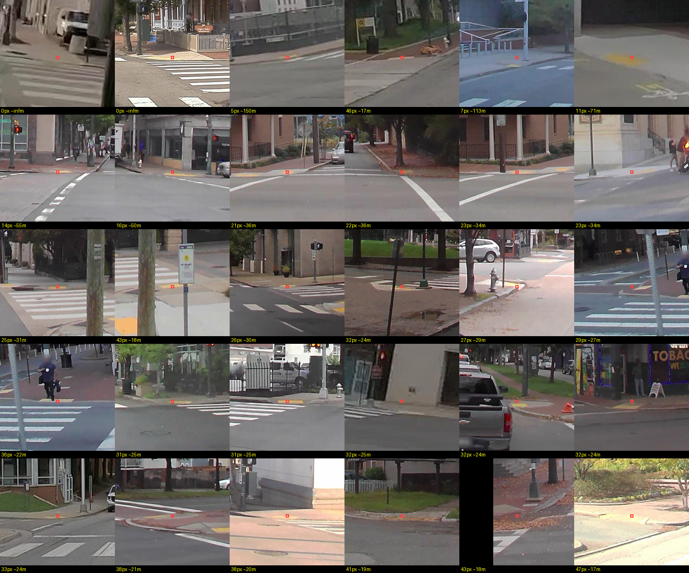
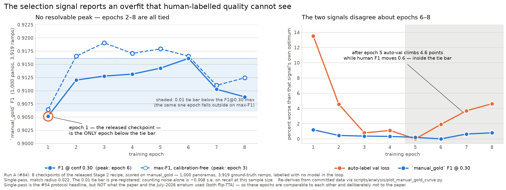

# RampNet 1.0: an internal report

**Status: draft, written 2026-09-21 against `main` at `081bde0`.** This is the lab's own account
of RampNet 1.0: what we built for the ICCV'25 workshop paper, what we measured about it in the
fourteen months after publication, what we got wrong and corrected, and what that says about
RampNet 2.0. It is written for the team and for anyone reading this repository, not for peer
review; the paper is [arXiv:2508.09415](https://arxiv.org/abs/2508.09415), and the RampNet 2.0
work is what we intend to publish next.

Every number here is re-read from a committed document, and every section names that document.
The one-line-per-result index, with the caveat each number carries, is
[`rampnet1_findings.md`](rampnet1_findings.md). If this report and that page ever disagree,
the page is wrong more recently and should be fixed first.

## Contents

1. [Summary](#1-summary)
2. [Motivation](#2-motivation)
3. [Related work, as of the paper and as of now](#3-related-work-as-of-the-paper-and-as-of-now)
4. [What differentiates RampNet](#4-what-differentiates-rampnet)
5. [Method](#5-method)
6. [Findings](#6-findings)
7. [What we withdrew or corrected](#7-what-we-withdrew-or-corrected)
8. [Limitations and open items](#8-limitations-and-open-items)
9. [RampNet 2.0](#9-rampnet-20)
10. [Cost](#10-cost)
11. [Reproducibility](#11-reproducibility)

## 1. Summary

RampNet 1.0 is a two-stage pipeline. Stage 1 turns open government curb-ramp inventories into
pixel-level labels on Google Street View panoramas, producing 214,376 labelled panoramas with
849,895 curb ramp points from three cities. Stage 2 trains a ConvNeXt V2 keypoint-heatmap
detector on that dataset. The paper reported the dataset at 94.0% precision and 92.5% recall
against a hand-labelled gold set, and the detector at 0.9236 AP.

What we know now that we did not know at publication:

- **The paper's evaluation protocol was lenient.** Under standard one-to-one matching the released
  model scores precision 0.949, recall 0.873 and AP 0.9205 on the same gold set, not 0.938 /
  0.935 / 0.9236. The comparison with prior work is unaffected.
- **RampNet beats every off-the-shelf model we tried, on every split.** Against nine zero-shot
  models (chat VLMs, a pointing model and two open-vocabulary detectors) across twelve benchmark
  bundles in three countries and four camera rigs, RampNet leads the best of them by 0.11 to
  0.34 F1, and by 0.22 F1 pooled over the eight US city splits.
- **RampNet beats a supervised YOLO trained on the same data by much less than we first said.**
  The first comparison read 0.252 F1. At matched operating points it is 0.039, and with three
  YOLO seeds against nine RampNet seeds the replicated gap is 0.016 F1, 95% CI [0.008, 0.024].
  The keypoint formulation is a real but small advantage. On the in-distribution gold set the two
  are level.
- **Seed variance is the noise floor of this repository.** RampNet's replicate-to-replicate SD on
  pooled F1 is 0.0094, larger than anything the benchmark alone can resolve. Every single-seed
  comparison we published before September 2026 is bounded by it.
- **The deployed threshold was wrong.** 0.55 was chosen for precision; at 0.30 the model gains
  7.4 recall points for 4.5 precision points, and a quarter of the "false positives" that appear
  in between are real ramps the ground truth had missed. Flip-TTA is not worth its cost outside
  the training distribution.
- **Recall is lost at distance, and the mechanism is the decoder, not the vocabulary.** Recall
  falls from 0.84 near the camera to 0.18 beyond 25 m. Of the misses, 29% are two ramps the
  heatmap merged, 39% fired below threshold, and only 8% of the "silent" remainder show no
  response at all. The recall a bigger training corpus could buy is about 0.013 points.
- **The training recipe has no resolvable optimum.** Epoch 1 (the released checkpoint) is about
  0.01 F1 below a plateau that runs from epoch 2 to 6, after which the model declines. Annealing
  improves the training signal and moves human-labelled F1 by nothing measurable.
- **RampNet is rig-sensitive.** The same rural town photographed with a consumer 360 camera and
  with Google's rig moves RampNet by 0.115 F1; a YOLO trained on the same data moves a third as
  much, and zero-shot models do not move at all.
- **More data of the same kind is not the lever.** New York is 78% of the training records.
  Assessed inventories cannot reach 500,000 records; two million candidate records exist, and
  what limits us is the throughput of judging their coordinate precision, one reviewer-hour per
  city.
- **Two of our own findings were wrong and are withdrawn:** that the model is blind at the
  360° seam, and that Stage 1 drops most labels near it. Both were instrument errors. What
  survives is a 1% label-duplication defect in the published dataset, documented and deliberately
  left in place.

## 2. Motivation

Curb ramps are the single most consequential accessibility feature of a street crossing: without
one, a wheelchair user cannot leave the sidewalk. Cities are required to inventory them, and most
do not have a usable inventory. Deitz, Lobben and Alferez (2021) scored 178 US municipalities on
their open accessibility data; 90% published open street data, 34% had sidewalk data, and 10%
included curb ramps (`curb_ramp_data_sourcing.md` §4, citing the paper's §3.1).

Street-level imagery covers far more of the world than any inventory does, and a detector that
finds curb ramps in it can produce an inventory for any city that has been photographed. Prior
attempts at that detector were limited by training data: crowdsourced labels are incomplete per
image, and hand labelling at the scale a modern detector wants is expensive. The premise of
RampNet 1.0 was that the cities that do publish curb-ramp coordinates have, in effect, already
labelled their street imagery, and that those coordinates can be translated into pixel labels
automatically and at scale.

The broader goal, which RampNet 2.0 inherits, is an AI labeller that finds, tags and rates
accessibility problems at least as well as a human. Curb ramps were the right place to start
because they are a designed object with a fixed vocabulary, and because their severity is
objectively measurable (slope, width, lip height against published standards). Detection is the
first of those three capabilities and this report is about how far it got.

## 3. Related work, as of the paper and as of now

The paper's review (§2 of arXiv:2508.09415) covers the prior curb-ramp detectors and the reasons
none was usable at scale. In brief, as the paper states them (the figures in this section are the
paper's own §2 and are not re-derived anywhere in this repository; Tile2Net is Hosseini et al.,
*Computers, Environment and Urban Systems* 2023):

- **Tohme (Hara et al.)** combined crowdsourcing and computer vision to find curb ramps in GSV,
  reaching recall 67% and precision 26% against manual labels.
- **Project Sidewalk** collects curb-ramp labels from volunteers through a GSV interface at large
  scale, but a user need not label every ramp in a panorama, so the data under-labels each image
  and is a poor detection training set as-is. It is, however, what trained our Stage 1 crop model.
- **Weld et al.** trained a ResNet on crowdsourced labels and reached recall 78.7% and precision
  33.7%. Scored on our gold set, that model reaches 0.3803 AP; RampNet's paper figure is 0.9236.
- **Mapillary Vistas** has a `Curb Cut` class, which the paper rejected as a data source because
  it also covers driveway aprons.
- **Aerial imagery** was set aside in the paper because ramps are small and often occluded from
  above.

Since publication we have measured three of those alternatives directly, and the picture has
sharpened rather than changed:

- **General-purpose vision-language models and open-vocabulary detectors** (Gemini, Claude, Qwen,
  Molmo, OWLv2, Grounding DINO) were benchmarked on the same splits as RampNet. The best of them
  reaches pooled F1 0.575 against RampNet's 0.792 (§6.1). The open-vocabulary detectors' high
  recall is mostly box density: OWLv2 emits about 74 boxes per panorama and matches 73% of
  richmond's ramps by chance alone (`model_comparison.md`, "How much of a detector's recall is
  real?").
- **Mapillary Vistas' curb-cut segmentation**, run at input parity, reaches F1 0.534 on richmond
  against RampNet's 0.855, but out-recalls RampNet (0.884 vs 0.768). The paper's judgement stands
  as a supervision decision; as a baseline the class transfers usefully (§6.8).
- **Aerial detection is in production**, not prospective: Douglas County, Colorado mapped over
  34,000 ramps from one-inch county orthoimagery with an Esri model, and Esri now ships that
  model ([#85](https://github.com/ProjectSidewalk/RampNet/issues/85)). Ramps are about 60 px at
  that resolution and 2 to 5 px in sub-metre imagery, which is why Tile2Net (Hosseini et al.,
  2023) maps sidewalks and crosswalks but has no ramp class. Aerial answers "is there a ramp" for
  cities that fly such imagery; it cannot judge slope, surface or obstruction, which need a
  pedestrian viewpoint. That division of labour is part of the 2.0 case (§9).
- **Metric measurement from GSV** has been demonstrated for sidewalk width by UrbanVGGT (2026),
  at 0.25 m mean error, using the same camera-height scale calibration Stage 1 already relies on
  ([#86](https://github.com/ProjectSidewalk/RampNet/issues/86)). Nobody has published multi-view
  triangulation for curb ramps ([#48](https://github.com/ProjectSidewalk/RampNet/issues/48)).

## 4. What differentiates RampNet

Three things, in decreasing order of how much they turned out to matter.

**The data engine.** Stage 1 is the contribution. It converts a government point inventory into
per-panorama pixel labels without a human in the loop, at 97.91% yield over the panoramas Google
would serve, and its labels agree with hand labels at 0.94 precision as published, 0.92 once redundant
points count as false positives and matching claims the nearest unclaimed ramp (#172), and 0.93 recall. No other curb-ramp dataset of this size exists.
The Stage 1 label recall, stratified by distance, is flatter than the detector's own recall (0.78
at 25 to 40 m against the model's 0.49), so the labels are not the ceiling the detector is hitting
(`data_scaling_59.md` §0). That is an in-distribution result: the gold set is drawn from
the NYC/Portland/Bend test split, so it says nothing about the out-of-distribution failure
vocabularies of §6.10.

**Government coordinates as priors.** Stage 1 consumes the published coordinate only for its
bearing from the panorama; range is computed and discarded. The tolerance is therefore angular,
±18.37°, and a coordinate error of 0.29 m (Denver) costs 0.25% of labels while 1.75 m (Seattle)
costs 8.87% (`location_precision_assessment_96.md` §5g for Denver's tolerance curve, §5l for Seattle's own
measured loss; §5g's curve read at 1.74 m gives 16.5%, because it scales Denver's distribution). That is why "location precision" was the paper's
gate for admitting a city, and why it remains the gate for scaling (§6.10). It is also the
advantage no zero-shot model has: RampNet's training labels come from a source that knows where
the ramps are.

**The keypoint formulation.** Stage 2 predicts a heatmap and reads ramps off as peaks, rather
than boxes. Against a YOLO trained on the same labels at matched operating points the advantage
is real and small, 0.016 F1 [0.008, 0.024] (§6.2), and it is entirely recall. The part of the
published gap that was architecture was a fraction of what we first reported; most of it was
operating-point mismatch and one-seed luck.

## 5. Method

### 5.1 Stage 1: from coordinates to labels

The inputs are three municipal curb-ramp inventories rated "Good" for location precision in the
paper's Table 1: New York City (217,680 records), Portland (45,324) and Bend (13,611), 276,615
in total; the files now committed hold 276,071, a gap that sits between the paper's table and
the files rather than anywhere in the pipeline (`data_provenance.md` §3.3). Street centrelines
locate panoramas; for each ramp record the pipeline finds nearby GSV panoramas, fetches the
equirectangular image at 4096×2048, renders a perspective view toward the record's bearing, and
runs a **crop model** that places the ramp within that view. The crop model is a keypoint model
of the same architecture as Stage 2, trained in two rounds: first on 27,704 Project Sidewalk
crops from 12 city deployments, then on 1,212 hand-labelled crops. Per-ramp heatmaps are
max-combined into one panorama heatmap and peaks are extracted with a 40-pixel minimum spacing.
Twenty percent of the final set is negative panoramas sampled from streets with no ramp nearby
(`README.md`, Stage 1; `data_provenance.md` §1–2).

The output is 214,376 panoramas and 849,895 point labels, split 70/20/10 into 150,063 train,
42,875 validation and 21,438 test panoramas, published as `projectsidewalk/rampnet-dataset`
(463 GB). Two facts about it that the paper did not record: the run hit a storage wall at about
214k panoramas, which cost no data (every quota-failed panorama completed on a later pass,
`stage1_generation_cost.md`) but means a 2.0-scale corpus of roughly twice the size needs storage
headroom first; and 8,361 of its labels (0.98%) are seam duplicates, a ramp on the
panorama's wrap column labelled once on each edge (§6.7).

### 5.2 Stage 2: the detector

`KeypointModel` (`rampnet/model.py`) is a timm `convnextv2_base.fcmae_ft_in22k_in1k_384`
backbone with a small convolutional head and bilinear upsampling, producing a single-channel
heatmap of 512×1024 from a 2048×4096 input; 90.05 M parameters. Targets are Gaussians of σ = 10
heatmap pixels at each label; the loss is MSE; the optimizer is Adam at a constant 1×10⁻⁵ with no
scheduler; the global batch is 16 (one panorama per GPU on 16 GPUs); one epoch is 9,378 steps.
Detections are peaks of the predicted heatmap (`peak_local_max`, minimum spacing 10) above a
confidence threshold. The released checkpoint is the paper run's epoch 1, and the model is
published as `projectsidewalk/rampnet-model` (`stage2_training_cost.md`; `CLAUDE.md`).

### 5.3 Evaluation, and the erratum

The paper evaluated on a 1,000-panorama gold set (`manual_labels/`, 3,919 ramps, 207 empty
panoramas) labelled by hand with no model in the loop, sampled from the three training cities'
imagery, matching predictions to labels within a normalized radius of 0.022. After publication we
found that the paper's matcher let one detection count as a true positive for two adjacent ramps,
and did not count redundant detections as false positives. Both biases are upward. Re-scored under
greedy one-to-one matching, the released model reads precision 0.949, recall 0.873 and AP 0.9205
instead of 0.938 / 0.935 / 0.9236; the matching rule alone moves precision −1.0 and recall −4.4
points (`README.md` §Erratum, [#9](https://github.com/ProjectSidewalk/RampNet/issues/9)). The
Stage 1 agreement of 94.0% precision / 92.5% recall had the same flaws; re-measured under the
shared matcher it is precision 0.9152 / recall 0.9275
([#172](https://github.com/ProjectSidewalk/RampNet/issues/172)). The repository is tagged `v1.0-iccv2025` at paper state and
`v1.1-corrected-eval` with the corrected scorer.

### 5.4 The post-publication benchmark

The paper's gold set is in-distribution: same cities, same imagery source. To measure deployment
we built a benchmark of city splits, each a stratified sample of about 125 panoramas from a city
outside the training set, reviewed by a person who judged every RampNet detection and marked every
ramp the model missed. Twelve bundles exist (`benchmark/`): eight pooled US splits (richmond,
bend, clovis, morgantown, annapolis, paterson, gainesville, laurens_mapillary; 953 panoramas,
2,309 ramps) and four held out for stated reasons: `laurens_gsv` (the same town as
laurens_mapillary on a second rig), `budapest_district5` (single-rater, low reviewer confidence),
`sao_paulo` (non-US) and `manual_gold` (the paper's gold set, in-distribution). Imagery spans
GSV and Mapillary 360 from four rigs: Google's, iSTAR Pulsar, GoPro Max/Fusion and a Trimble MX7
survey rig. Nine of the eleven city splits are published as `projectsidewalk/rampnet-benchmark`;
the two Laurens arms are committed but not yet pushed.

Every model is scored the same way: its output is reduced to points, greedily matched to the
reviewer's ramp set within radius 0.022, with `unsure` items ignored; precision, recall and F1
carry Wilson intervals; pooled numbers are macro-means over the pooled splits so that each city
counts once (`model_scoreboard.md`, "How to read this"; `model_comparison.md`, Methodology). Two
properties of that ground truth matter for everything below. It was assembled from a RampNet
review, so it is RampNet-anchored, and the size of that bias has been measured on every split
(§6.4). Every split's rating rests on one reviewer; `budapest_district5` is the only split where that
reviewer rated their own pass low confidence.

### 5.5 Published artifacts

Model weights, the Stage 1 dataset, both crop-model datasets, the crop-model checkpoints, the
Stage 1 manifests and the benchmark are on Hugging Face under `projectsidewalk`
(`README.md` §"Published Artifacts"). The government inventories and street-centreline
derivatives are committed in-repo, hash-pinned. What cannot be reproduced is stated in
`replication.md`: the paper's row order (an unseeded shuffle), the negatives (an unseeded sampler;
the manifest is what reproduces them), the crop training set (Project Sidewalk's database keeps
growing), and the 2025 training code itself, which predates the public git history.

## 6. Findings

Figures referenced here are in `docs/figures/` and are regenerated by the scripts named in each
subsection.

### 6.1 RampNet against off-the-shelf models

Pooled over the eight US city splits (`model_scoreboard.md`, "The board"):

| model | class | P | R | F1 |
|---|---|--:|--:|--:|
| **RampNet** (0.55) | purpose-trained | 0.951 | 0.686 | **0.792** |
| YOLO11l, whole-pano (0.25) | supervised, same data | 0.940 | 0.443 | 0.599 |
| Gemini 3.1 Pro | chat VLM | 0.638 | 0.533 | 0.575 |
| Claude Opus 5 (low effort) | chat VLM | 0.562 | 0.586 | 0.568 |
| Gemini 3.7 Flash | chat VLM | 0.679 | 0.458 | 0.539 |
| Molmo2-8B | pointing model | 0.423 | 0.425 | 0.419 |
| Qwen3-VL-8B / 32B | chat VLM | 0.312 / 0.626 | 0.340 / 0.220 | 0.322 / 0.320 |
| OWLv2-large (0.05 floor) | open-vocab detector | 0.033 | 0.932 | 0.065 |
| Grounding DINO (0.05 floor) | open-vocab detector | 0.028 | 0.848 | 0.053 |

RampNet leads the best zero-shot model on every one of the twelve bundles, from 0.114 on
`laurens_mapillary` to 0.340 on `manual_gold`. That top figure is against
`gemini-3.1-pro-preview`, the one cell in the comparison not re-derivable from a clean clone;
against the best challenger that is, the `manual_gold` lead is 0.381. The lead holds on ground truth that never saw a
RampNet review (`manual_gold`), on non-US imagery (`sao_paulo`, `budapest_district5`), and on
the split whose rubric the reviewer distrusts (budapest). It is not a threshold artifact: chat
VLMs have no confidence to threshold, and the open-vocabulary detectors are worse at every
threshold, with tuned-on-test best-F1 sweeps reaching only 0.06 to 0.22.

Four things that qualify the ranking (`model_comparison.md`, Caveats and per-split sections):

- **Ranking is robust, not invariant.** Qwen3-VL-32B falls below the smaller 8B model on four
  splits (budapest, paterson, gainesville, laurens_mapillary) by going nearly silent: 0.24 boxes
  per panorama on budapest, below even its previous US floor of 0.6 (gainesville) and 0.9
  (paterson). The mechanism is the larger model's
  caution on unfamiliar-looking infrastructure, and it replicates on HIGH-confidence US ground
  truth, so it is not a rubric dispute.
- **Open-detector recall is mostly density.** Scoring richmond's ramps against OWLv2 boxes from a
  *different* panorama still matches 73.3% of them. Of OWLv2's 0.971 recall, about 24 points are
  attributable to detection. Any "recall ceiling" or union-oracle argument built on the open
  detectors has to be discounted first. The same holds on the false-positive side: OWLv2 and
  Grounding DINO are the only models whose near-ramp false positives are exactly what chance
  predicts.
- **Effort and model version are operating-point dials.** Claude Opus 5 at high effort spends
  127k thinking tokens to fall from 0.588 to 0.520 F1 on annapolis; Sonnet 5 moves the same
  direction. Claude Fable 5 and 5.1 sit 0.001 F1 apart at visibly different precision/recall
  points. More thinking makes these models fire more, not see better.
- **The prompt is fixed and Gemini-derived**, the challengers see perspective reprojections of a
  panorama they were not trained on, and a single-split margin under about 0.09 F1 between two
  models should be treated as unresolved until pooled; Opus's annapolis lead over Gemini Pro
  did not survive pooling: the two trade wins four apiece on the eight pooled splits and the
  pooled gap is −0.007.

The honest one-line version, from `model_comparison.md`: an in-domain model trained for curb
ramps beats zero-shot general models, chat VLMs and open-vocabulary detectors alike, under a
reasonable but untuned prompt.

### 6.2 RampNet against a supervised detector trained on the same data

This is the comparison that tests the architecture rather than the data, and it is the one whose
number moved most.

Six YOLO arms (YOLO11l, YOLO11x, YOLO26; whole-panorama and perspective-tile geometries) were
trained on the Stage 1 dataset under a pre-registered protocol
([#51](https://github.com/ProjectSidewalk/RampNet/issues/51),
[#71](https://github.com/ProjectSidewalk/RampNet/issues/71)). The first read, at RampNet's shipped
0.55 and YOLO's default 0.25, gave a residual of 0.252 F1. Three corrections followed, each
committed with the script that produces it:

| step | residual | document |
|---|--:|---|
| whole-pano YOLO11x at conf 0.25 vs RampNet at 0.55 | 0.252 | `model_comparison.md` |
| best YOLO cell (perspective tiles), same operating points | 0.160 | `yolo_geometry_51.md` |
| each model at a threshold selected the same way, on a dev split | 0.039 | `operating_point_parity_51.md` |
| gap of replicate means, 3 YOLO seeds vs 9 RampNet seeds | **0.016 [0.008, 0.024]** | `seed_variance_51_135.md` |

The geometry step is informative in its own right: feeding YOLO perspective tiles instead of the
equirectangular panorama is worth about 0.044 F1, all of it recall, so the equirectangular input
handicaps a box detector and does not handicap the heatmap model. The parity step is the largest:
0.25 was not selected by anyone, and moving YOLO to its own best uniform threshold is worth 0.137
F1 against 0.018 for RampNet. The seed step shows that the published RampNet checkpoint was a
favourable draw, 0.020 above its own nine-replicate mean, paired with a slightly unfavourable
YOLO draw.

The replicated gap of 0.016 F1 has a Welch 95% CI of [0.008, 0.024]: it excludes zero and it
excludes 0.039. RampNet still wins on recall (0.797 vs 0.749 at parity) at similar precision, and
its precision-recall curve dominates over the whole range (AP 0.849 vs 0.773). On the
in-distribution gold set the two are level or YOLO is ahead: 0.911 ± 0.001 (n=3) against
0.905 ± 0.003 (n=9) at matched thresholds. Separately, the whole-panorama `y11x_pano_h200` arm
has the higher `manual_gold` AP, 0.931 against RampNet's 0.917 (`model_scoreboard.md`,
"In-distribution vs deployed"); the tiles arm has no committed `manual_gold` AP.

Caveats that travel with this: every YOLO arm ran Ultralytics' untuned default schedule and lost
its validation mAP during warmup before recovering ([#72](https://github.com/ProjectSidewalk/RampNet/issues/72)),
so every YOLO figure is a lower bound on a tuned recipe. The RampNet replicates ran on a
preemptible partition and resumed from checkpoints without restoring the augmentation RNG, so
their SD is an upper bound on seed effect alone. The pre-registered band call ("real" at
`s_gap` < 0.010) lands at 0.0097, 0.0003 under the cut; the interval is the finding, not the
band word. And seeds 4 to 9 were added after the n=3 result was seen; the blind n=3 read, with a
CI of [−0.011, 0.041], is kept beside the n=9 one.

### 6.3 Seed variance is the noise floor

The seed campaign answered a question every earlier experiment had assumed away. RampNet's
replicate SD on pooled US7 F1 is `s_B` = 0.0094 (n=9, 95% CI [0.0064, 0.0180]); YOLO's is 0.0025
(n=3). Per split the spread is larger: 0.032 on clovis, 0.022 on gainesville. Since `s_B` exceeds
the paired epoch-to-epoch minimum detectable effect on the gold set (0.0063,
`stage2_run_b_power_135.md`), every unpaired single-checkpoint comparison in this repository, the
epoch curve read across runs, the cosine rung, any published number against any other, is limited
by seed variance and not by the benchmark. The limit is `s_B` = 0.0094 (`seed_variance_51_135.md`, A1.2); in practice, single-run
differences of that order should not be read.

### 6.4 In-distribution versus deployed, and what the ground truth is worth

Every model trained on the RampNet dataset scores higher on the in-distribution gold set than on
the deployed splits, and the drop is the generalization penalty: RampNet −0.08, YOLO26 −0.19,
YOLO11l −0.24, YOLO11x −0.28. Zero-shot models land on the diagonal within ±0.07. RampNet's
recall on home imagery is 0.873; deployed it is 0.71 to 0.77 at the same precision
(`model_scoreboard.md`, "In-distribution vs deployed").

The city ground truth was assembled from a RampNet review, and the size of that anchoring was
measured on every split by re-reviewing the detections RampNet surfaces only below its deployed
threshold ([#55](https://github.com/ProjectSidewalk/RampNet/issues/55)): 12.5% to 35% of those
"false positives" were real ramps the reviewer had not marked, with no ordering by imagery quality.
So RampNet's precision below 0.55 is understated, by a city-dependent amount, and the correction
cannot be applied to challengers, whose misses are a different population. The gold set is the
control: labelled independently, its precision curve is smooth where the anchored splits show a
discontinuity at the review floor, and the challengers' scores there sit inside their city ranges,
which retires the worry that the city rankings were an artifact of anchoring
(`model_comparison.md`, Caveats and §manual_gold).

### 6.5 The operating point

The deployed threshold of 0.55 was set for precision and was never swept downward. Pooled over
the seven US splits, with the ground-truth completeness correction applied
(`operating_point.md`):

| threshold | P | R | F1 | detections / pano |
|---|--:|--:|--:|--:|
| 0.55 (deployed) | 0.964 | 0.722 | 0.826 | 1.86 |
| **0.30 (recommended)** | 0.919 | 0.796 | 0.853 | 2.23 |

The 0.30 row is corrected for ground-truth completeness; no correction applies at 0.55, where
the incremental band is empty by construction (`operating_point.md`).

That is +7.4 recall for −4.5 precision at 0.37 more detections per panorama. Clovis is the
binding split, at corrected precision 0.883. The gain is uniform across distance, so it stacks
with multi-view rather than overlapping it. Two limits: the threshold is tuned on the benchmark
(there is no separate validation split), and after multi-view fusion across a whole city the
per-ramp gain is +0.4 to +3.2 recall points rather than the per-panorama +7.4. The labeler has not
yet adopted it.

Horizontal-flip test-time augmentation, which the paper's curves used, was measured separately
([#78](https://github.com/ProjectSidewalk/RampNet/issues/78)). At the deployed 0.55 it buys
+2.4 recall points; after the threshold drop its marginal effect is +0.009 recall, −0.024
precision and −0.007 F1 over five US splits, at twice the GPU cost. The exception is in-domain:
on the gold set TTA keeps +0.019 recall and moves AP from 0.904 to 0.917. No production TTA
knob was added, deliberately.

### 6.6 Where recall is lost

**Distance.** On richmond and bend (637 reviewed ramps), recall at 0.55 is 0.842 at 0 to 8 m,
0.879 at 8 to 12 m, 0.812 at 12 to 18 m, 0.564 at 18 to 25 m and 0.182 beyond 25 m. Precision does
not fall with distance; beyond 25 m it is 1.000. Culling detections beyond 18 m would lose 132
true ramps to remove 4 false ones. When RampNet sees a distant ramp it is almost always right; it
usually does not see it (`detection_recall_analysis.md`). The distance axis is a flat-ground
estimate at an assumed 2.5 m camera height. Re-measured on GSV's own depth
(`detection_recall_analysis.md` §0, [#112](https://github.com/ProjectSidewalk/RampNet/issues/112)),
that axis is about 1.06–1.08× long on bend, whose rig sits at 2.4 m, so 18 m / 25 m read
16.9 m / 23.3 m there. On Google's 2025–26 rig (camera at 1.8–1.9 m; paterson's 2025 and
gainesville's 2026 imagery, reported by capture year rather than by split) it is ~1.4× long, and
the same thresholds are 13.1 m / 18.7 m. Richmond is Mapillary and has no depth. The band
ordering is unaffected. Two caveats travel with these factors. The GSV depth payloads they come
from are an unpublished input (per-file sha256 pinned; every table re-derives from the committed
per-point rows). And the depth axis covers only panoramas with a measured ground plane (bend 254
of 327 GT points), whose flat-axis recall differs from the excluded panoramas' by up to ~10
points.

**Mechanism.** Of the 427 misses at 0.30 across the seven US splits
(`data_scaling_59.md` §0a–§0c, [#46](https://github.com/ProjectSidewalk/RampNet/issues/46)):

| bucket | share | what it is |
|---|--:|---|
| merged | 29.0% | two adjacent ramps, one heatmap peak (Paterson's paired tactile pads are 72% of its misses) |
| sub-threshold | 38.9% | localized, scored between 0.05 and 0.30; already priced by the threshold change |
| mislocalized | 2.1% | fired just outside the match radius |
| silent | 30.0% | nothing at the floor |

Of the 128 silent misses, only 10 (8%) have a flat heatmap; 62% sit in the tail of an adjacent,
confident mode and 30% show a faint response on site. Far-field failure is graded sensitivity,
not a cliff: the model detects other far ramps of the same apparent size as its silent misses at a
median 57% rate. The population a broader training corpus could reach, chance-corrected, is about
0.013 recall points (bracket 0.009 to 0.022), against the 0.087 first estimated; the source
holds that point estimate deliberately unrevised until its Phase 2 and Phase 3 run, so it is
provisional. The levers this
points to are decoder-side: the σ of the training target (78 of 124 merged pairs sit above the
peak extractor's minimum spacing), threshold calibration, and multi-view, which re-presents a far
ramp near-field. It does not point to vocabulary.

### 6.7 The 360° seam

A panorama wraps, and several things in the codebase measured horizontal distance without
wrapping (`seam.md`, [#132](https://github.com/ProjectSidewalk/RampNet/issues/132), whose title
still states the withdrawn claim). Three real
defects were found and are stated with their status:

- **The scorer.** Matching and cached-peak extraction did not wrap. Fixed (`eccadda`, `f4c71c8`);
  the fix moved 66 challenger cells by small amounts and no RampNet or YOLO number.
- **The gold set.** Ten seam ramps are marked twice. Adjudicated by one rater under a written
  rubric (10 duplicates, 4 genuine adjacent pairs, perfectly rank-ordered by separation); the merge
  is not applied, so every model's gold-set recall is understated by at most 10 of 3,919.
- **The Stage 1 dataset.** 8,361 seam-crossing label pairs, 0.98% of labels on 3.7% of
  panoramas, 17× the uniform-azimuth expectation, of which roughly one in seven is two real
  ramps. The published 1.0 dataset is deliberately not being changed: it is the artifact the
  paper's numbers were computed on. The generator fix belongs in the 2.0 generation run.

The model's raw response is also seam-sensitive: rolling the panorama so the seam falls elsewhere
moves the response at 12 of 25 seam-band ramps by more than 0.05 (9 up, 3 down) against 0 of 77
control ramps; no ramp in that sample crossed the detection threshold either way, so at the
deployed setting it changes no detection. Two stronger claims we made during this investigation
were wrong and are recorded in §7.

### 6.8 Supervised transfer, and the cascade that is not yet built

Mapillary Vistas' public Mask2Former checkpoint carries a `Curb Cut` class. Run on richmond at
input parity (1024×1024 views), it reaches F1 0.534 (P 0.383 / R 0.884 / AP 0.649) against
RampNet's 0.855; the published 384×384 run was 0.517, so the resolution handicap was real and was
not the reason it does not compete (`vistas_transfer_126.md`, "Supervised transfer";
[#126](https://github.com/ProjectSidewalk/RampNet/issues/126)). Two things about it matter for
2.0. It out-recalls RampNet (0.884 vs 0.768 at 0.55), and after re-basing RampNet at 0.30 and
discounting chance it finds about 30 of the 53 ramps RampNet misses on that split. And a naive
union is dead: F1 0.549 against RampNet's 0.864 at that operating point (0.555 at 0.55), about
8.2 false positives per recovered ramp at 0.55. A confidence-gated cascade,
promoting RampNet's sub-threshold peaks where the challenger also fires, has a measured ceiling of
about 19 ramps (+6.1 recall points) and an unmeasured false-positive cost. RampNet's own heatmap
mass does not predict which misses are recoverable, so there is no self-gating shortcut. This is
one split and one imagery tier.

### 6.9 Rig sensitivity: Laurens, Iowa

Laurens is a town of 1,264 people, photographed by a consumer GoPro Max on Mapillary and by
Google's rig over the same 1.91 km². RampNet's recall is 0.390 on the Mapillary arm, the worst in
the benchmark, and 0.509 on GSV; F1 0.543 against 0.659, +0.115. On the same change the YOLO pano
arms move +0.039, +0.024 and −0.036, and every zero-shot challenger is flat or worse, the strongest
of them (Claude Opus 5) by +0.007. The town is not the problem; the rig is, and RampNet is three
to five times more rig-sensitive than a YOLO trained on its own data, which points at its
preprocessing and fixed 2048×4096 input rather than at the training distribution alone
(`model_comparison.md`, "The rig, not the town"; [#151](https://github.com/ProjectSidewalk/RampNet/issues/151)).
The arms are unpaired samples of one town, and the GSV arm is still the worst US split by about
18 recall points, so a rural deficit remains after the rig is accounted for. An earlier reading
that near, well-resolved ramps were being missed was arm-specific and is withdrawn.

### 6.10 Data: composition, precision, and the 500k question

Two thirds of the way through 1.0 we asked whether a corpus of 500,000 records or more would
change the model ([#59](https://github.com/ProjectSidewalk/RampNet/issues/59)). The committed
answer (`curb_ramp_data_sourcing.md`):

- **The corpus is mostly one city.** NYC is 78.2% of training records; Portland 16.5%, Bend
  5.3%. The failure vocabularies on paterson and gainesville (paired tactile indicators, large
  diagonal ramps into arterials) are not NYC's. Composition is the missing lever, not volume.
- **Assessed data cannot reach 500k.** The paper used every inventory it rated Good. Adding every
  inventory it rated OK reaches 470,513 records, and that is already a quality tier the paper
  rejected.
- **Supply was never the constraint.** A synonym-aware sweep of ArcGIS Hub found 1,972,275
  candidate records across 65 publishers, a floor rather than a total. What limits us is the
  assessment: a basemap hunt, a 60-chip sheet, and an hour of a reviewer per city, with up to 42%
  of chips unjudgeable under tree canopy.
- **The gate works and has been applied.** Denver's coordinates are Good (median offset 0.29 m,
  92% within 1 m; a lower bound below the imagery's own registration residual, to be read with
  §5a of the source, and against our threshold rather than the paper's). Charlotte's are 0.52 m
  and pass on Stage 1's angular tolerance; dropping its undated records cuts label loss from
  2.45% to 0.77%, a rule that did not show an effect in Seattle, where the test is underpowered
  for a moderate one (power 0.31 at 1.0 m). Seattle's Poor rating is confirmed and attributed:
  genuinely imprecise at 1.75 m, no registration shift; the 34 measured offsets are un-treed
  corners, so that median is a best-case read at MEDIUM reviewer confidence. San Francisco publishes intersection centroids and is unusable.
- **Stage 1's tolerance is angular.** The pipeline uses only the bearing, so metric error is
  absorbed in proportion to range: 1 m at 3 m, 6.6 m at 20 m. The "90% within 1 m" bar first
  proposed was far too strict; the cost curve is what to read.

The question the document does not answer is whether more data helps at all. E1 showed that
Stage 1's far-field label gap is real but not what binds the detector. E2 (§6.11) showed that the
released model is about one epoch under-trained and no more. E3, a data-fraction curve, was not
run.

### 6.11 The training recipe

The paper's training run continued to 11.99 epochs before it was cancelled; its auto-label
validation loss bottomed at epoch 5, and the released model is the epoch-1 checkpoint, copied
back by hand over the automatic selection (`stage2_training_cost.md`). Run A re-ran the recipe for
8 epochs and scored every epoch on the gold set (`stage2_epoch_curve_84.md`,
[#84](https://github.com/ProjectSidewalk/RampNet/issues/84)):

Epoch 1 is the only checkpoint clearly below the plateau, by 0.007 to 0.011 F1. Epochs 2 to 6 are
mutually indistinguishable under the paired instrument, and epochs 7 and 8 decline measurably
(3 vs 7 at z = 4.0). There is no resolvable human-labelled peak. The selection signal reports a
4.6% degradation between epochs 5 and 8 that human labels cannot see, and by the pre-registered
rule the released model ties Run A's epochs 3 and 6 on F1 while losing to them on recall by 2.3
points. Under a recall-first stance epoch 3 is the checkpoint to prefer.

An 8-epoch cosine-annealed rung improved auto-label validation loss by up to 3.98% and moved gold
F1 by +0.0030 at the pre-registered endpoint, a tie (`stage2_cosine_rung_135.md`,
[#135](https://github.com/ProjectSidewalk/RampNet/issues/135)). On that evidence, and on the
seed-variance argument that a single 30-epoch run could not be told from a seed draw at any
length, Run B was decided against on 2026-09-03. A readable version would be three seeds,
5,025 to 10,050 GPU-hours, roughly $4,500 to $9,000 on the billed cluster.

### 6.12 Extent, not just position

The gold set's label files are YOLO boxes, and it was assumed they carried ramp extent. They do
not: the median box is 12.8 px on a side on a 4096×2048 panorama, about 0.13 of a ramp's
geometric footprint, and grows seven times more slowly with proximity than a real ramp would
(`crop_window_eval.md`, [#114](https://github.com/ProjectSidewalk/RampNet/issues/114)). The
centre points are as good as they always were; the widths and heights are marks, not extents.
Real extent gold now exists for richmond (all 310 adjudicated ramps: 299 boxed, 11
undeterminable) and as random partial samples for paterson, annapolis and sao_paulo, by a single
annotator. It feeds the crop rule in the Project Sidewalk gallery and the extent work in
[#83](https://github.com/ProjectSidewalk/RampNet/issues/83); it does not affect the ranking.

## 7. What we withdrew or corrected

Recording these is part of the method. Each was internally consistent when reported, and each was
caught by a control or a rendering that disagreed with the number.

| claim | what it was | what it is now |
|---|---|---|
| The paper's P/R/AP | lenient matcher | P 0.949 / R 0.873 / AP 0.9205 under one-to-one matching |
| RampNet beats YOLO by 0.252 F1 | one seed at mismatched thresholds | 0.016 F1 [0.008, 0.024], nine seeds vs three at matched thresholds |
| "RampNet is blind at the seam" (recall 0.44) | our peak extractor discarded edge columns | production recall 0.96 on seam-band ramps; a real but second-order response effect |
| "Stage 1 drops ~72% of labels near the seam" | the along-street density dip, identical at the anti-seam | 8,361 duplicate pairs, the opposite sign |
| Run A's plateau is epochs 2–8 | unpaired tie bar | 2–6; 7–8 decline (paired s.e. 0.0016–0.0029) |
| Seattle's coordinates carry an 87% systematic shift | a share statistic with no null | no shift; imprecise at 1.75 m |
| Laurens misses near, well-resolved ramps | one rig in November | arm-specific; withdrawn |
| The sourcing prize is 0.087 recall points | whole near-field miss population | ~0.013 after the taxonomy and chance correction |
| Aerial ramp detection is an open angle | not checked | in production at one-inch GSD |
| One Stage 2 epoch takes ≳36 h on 16 GPUs | misread README | 3.49 h; the run was ~12 epochs |
| Budapest is the only ranking inversion | first non-US split | recurs on three HIGH-confidence US splits |

The complete list, with the figure that replaces each, is §3 of
[`rampnet1_findings.md`](rampnet1_findings.md).

## 8. Limitations and open items

Things this report states as caveats rather than resolves:

- **One reviewer.** Every city split's ground truth, every ground-truth completeness tag, every
  miss-taxonomy verdict, every location-precision verdict and every extent box rests on one
  person. Rubrics are committed per task so a second pass can be compared, and none has been
  done. Budapest is the split where it matters most
  ([#74](https://github.com/ProjectSidewalk/RampNet/issues/74)).
- **The gold-set seam merge is adjudicated and not applied.** Applying it re-scores every model on
  that split and changes recall by at most 10 in 3,919.
- **The Stage 1 dataset carries its 1% duplication defect** into any model trained on it. The fix
  is in the generator for 2.0.
- **`silent_activation.json` now has two provenances**: the RTX 3070 original and a klone L40S
  replica from the published inputs ([#131](https://github.com/ProjectSidewalk/RampNet/issues/131),
  2026-09-24). Every number §6.6's 8/62/30 split rests on reproduces; the raw activations differ
  by at most 7 × 10⁻⁵ (`data_scaling_59.md` §0c).
- **The YOLO baseline is untuned**, so the 0.016 gap is against a lower bound; a tuned schedule
  is a different recipe with its own replicates
  ([#90](https://github.com/ProjectSidewalk/RampNet/issues/90) and
  [#70](https://github.com/ProjectSidewalk/RampNet/issues/70) were closed won't-do).
- **Several inputs live only on cluster storage**: the YOLO checkpoints and the tiles arm's
  detections, Run A's and the cosine rung's eight checkpoints each, and the 13 GB evaluation
  heatmap caches. Publishing them is a storage decision, not a technical one.
- **The distance axis is stretched by a rig-dependent factor** in `detection_recall_analysis.md`
  (~1.06–1.08× on bend's 2.4 m rig, ~1.4× on the 2025–26 GSV rig, unmeasured on Mapillary) and the
  miss taxonomy's 18 m boundary inherits it ([#112](https://github.com/ProjectSidewalk/RampNet/issues/112),
  measured in `detection_recall_analysis.md` §0). The depth payloads behind it are unpublished,
  and the depth axis covers only measured-ground panoramas.
- **The 0.30 operating point is tuned on the benchmark** and has no held-out validation.
- **Two Laurens bundles are not yet on the Hub**, and the review notes and Bend overlap flag are
  not yet in the published benchmark ([#127](https://github.com/ProjectSidewalk/RampNet/issues/127)).
- **The paper's own runs are absent from the compute ledger**, and 535.8 of the cosine rung's
  560.9 GPU-h are recorded in its doc only (§10).

## 9. RampNet 2.0

The 1.0 results reshape the 2.0 agenda in three ways, and the milestone
([RampNet 2.0](https://github.com/ProjectSidewalk/RampNet/milestone/1), 21 issues) reflects them.

**Detection is close to done, and the remaining levers are not "a better detector".** The gap to
a supervised box detector on the same data is 0.016 F1; the gap to the strongest general model is
0.22 and not closing with model size or effort. What moves recall is the operating point (done),
the heatmap's σ and peak spacing (the merged bucket,
[#83](https://github.com/ProjectSidewalk/RampNet/issues/83) for extent), input resolution
([#25](https://github.com/ProjectSidewalk/RampNet/issues/25); native panoramas are usually far
wider than the 4,096 px the model sees, and that detail is discarded at resize), and above all **multi-view
fusion** ([#48](https://github.com/ProjectSidewalk/RampNet/issues/48),
[#38](https://github.com/ProjectSidewalk/RampNet/issues/38)): 58% of misses are beyond 18 m, and a
ramp invisible at 30 m is at 8 m two panoramas later. Per-ramp deployment recall across a city
has never been measured and is the cheapest large number left.

**The data engine should change what it consumes, not how much.** Composition beats volume;
supply is unlimited and assessment throughput is the gate, so the next investment is the
street-level review instrument ([#103](https://github.com/ProjectSidewalk/RampNet/issues/103),
built and pre-registered) rather than more cities. Two label sources that do not depend on city
inventories are on the milestone: hard positives mined from multi-view consensus
([#102](https://github.com/ProjectSidewalk/RampNet/issues/102)) and Mapillary and Panoramax
imagery ([#158](https://github.com/ProjectSidewalk/RampNet/issues/158),
[#159](https://github.com/ProjectSidewalk/RampNet/issues/159)). Laurens says the rig, not the
town, is what RampNet cannot handle, and training on open imagery is the direct answer. GSV's own
per-panorama depth map ([#111](https://github.com/ProjectSidewalk/RampNet/issues/111)) fixes the
distance axis and anchors the multi-view lift.

**The larger goal is measurement, condition and tagging**
([#86](https://github.com/ProjectSidewalk/RampNet/issues/86)). Aerial imagery already detects
ramps in production; what only street-level imagery can judge is whether a ramp is usable. Three
streams of condition supervision already pass through this repository and are discarded at
ingest: Project Sidewalk severity ratings, tags and descriptions; government inventory attributes
beyond latitude, longitude and date; and ramp extent. Width, landing and footprint are feasible
from GSV geometry to a few centimetres at 10 m; running slope is an empirical question; cross
slope and lip height are out of reach from street level. The first step is a CPU-only audit of
what that supervision actually contains, before any model is designed. The four hard parts are
recorded in that issue: absence of a tag is not a negative, severity is rater-dependent, label
and imagery dates diverge, and crop-based tagging needs extent first.

Two things 2.0 inherits from 1.0's methodology: replicate before comparing (three seeds minimum
for any training claim), and the Stage 2 backbone change the roadmap contemplates
([#107](https://github.com/ProjectSidewalk/RampNet/issues/107)) is a full retrain whose result is
unreadable at n=1.

## 10. Cost

Recorded at run time as the repository's rules require; dollars are estimates and token counts
and GPU-hours are the facts (`compute_cost.md`, `stage1_generation_cost.md`,
`stage2_training_cost.md`, `analysis_out/usage_log.jsonl`, `analysis_out/compute_log.jsonl`).

| item | time | money |
|---|---|---|
| Paper Stage 1 generation | ≥ 49 h wall-clock, 97.91% yield, ≤ 4,370 panoramas/h | $0 (klone) |
| Paper Stage 2 training | ~12 epochs at ~56 GPU-h/epoch; 44.7 h compute over 74.6 h calendar, 15 preemptions | $0 (klone) |
| Everything on klone since 2026-07-02 | 2,684.4 GPU-h across 3,990 allocations (YOLO baseline 2,046.9; Run A 528.6); 95% preempted. A 2026-08-19 snapshot: 158.0 h of it is still-running elapsed, and 34.3 h belongs to other projects, so the RampNet-only total is 2,650.0 | $0 |
| Cosine rung | 560.9 GPU-h, 21 restarts; one 25.1 GPU-h incarnation is in the ledger, the other 535.8 are in its doc only because the dump predates the run's end | $0 |
| Paid API legs (log from 2026-08-18) | 22 rows | $131.45, of which $70.10 recovered from billing telemetry for an eight-split Opus leg that wrote no row |
| Claude on annapolis, the four original legs (2026-08-15) | | $28.82 from console output, **not in the ledger** (only a $0.03 re-run is); Cloud Monitoring puts it at $29.26, within 1.5%. Paid API spend is therefore about $160 across both records |
| Claude Fable 5 / 5.1 on annapolis (in the $131.45) | | $19.23 / $20.67 |
| Tillicum (billed, $0.90/GPU-h) | 674.7 GPU-h across 38 allocations, 2026-07-30 to 09-14: three YOLO seed replicates at 225.2 / 195.5 / 180.1 GPU-h (all 60 epochs), the `y11x_pano_h200` arm 62.4, the throughput probe 7.0, data prep 4.7 | **$607.24**, reconciled to `hyakusage` to the cent; $540.61 of it is the replicates ($162 to $203 each, modal $162 with a stall tail, not the ~$130 projected), $66.62 came from the demo credit. Back-filled 2026-09-21 in [#170](https://github.com/ProjectSidewalk/RampNet/pull/170) |

Two lessons are worth more than the totals. `sacct -D` recovers 4.35× the GPU-hours plain
`sacct` reports on a preemptible partition, so a ledger built without it under-counts by that
factor. And a ledger that defaults into a scratch worktree is deleted with it, which is how one
leg spent $70.41 and left no row; the billing console keeps about six weeks, so a missing record
has a deadline.

## 11. Reproducibility

The standard the repository sets itself is that a new student can clone it, follow written
instructions, obtain every input, re-run, and get these numbers (`replication.md`; `CLAUDE.md`).
Where that holds: every benchmark number reproduces from committed bundles and detections with
`scripts/analysis/scoreboard.py --check`; the operating-point, parity, geometry and seed-variance
reads each have a committed artifact, a `--check` mode and a test; the seam, miss-taxonomy and
power analyses run CPU-only from committed caches; and the human passes carry their rubric in the
verdict file. Where it does not hold, the document says so beside the number: the paper's row
order and negatives are unseeded; the 2025 training code predates git; per-epoch paper weights
are gone; the YOLO and Run A checkpoints and the heatmap caches are on cluster storage; two Gemini
gold-set cells cannot be re-derived; the basemap tiles behind the precision verdicts are fetched
live; and Stage 1 regeneration depends on undocumented Google endpoints that can change.

The findings index, [`rampnet1_findings.md`](rampnet1_findings.md), carries the per-result
version of this statement.
