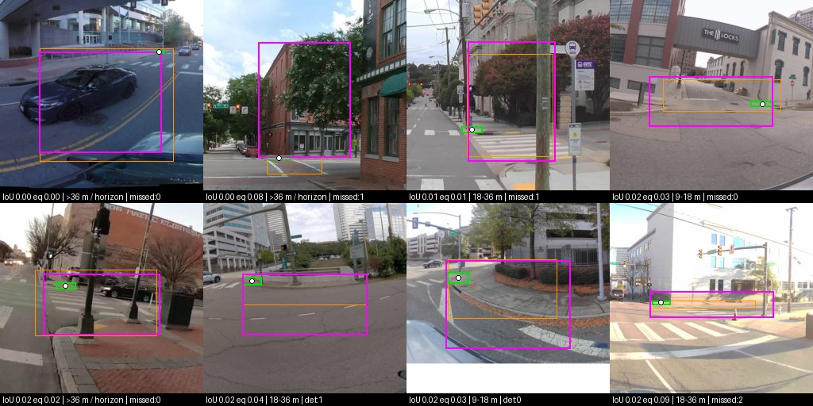
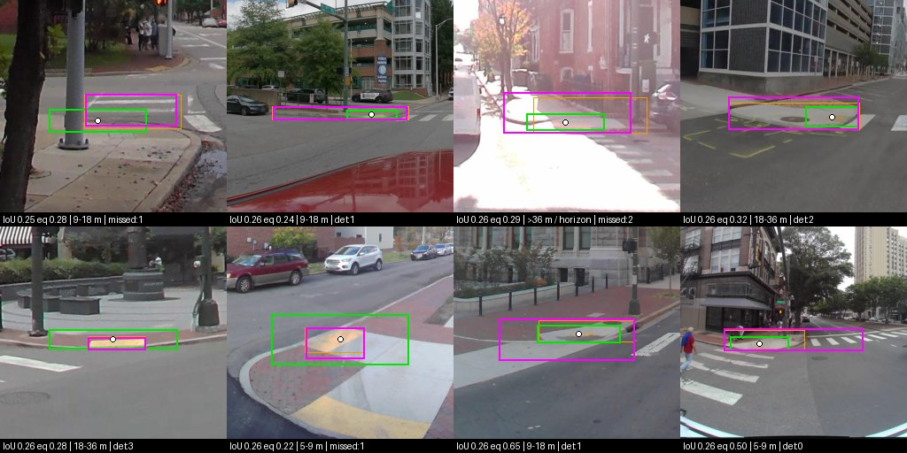
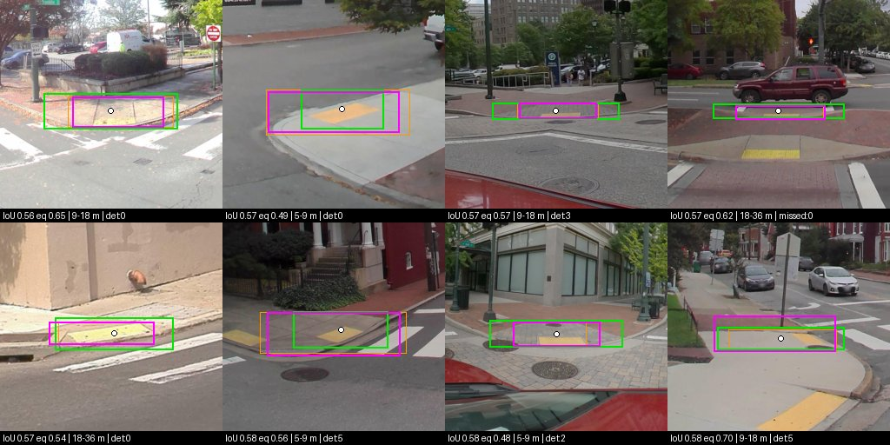
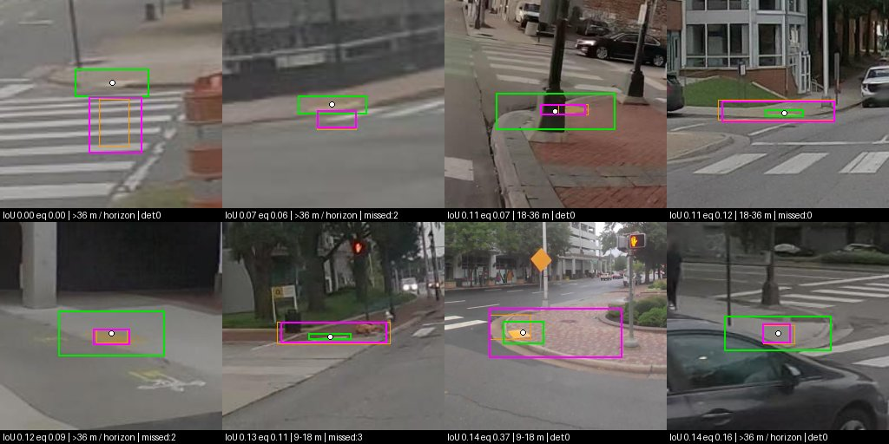

# SAM2 extent vs the whole-apron gold (#83 path 1, RampNet 2.0 plan item 7)

**Issue:** #83 (path 1, the first experiment), plan item 7 in [`rampnet2_plan.md`](rampnet2_plan.md).
**Run date:** 2026-09-23 (UTC). **Script:** `scripts/analysis/sam2_extent_83.py`
(tests: `tests/test_sam2_extent_83.py`; exact commands: `scripts/analysis/sam2_extent_83_runbook.sh`).
**Results:** `analysis_out/sam2_extent_83/` (per-item rows, run provenance, summaries).

## Result, in one paragraph

**Path 1 as designed, with a point prompt alone, is not production-grade, and the projection does not
matter.** On Richmond's complete gold (299 ramps), SAM2.1 Hiera-L prompted with one point at the
*gold box center* on a gnomonic view has a median IoU of **0.260** against the whole-apron box; 23%
of ramps reach IoU ≥ 0.5 and 8% reach ≥ 0.75. Prompted from the **RampNet detection** (the
end-to-end arm, 227 `det:` ramps) it is **0.195** (16% ≥ 0.5). The mask is the wrong *object*,
not a slightly wrong outline: its median size is right (size ratio 1.01) but the p10–p90 spread
is 0.45–4.2×, because SAM2 returns the tactile pad or a slab of the ramp on one side of that and
the whole corner, the road or a car on the other (galleries below). **The gnomonic view does not
fix this:** gnomonic minus equirect at 90° is **+0.013 IoU [−0.002, +0.028]** (pano-clustered
95% CI), and **+0.001 [−0.010, +0.012]** at matched magnification (gnomonic 76° vs equirect 90°);
across all 72 projection comparisons (2 prompts × 4 variants × 9 FOV pairings) the largest mean delta is 0.026 IoU; none of the 24 matched-FOV CIs excludes zero, and the 9 cross-FOV ones that do split 6 for gnomonic, 3 for equirect. Adding a **box prior built from
flat-ground geometry alone** lifts the median IoU to 0.574 (box center) and 0.436 (detection),
but most of that is the prior: the prior box by itself, no SAM2, scores 0.469 and 0.356. SAM2 adds
+0.098 IoU [+0.075, +0.121] on top of it, and **on the quantity #86 wants first, width, SAM2 plus
the prior is no better than the prior alone at the detection (43% vs 45% of ramps within ±20%)**.

**Decision for #83:** do not mint extent labels with point-prompted SAM2 on the 850k points.
Path 1 needs work before it can be the extent source, and the work is on *what SAM2 is asked*
(a better prompt or a ramp-specific decoder), not on *what SAM2 sees*: the equirect crop is as good
as the gnomonic view, so the input path for any follow-up can be whichever is cheaper (the
equirect crop needs no reprojection; the reprojection was 70% of this run's wall-clock). This
moves #83's weight toward path 2 (a size head on the keypoint model), with the gold here as its
test set, and makes the geometry prior the baseline any extent method has to beat, on width in
particular. The secondary cities agree (below).

## Richmond (primary: complete gold, Mapillary)

299 boxed ramps on 86 panos (the other 6 of `boxes.json`'s 92 panos hold only "can't determine
extent" items; 11 of those are excluded, 299 + 11 = all 310 adjudicated). Headline variant is
`pt_multi` (one point, multimask, best predicted IoU); the `+ prior` rows are `ptbox_multi`.

| arm @ 90° | n | IoU median | mean | ≥0.5 | ≥0.75 | size ratio p10 / p50 / p90 | width ±20% | gold covered (med) | mask in gold (med) |
|---|---:|---:|---:|---:|---:|---:|---:|---:|---:|
| 1. box center, gnomonic, point only | 299 | 0.260 | 0.321 | 0.231 | 0.077 | 0.45 / 1.01 / 4.23 | 0.234 | 0.75 | 0.91 |
| 2. box center, equirect, point only | 299 | 0.239 | 0.308 | 0.231 | 0.064 | 0.46 / 0.99 / 4.29 | 0.194 | 0.78 | 0.91 |
| 3. detection point, gnomonic, point only (`det:` items) | 227 | 0.195 | 0.265 | 0.159 | 0.053 | 0.35 / 0.82 / 4.57 | 0.172 | 0.53 | 0.99 |
| 1 + prior | 299 | 0.574 | 0.553 | 0.625 | 0.171 | 0.66 / 1.04 / 1.63 | 0.458 | 0.86 | 0.95 |
| 2 + prior | 299 | 0.587 | 0.556 | 0.632 | 0.157 | 0.65 / 1.02 / 1.60 | 0.462 | 0.84 | 0.96 |
| 3 + prior (`det:` items) | 227 | 0.436 | 0.439 | 0.366 | 0.110 | 0.61 / 1.01 / 1.63 | 0.427 | 0.72 | 0.85 |
| control: prior box alone, at the box center | 299 | 0.469 | 0.455 | 0.431 | 0.060 | 0.43 / 0.88 / 1.43 | 0.381 | 0.64 | — |
| control: prior box alone, at the detection (`det:` items) | 227 | 0.356 | 0.343 | 0.167 | 0.004 | 0.42 / 0.89 / 1.42 | 0.445 | 0.50 | — |

- *Size ratio* is √(area SAM2 box / area gold box); *width ±20%* is the share with SAM2 box width
  within [0.8, 1.25]× the gold width (an empty mask counts as a miss; there were ≤ 1 per cell);
  *gold covered* is the share of the gold box inside the SAM2 box; *mask in gold* the share of the
  mask's pixels inside the gold box.
- Arm 3 and the detection controls are on the 227 `det:` ramps. On the 72 `missed:` ramps the
  recorded point is a reviewer's click, not a detection; those rows are in the CSV and the summary
  (`subsets`), not in this table.
- The box center is an oracle prompt: production has no gold box. It bounds what a perfectly
  centered prompt buys; the detection rows are the operating number.

**Prompt variants** (90°, gnomonic; the equirect arm ranks them the same way):

| variant | n | IoU median | mean | ≥0.5 | ≥0.75 | size ratio p10 / p50 / p90 | width ±20% | gold covered (med) | mask in gold (med) |
|---|---:|---:|---:|---:|---:|---:|---:|---:|---:|
| box center, gnomonic, `pt_multi` | 299 | 0.260 | 0.321 | 0.231 | 0.077 | 0.45 / 1.01 / 4.23 | 0.234 | 0.75 | 0.91 |
| box center, gnomonic, `pt_single` | 299 | 0.281 | 0.335 | 0.258 | 0.067 | 0.45 / 1.00 / 4.11 | 0.237 | 0.74 | 0.92 |
| box center, gnomonic, `ptbox_multi` | 299 | 0.574 | 0.553 | 0.625 | 0.171 | 0.66 / 1.04 / 1.63 | 0.458 | 0.86 | 0.95 |
| box center, gnomonic, `ptbox_single` | 299 | 0.571 | 0.535 | 0.599 | 0.157 | 0.56 / 0.94 / 1.48 | 0.448 | 0.79 | 0.97 |
| detection, gnomonic, `pt_multi` (`det:`) | 227 | 0.195 | 0.265 | 0.159 | 0.053 | 0.35 / 0.82 / 4.57 | 0.172 | 0.53 | 0.99 |
| detection, gnomonic, `pt_single` (`det:`) | 227 | 0.222 | 0.276 | 0.167 | 0.049 | 0.34 / 0.80 / 4.49 | 0.181 | 0.47 | 0.99 |
| detection, gnomonic, `ptbox_multi` (`det:`) | 227 | 0.436 | 0.439 | 0.366 | 0.110 | 0.61 / 1.01 / 1.63 | 0.427 | 0.72 | 0.85 |
| detection, gnomonic, `ptbox_single` (`det:`) | 227 | 0.405 | 0.404 | 0.339 | 0.049 | 0.49 / 0.89 / 1.49 | 0.401 | 0.59 | 0.86 |

Single-mask vs multimask is a wash for a point (within 0.03 median IoU); a box prior dominates either.
Multimask with the prior picks bigger masks (size p50 1.04 vs 0.94) and wins by a little.

**By distance band** (box center, gnomonic, 90°; cells are IoU median / share ≥ 0.5; bands are
depression strata from the gold box's center row at the 2.5 m convention; the delta columns are
gnomonic − equirect, mean IoU with the pano-clustered 95% CI, 2,000 resamples per band):

| band | n | point only | point + prior | prior alone | Δ proj, point only | Δ proj, + prior |
|---|---:|---:|---:|---:|---:|---:|
| >36 m / horizon | 23 | 0.205 / 0.09 | 0.430 / 0.35 | 0.070 / 0.00 | -0.032 [-0.101, +0.028] | +0.015 [-0.018, +0.050] |
| 18-36 m | 89 | 0.260 / 0.16 | 0.562 / 0.66 | 0.390 / 0.24 | +0.008 [-0.024, +0.038] | +0.008 [-0.009, +0.026] |
| 9-18 m | 121 | 0.274 / 0.29 | 0.587 / 0.62 | 0.511 / 0.55 | +0.029 [+0.007, +0.057] | -0.012 [-0.032, +0.004] |
| 5-9 m | 57 | 0.249 / 0.26 | 0.583 / 0.65 | 0.597 / 0.63 | +0.004 [-0.007, +0.014] | -0.007 [-0.030, +0.021] |
| <5 m | 9 | 0.202 / 0.33 | 0.707 / 0.89 | 0.586 / 0.67 | +0.013 [-0.013, +0.041] | -0.008 [-0.037, +0.021] |

The projection delta is flat across bands, including the near field (<5 m, 5–9 m) where the
1/cos(latitude) stretch is largest. The one band here whose CI excludes zero (9–18 m, point only,
+0.029) does not repeat with the prior. Over every per-band projection comparison in the summary
(120: both prompts, all variants, the three matched FOVs, five bands), 16 CIs exclude zero against 6
expected by chance at 5%, and 14 of the 16 favour the gnomonic view: 5 in 9–18 m (where 17 of
24 comparisons are positive, largest +0.035) and 3 in 5–9 m (largest +0.026). The <5 m band
(n = 9) goes both ways and holds the largest delta, −0.080 with a CI spanning zero. So there may
be a small gnomonic edge of about +0.03 IoU at 5–18 m; it is an order of magnitude smaller than
the gap to a usable extent, and the matched-FOV headline deltas do not show it.

The far field (>36 m) is where everything fails: those gold boxes
are a median 142 native px wide (30–277), about a third of that after SAM2's resize to 1024. The
prior alone collapses there (median 0.070: near the horizon a small depression error is a large
distance error), SAM2 with a point stays at its usual 0.2, and the two together reach 0.43. At the
other end, 5–9 m, the prior alone (0.597) already matches SAM2 with the prior (0.583).

**Paired deltas** (mean over the same ramps; 95% CI from 10,000 pano-clustered resamples, seed
83; the last column counts ramps where the first arm won / lost):

| comparison | n | mean Δ IoU | 95% CI | median Δ | wins / losses |
|---|---:|---:|---:|---:|---:|
| `gnomonic-equirect\|boxcenter\|90\|pt_multi` | 299 | +0.0128 | [-0.0024, +0.0279] | +0.0019 | 159 / 140 |
| `gnomonic-equirect\|boxcenter\|90\|ptbox_multi` | 299 | -0.0031 | [-0.0141, +0.0078] | -0.0008 | 147 / 151 |
| `gnomonic@76-equirect@90\|boxcenter\|pt_multi` | 299 | +0.0010 | [-0.0096, +0.0118] | +0.0003 | 159 / 140 |
| `gnomonic@76-equirect@90\|boxcenter\|ptbox_multi` | 299 | -0.0010 | [-0.0075, +0.0054] | -0.0019 | 139 / 158 |
| `gnomonic-equirect\|boxcenter\|60\|pt_multi` | 299 | -0.0082 | [-0.0168, +0.0009] | -0.0008 | 134 / 164 |
| `gnomonic-equirect\|boxcenter\|60\|ptbox_multi` | 299 | -0.0001 | [-0.0074, +0.0078] | -0.0011 | 148 / 151 |
| `gnomonic-equirect\|point\|90\|pt_multi` | 299 | +0.0129 | [-0.0024, +0.0281] | +0.0008 | 157 / 141 |
| `gnomonic-equirect\|point\|90\|ptbox_multi` | 299 | +0.0039 | [-0.0070, +0.0144] | +0.0000 | 147 / 147 |
| `gnomonic@76-equirect@90\|point\|pt_multi` | 299 | +0.0054 | [-0.0041, +0.0156] | +0.0017 | 181 / 117 |
| `gnomonic@76-equirect@90\|point\|ptbox_multi` | 299 | +0.0057 | [-0.0023, +0.0137] | +0.0010 | 158 / 131 |
| `fov90-fov60\|boxcenter_gnomonic\|pt_multi` | 299 | +0.0077 | [-0.0104, +0.0250] | +0.0007 | 153 / 146 |
| `fov90-fov60\|boxcenter_gnomonic\|ptbox_multi` | 299 | -0.0021 | [-0.0163, +0.0111] | +0.0061 | 158 / 141 |
| `detpoint-boxcenter\|det\|gnomonic\|90\|pt_multi` | 227 | -0.0782 | [-0.1179, -0.0419] | -0.0106 | 97 / 130 |
| `detpoint-boxcenter\|det\|gnomonic\|90\|ptbox_multi` | 227 | -0.1339 | [-0.1570, -0.1107] | -0.0782 | 55 / 172 |
| `sam-prior\|boxcenter_gnomonic\|90\|ptbox_multi` | 299 | +0.0977 | [+0.0750, +0.1210] | +0.0903 | 219 / 79 |
| `sam-prior\|point_gnomonic\|90\|ptbox_multi` | 299 | +0.0888 | [+0.0689, +0.1088] | +0.0549 | 203 / 91 |

Reading the keys: `gnomonic-equirect|<prompt>|<fov>|<variant>` is the matched-FOV projection
delta; `gnomonic@76-equirect@90` the matched-magnification one; `fov90-fov60` the FOV sensitivity
within one projection; `detpoint-boxcenter` the cost of prompting from the detection rather than
the gold center (`det:` ramps); `sam-prior` SAM2 + prior minus the prior box alone.

**Why the detection prompt costs so much.** 91% of the detection points fall *inside* the gold
box (median offset 0.09 box-widths horizontally, 0.19 box-heights vertically), yet the paired
cost is −0.078 IoU point-only and −0.134 with the prior. With a point alone, SAM2's choice of
segment is sensitive to where on the ramp the point lands (a point on the pad returns the pad).
With the prior, the prior box moves with the point, so its own error adds.

**Failure gallery** (box center, gnomonic, 90°, `pt_multi`): green = gold whole-apron box,
magenta = SAM2 box from the gnomonic view, orange = SAM2 box from the equirect crop of the same
prompt, white dot = prompt. Captions: IoU gnomonic, IoU equirect, band, item.

Worst 8 (all IoU ≤ 0.02): the mask leaks into the road, a building face, a car or the whole
crosswalk; three are `>36 m` ramps and the rest 9–36 m. The equirect arm fails on the same items
(orange boxes, IoU ≤ 0.09).



Median 8 (IoU ≈ 0.26): the typical miss is *part* of the ramp (the tactile pad, or the sloped
apron without its flares) or the ramp plus the adjoining sidewalk corner.



With the geometry prior (`ptbox_multi`), median 8 (IoU ≈ 0.57) and worst 8:





## Method

**Question.** RampNet emits points. Given a point, can a point-prompted SAM2 recover the ramp's
whole-apron extent well enough to measure it (width first, #86)? This is #83's path 1, the one
that needs no Stage 2 retrain.

**Gold.** `benchmark/<city>/boxes.json`, drawn with `scripts/box_gallery.py` under BOX_RULE v2
(whole constructed ramp surface: apron + pad + flares; tight; axis-aligned), #116. Richmond is
complete (299 boxed + 11 "can't determine extent" = all 310 adjudicated ramps, 92 panos,
Mapillary). Annapolis (131 + 11 of 294, Mapillary), São Paulo (119 + 15 of 281, GSV) and Paterson
(109 + 10 of 395, GSV) are partial random-pano samples ([`crop_window_eval.md`](crop_window_eval.md)
Round 3). "Can't determine extent" items are excluded and counted; nothing else is dropped.
`manual_labels/` boxes are not used: they are tactile-pad marks, not aprons (#114).

**Arms.** Every boxed item is segmented from two prompt sources, each through two projections,
at three fields of view:

| name | prompt | what SAM2 sees |
|---|---|---|
| `boxcenter_gnomonic` | gold box center (oracle, "GT-center") | rectilinear (gnomonic) view centered on the prompt |
| `boxcenter_equirect` | gold box center | plain seam-wrapped equirect crop centered on the prompt (`box_gallery.py`'s cut) |
| `point_gnomonic` | the item's recorded point | gnomonic view |
| `point_equirect` | the item's recorded point | equirect crop |

The recorded point is, on `det:<i>` items, the RampNet detection the reviewer judged true
(checked against `records.jsonl` at load, so it is exactly the model's output); on `missed:<i>`
items it is the reviewer's click. So **plan arm 1** is `boxcenter_gnomonic`, **arm 2** is
`boxcenter_equirect`, and **arm 3 (end-to-end)** is `point_gnomonic` on the `det:` items.

FOVs: **90°** (the annotation view, `crop_fov_deg` in every `boxes.json`), **60°** (narrower,
the sensitivity row), and **76°**. The 76° row exists because equal FOV is not equal
magnification: at FOV f a gnomonic view's center carries `(side/2)/tan(f/2)` pixels per radian
against the equirect crop's `side/f`, so at 90° the gnomonic view shows the prompted ramp at
0.785× the linear size. SAM2 resizes both to 1024 px, so this is what it sees. Gnomonic at
2·atan(π/4) = 76.3° matches the equirect crop at 90° in center magnification, so
**gnomonic@76 vs equirect@90 is the matched-magnification comparison**, and gnomonic@90 vs
equirect@90 is the matched-FOV one. Both are reported.

Both images are cut at the same pixel side, `box_gallery.crop_side(W, H, fov)` (3072 px at 90°
on a 12288-wide pano), from the native pano; the gnomonic view is rendered bilinearly (the in-repo
`equirect_to_perspective` is nearest-neighbour, fine for a detector, not for edges), using the
camera math of `scripts/model_comparison/equirect_tiling.py` unchanged.

**Prompt variants.** One image embedding per view; four decodes from it. `pt_multi`: one
positive point, multimask output, keep the mask with the highest predicted IoU. **This is the
headline, fixed in the script before any number was seen** (`HEADLINE_VARIANT`), because a lone
point is the ambiguous case multimask exists for. `pt_single`: one point, single mask.
`ptbox_multi` / `ptbox_single`: the point plus a box prior computed from production-available
geometry only: flat ground, 2.5 m camera, the prompt's depression gives a ground distance, and
the prior is the image of a 3 m × 3 m ground square (2 × a 1.5 m nominal apron) centered there.
It never sees the gold.

**Scoring.** Each mask is reduced to its tight bounding box in pano-normalized equirect
coordinates. For a gnomonic mask, the four corners of every boundary pixel are mapped back
through the inverse projection and the box is taken with x unwrapped around the view center, so
a mask crossing the 0/1 seam gets a narrow box. For an equirect crop, pixel edges are offset by
the crop origin, modulo the pano width. Per item: **IoU** with the gold box (seam-aware);
**gold coverage** (share of the gold box inside the SAM2 box); **mask in gold** (share of the
mask's pixels inside the gold box); the **size ratio** √(area_SAM2 / area_gold); and SAM2's own
predicted IoU. Bands are crop_window_eval's depression strata, from the gold box's center row
(flat ground, 2.5 m camera; read them as bands, not distances). The projection delta is paired
by item, and its 95% CI is a **pano-clustered** percentile bootstrap (10,000 resamples, seed 83),
since ramps in one pano share imagery and rig.

## Inputs and provenance

| input | identifier |
|---|---|
| SAM2 code | `facebookresearch/sam2` at `2b90b9f5ceec907a1c18123530e92e794ad901a4` (main, 2024-12-15), installed editable, dist `SAM-2` 1.0, CUDA extension not built (`SAM2_BUILD_CUDA=0`) |
| checkpoint | `sam2.1_hiera_large.pt` from `dl.fbaipublicfiles.com/segment_anything_2/092824/`, sha256 `2647878d5dfa5098f2f8649825738a9345572bae2d4350a2468587ece47dd318`; config `configs/sam2.1/sam2.1_hiera_l.yaml` |
| environment | Python 3.11.15, torch 2.5.1+cu124, bf16 autocast; full freeze in [`data/sam2_extent_83_env_freeze.txt`](data/sam2_extent_83_env_freeze.txt) |
| gold | `benchmark/<city>/boxes.json` (BOX_RULE v2); Richmond sha256 `f6b7f73c…6293b`, every city's in its `<city>_run.json` |
| detections | `benchmark/<city>/records.jsonl`; `det:<i>` points are asserted equal to the record's detection at load |
| panos | `benchmark/<city>/panos/`, git-ignored; `run` verifies every file against `imagery_manifest.json` (Richmond digest `ec8ef3678aa9bf84`) and refuses to start on a mismatch. The imagery is published on HF as [`projectsidewalk/rampnet-benchmark`](https://huggingface.co/datasets/projectsidewalk/rampnet-benchmark) |
| host | makelab2 (1× NVIDIA A40, shared with one unrelated process holding ~8.8 GB) |

Committed outputs, `analysis_out/sam2_extent_83/` (LF-pinned, floats rounded to 5 places):

__SHA_TABLE__

Each `<city>_run.json` records the rows-CSV sha256 as written on makelab2; the committed CSVs
match it byte for byte. The summaries regenerate on CPU from the CSVs
(`summarize`, deterministic: seeded bootstrap).

## What it cost

makelab2 has no Slurm, so the time is recorded as `paid: false` rows in
`analysis_out/usage_log.jsonl` (provider `sam2`), per [`compute_cost.md`](compute_cost.md).

__COST_TABLE__

Most of the wall-clock is not the GPU. On Richmond, the numpy gnomonic render took 2,294 s of
3,289 (70%); SAM2 image embedding 202 s and the four decodes per view 372 s. Anyone scaling this
up should render on the GPU or at 1024 px directly; the equirect arm needs no render at all.

## What was not run, and why

- **No second rater on the gold.** All four `boxes.json` were drawn by one annotator (jonf). The
  IoUs here are against one person's reading of BOX_RULE v2; the gap between SAM2 and the gold is
  large enough (median 0.2–0.6) that rater noise of the size seen elsewhere in this repo does not
  change the decision, but no inter-rater IoU exists to prove it.
- **No manual_gold arm.** `manual_labels/` boxes are pad marks (#114) and the GSV re-annotation
  (`box_gallery.py --from-manual-labels`) has not been drawn.
- **No SAM2 fine-tune, no automatic-mask-generator, no text-prompted variant** (e.g. Grounded
  SAM). Out of scope for path 1's first experiment; the decision above is what would justify
  them.
- **Only one box prior** (2.5 m camera, 1.5 m apron, scale 2). It was not tuned, deliberately: a
  prior tuned on this gold would be scored on the gold it was tuned on. Its measured size bias
  (median size ratio 0.88) says a per-rig camera height would move it; that belongs to whichever
  follow-up adopts the prior.
- **Masks are not kept**, only their boxes, so the committed rows cannot be re-scored against a
  polygon gold if one is ever drawn. A re-run costs ~2.5 GPU-hours on makelab2.
- **SAM2 small/base/tiny were not run.** Large is the ceiling for the family; a smaller model
  cannot rescue a prompt problem.

## Caveats

- **The gold is a box, and so is the score.** BOX_RULE v2 boxes oblique ramps axis-aligned with
  empty corners, and the SAM2 box is the same kind of box, so IoU compares like with like; it
  says nothing about mask shape inside the box.
- **The box center is a biased oracle for oblique ramps**: the center of an axis-aligned box
  around a diagonal apron can sit off the ramp surface. The detection prompt does not have this
  problem and does worse anyway (see the detection-offset paragraph).
- **Bands** are depression strata at a 2.5 m flat-ground convention (Richmond's Mapillary rig is
  nearer 1.7 m, `crop_window_eval.md`), so read them as bands, not distances; the `<5 m` band has
  9 ramps.
- **Partial cities are pano-sampled prefixes** (random panos, every ramp in each sampled pano),
  so per-ramp rates are unbiased for the covered panos but the partial files each carry a
  `completeness_warning`, repeated in their run JSON.
- **The resolution SAM2 sees is fixed by SAM2**, not by the pano: every view is resized to 1024 × 1024
  px, so a 90° view gives SAM2 about 11 px per degree whatever the source
  resolution. The FOV rows are the only resolution lever tested.

## Reproduce

From a clean clone, with the four cities' `panos/` fetched as their `imagery_manifest.json`
describes. Every step is in `scripts/analysis/sam2_extent_83_runbook.sh`:

```bash
# GPU, once per city (environment + checkpoint setup is in the runbook)
python scripts/analysis/sam2_extent_83.py run --city richmond \
    --arm boxcenter_gnomonic,boxcenter_equirect,point_gnomonic,point_equirect --fov 90,76,60 \
    --checkpoint /path/sam2.1_hiera_large.pt --out analysis_out/sam2_extent_83 \
    --usage-log analysis_out/usage_log.jsonl

# CPU, from the committed rows
python scripts/analysis/sam2_extent_83.py summarize --city richmond --out analysis_out/sam2_extent_83
python scripts/analysis/sam2_extent_83.py summarize --city annapolis,sao_paulo,paterson --name partial3 \
    --out analysis_out/sam2_extent_83
python scripts/analysis/sam2_extent_83.py gallery --city richmond --gallery-variant pt_multi \
    --out analysis_out/sam2_extent_83 --assets docs/assets
python scripts/analysis/sam2_extent_83.py gallery --city richmond --gallery-variant ptbox_multi \
    --out analysis_out/sam2_extent_83 --assets docs/assets
pytest -q tests/test_sam2_extent_83.py
```
