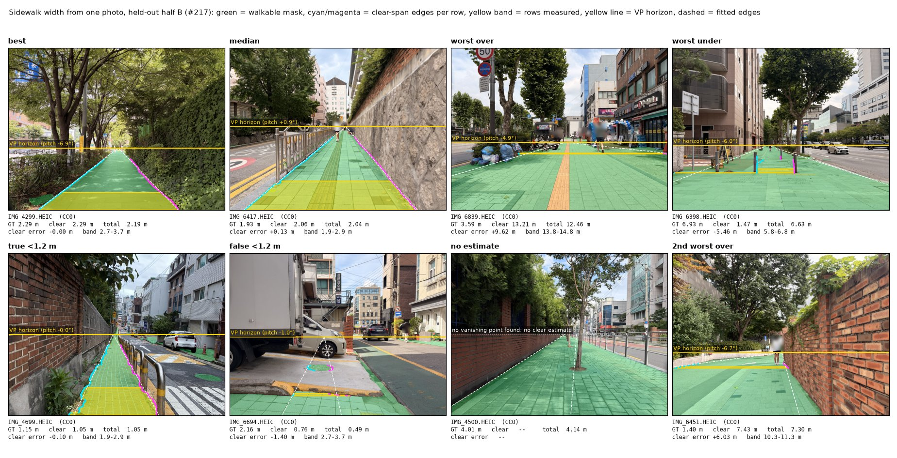
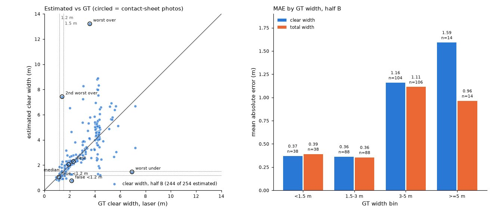

# Sidewalk width from one photo: arm 1 on the Seoul set (#217)

Issue [#217](https://github.com/ProjectSidewalk/RampNet/issues/217), part of the #86
measurement track. This is **arm 1** (single view, nearest point: Vistas segmentation →
sidewalk edges → ground-plane geometry → metric scale from camera height), run on the one
dataset we have with laser-measured width. **No GSV imagery was used**; the street-view arm is
not built. The second half of this doc lists which benchmark cities publish width ground truth
for that arm.

## Result, in one paragraph

On the held-out half of the Seoul set (254 photos, tuned on the other 260), the estimator
gets **clear width to a mean absolute error of 0.77 m (95% CI 0.50–1.06)**, with a mean bias of
+0.29 m (0.08–0.55) and a median bias of +0.13 m (−0.02 to 0.28). It flags **all 9 of the 9
photos with GT below 1.2 m** (exact 95% CI on recall 0.66–1.00) at a precision of 9/22 = 0.41
(0.21–0.64). MAE and bias are over the 244 photos (96%) that got an estimate; the VLMs answer
every photo. The median bias is smaller than any of the paper's four VLMs (+0.40 to +1.05 m),
**but the tails are heavier than all four**: our 5th–95th percentile error range is −1.39 to
+2.50 m, 3.89 m wide, against calibrated 90% intervals about 2.0–3.1 m wide (half-widths ±1.0
to ±1.54 m). The absolute errors are largest on sidewalks wider than 3 m, but *relative* error
is roughly flat across widths (19–30% relative MAE per bin), which is what a per-image
scale error (from pitch) would produce as much as an extent mismatch. The median scale is
unbiased (median relative bias under 10% in every bin); how much of the per-image error is
pitch and how much is extent is not measured. The half-B held-out claim survives the two
tested development-contact counterfactuals, which move MAE by at most 0.06 m (the one change
made by hand, the VP pitch cap, made it worse), and dropping the half-B photos within 10 m of
a half-A photo moves it by 0.01 m (sensitivity table below).
**This is the easy geometry** (the camera stands on the sidewalk, width is lateral); it says
nothing yet about width seen from the street.

## Data

- **Seoul Sidewalk Accessibility Image Dataset** (Lieu et al., arXiv 2609.17882; Zenodo
  [10.5281/zenodo.22699523](https://doi.org/10.5281/zenodo.22699523), CC0). 514 photos from
  four sites (7–11 July 2026), "positioned 1.0 m above ground level and aligned with the
  center of the pedestrian walking path", iPhone 17 (26 mm equivalent) and iPhone 16 Pro
  (24 mm equivalent). Width "was measured as the unobstructed pedestrian passage using a
  Sincon SD-70 laser distance meter, excluding permanent street furniture and other fixed
  obstacles" — i.e. **effective (clear) width**. GT range 0.92–10.15 m, mean 2.97 m; 22 photos
  below 1.2 m, 69 below 1.5 m.
- Committed: [`data/seoul_sidewalk_217/summary_attributes.csv`](../data/seoul_sidewalk_217/summary_attributes.csv)
  (byte-identical to Zenodo's, md5 `4f1b49f9…`, pinned `binary` in `.gitattributes`) and
  [`manifest.json`](../data/seoul_sidewalk_217/manifest.json) (every image's size and sha256,
  and each Zenodo archive's md5). The images are not committed.
- **Facts about the files that the paper does not state**, found on download:
  - The CSV names 464 photos `.HEIC` and 50 `.JPG`; the archives hold only `.jpg`. Matched on
    the case-folded stem.
  - **None of the 514 JPEGs carries EXIF** (checked with PIL on all of them). So the phone,
    the focal length and the orientation cannot be read per photo. 480 are 5712×4284 and 34
    are 4032×3024, all landscape.
  - The paper does not say where along the sidewalk the width was taken relative to the
    photo, or how the phone was aimed. **The phones were not held level**: the vanishing point
    of the sidewalk edges puts the median pitch at **3.4° up** in half A and 4.4° up in half B
    (clear configuration's VP source). Single photos reach 13.2° up in half A (IMG_6734) and
    14.9° up in half B (IMG_4335); 14 half-A and 38 half-B photos are tilted more than 8° up.
    Half B is tilted more than half A, which matters because `vp_prior` falls back to the
    half-A median (`vp_pitch_by_half` in `sensitivity.json`).
- The shared copy is at `makelab2:/homes/gws/jonf/seoul_sidewalk/` (README there), also used by
  #218.

## Method

[`scripts/analysis/sidewalk_width_217.py`](../scripts/analysis/sidewalk_width_217.py), three
stages.

1. **segment** (GPU). `facebook/mask2former-swin-large-mapillary-vistas-semantic` at revision
   `4772b6bf101d91f2534c106dc524d906aeb3c68a` (the revision `crossview_arms/semantic.py`
   pins), each photo resized to 1440 px wide, 768×1024 model input, full 65-class argmax.
   The 514 label maps (uint8 PNG, one class id per pixel, 11 MB in all) are at
   `makelab2:/homes/gws/jonf/sw217_seg/`; they are not committed or published. Their sha256
   values are committed in
   [`analysis_out/sidewalk_width_217/seg_meta.json`](../analysis_out/sidewalk_width_217/seg_meta.json)
   (byte-identical to that directory's `meta.json`; all 514 maps matched it on 2026-09-30), and
   `sidewalk_width_217.py verify-seg --seg DIR` checks any copy or re-run against them.
   **Environment for this step is not `environment.yml`.** It ran in the `sidewalk-auto-labeler`
   venv on makelab2 (`/homes/gws/jonf/sidewalk-auto-labeler/.venv`): Python 3.9.25,
   torch 2.8.0+cu128 (CUDA 12.8), torchvision 0.23.0, transformers 4.57.6, tokenizers 0.22.2,
   safetensors 0.7.0, timm 1.0.27, Pillow 11.3.0, numpy 2.0.2, on an NVIDIA A40.
2. **measure** (CPU). For each image row, the **span of walkable pixels connected to the
   walking line** (the image centre column, since the camera stood on the path's centre).
   Walkable = Sidewalk, Pedestrian Area, Curb Cut, and the manholes / catch basins / potholes
   that sit on it. Two spans per row:
   - **total**: people, bicycles and fixed obstacles are passable (the span runs through them
     and is trimmed back to walkable pixels at its ends);
   - **clear**: only people and bicycles are passable; a pole, bench, sign, bollard, etc. ends
     the span, and so do vegetation and terrain, always. The obstacle-set option below does
     not change the clear span at all.
   A row whose span touches the frame edge (3 px) is dropped: the true edge is out of view.
   Both span ends are back-projected onto a flat ground plane 1.0 m below the camera (pinhole,
   principal point at the centre, focal length from 25 mm equivalent, no roll). The path
   direction is the mean slope of the two edge lines fitted in ground coordinates (MAD-trimmed
   least squares), and width is the end-point separation along the path's normal, so a camera
   yawed off the path does not inflate it. The per-image width is a statistic over a depth
   band: rows from the first valid depth ≥ `zmin` to `zmin + band`, median or 10th percentile.
3. **score** (CPU, from the committed widths CSV alone). Tune on half A, report on half B.

**Horizon.** Width at depth Z scales as 1/(v − v_horizon), so the horizon row is the single most
important number. Three variants: `level` (horizon at the image centre, the protocol's
nominal level phone), `vp` (the horizon through the vanishing point of the two fitted edge
lines; no estimate if it is not found or implies more than 15° of pitch), and `vp_prior` (the
VP, else the median VP pitch of half A).

**Tuning grid** (2 × 2 × 2 × 3 × 12 = **288 configurations per measure**, of which 240 pass the
coverage rule on half A for each measure): walkable set with/without Bike Lane × which fixed
classes are passable in the *total* span (furniture only, or furniture + vegetation + terrain)
× lane markings as boundary or surface × 3 horizons × `zmin` ∈ {1.5, 2.5, 4} m × `band` ∈
{1, 3} m × {median, p10}. For clear width the second option only chooses which total spans the
vanishing point is read from (`image_vp`); it is a VP-source knob there, not an obstacle rule.
**Rule:** lowest MAE on half A among configurations that estimate at least 90% of half A.

**Split.** ~100 m lat/lon cells (0.001°), so repeat photos of one sidewalk stay in one half;
cells stratified by whether they contain a GT < 1.2 m photo, then halved by a seeded shuffle
(seed 217). Half A: 260 photos, 27 cells, 13 below 1.2 m. Half B: 254 photos, 25 cells, 9
below 1.2 m. **CIs** are 95% cluster-bootstrap percentiles over half-B cells (10,000 draws,
seed 217), plus exact Clopper–Pearson intervals for recall and precision of the < 1.2 m flag
(the bootstrap one degenerates to [1, 1] with 9 positives).

**The cells do not isolate sidewalk runs.** 28 of the 254 half-B photos have a half-A photo
within 10 m, 63 within 20 m and 91 within 30 m (median distance to the nearest half-A photo
35 m). The run IMG_4293–IMG_4335 spans four cells: three in B, one in A (IMG_4323 and
IMG_4325). Nothing is trained and one configuration is selected on A, so the leak can only act
through that choice; dropping the 28 photos changes clear MAE from 0.774 to 0.768 m, and
recall on the rest is 6/6. The split was not re-drawn after seeing B (sensitivity table below).

### What was chosen on half A

| measure | walkable | passable in total span (`obst`) | markings | horizon | band | stat | MAE A |
|---|---|---|---|---|---|---|---|
| clear | base | furniture (VP source only; see below) | surface | vp | 1.5–2.5 m | median | 0.62 m |
| total | base | furniture + vegetation + terrain | surface | vp | 4–5 m | p10 | 0.55 m |

For clear width, `obst = furniture` means only that the vanishing point was read from the
total spans with furniture passable. The clear span itself ends at every fixed obstacle,
vegetation and terrain included; at the level horizon (no VP) the two `obst` values give
identical clear widths.

The clear pick is the literal "nearest point" of the issue: the first metre of valid ground.
All top-5 half-A configurations for both measures use the VP horizon and markings as surface,
and they differ from the winner by at most 0.02 m of MAE, so the choice is not a knife edge.

## Results (half B, n = 254)

| | clear width | total width |
|---|---|---|
| estimated (coverage) | 244 (0.96) | 246 (0.97) |
| **MAE** | **0.77 m** [0.50, 1.06] | 0.72 m [0.45, 1.01] |
| relative MAE | 25% [18, 33] | 24% [18, 32] |
| mean bias | +0.29 m [0.08, 0.55] | +0.29 m [0.08, 0.52] |
| median bias | +0.13 m [−0.02, 0.28] | +0.11 m [−0.03, 0.22] |
| error, 5th–95th pct | −1.39 to +2.50 m | −1.08 to +2.69 m |
| 90th pct of \|error\| | 2.05 m [1.06, 2.93] | 1.73 m [1.00, 3.42] |
| within 0.3 m / 0.5 m | 45% / 63% | 46% / 66% |
| 3-class accuracy (<1.2, 1.2–1.5, ≥1.5), of estimated | 0.87 [0.80, 0.93] | 0.88 [0.81, 0.94] |
| 3-class accuracy, all 254 ("none" = wrong) | **0.84** [0.77, 0.90] | 0.85 [0.78, 0.91] |
| **recall, GT < 1.2 m** | **9/9 = 1.00** [0.66, 1.00] | 8/9 = 0.89 [0.52, 1.00] |
| **precision, flagged < 1.2 m** | **9/22 = 0.41** [0.21, 0.64] | 8/18 = 0.44 [0.22, 0.69] |

Brackets are 95% CIs (bootstrap; exact for recall and precision). Denominators differ by row:
MAE, bias, the error quantiles, "within" and the first 3-class row are over the photos with
an estimate (244 clear, 246 total); recall, precision and the second 3-class row are over all
254, where a photo with no estimate is never flagged and counts as wrong. All 10 clear-width
"none" photos have GT ≥ 1.5 m. The full-coverage `vp_prior` horizon in the same cell gives
clear MAE 0.78 m at coverage 0.98, recall 9/9, 23 flagged, so the headline does not depend on
leaving hard photos out.

**Confusion, clear width** (rows GT, columns estimate):

| GT \ est | < 1.2 | 1.2–1.5 | ≥ 1.5 | none |
|---|---|---|---|---|
| < 1.2 (9) | **9** | 0 | 0 | 0 |
| 1.2–1.5 (29) | 10 | **9** | 10 | 0 |
| ≥ 1.5 (216) | 3 | 8 | **195** | 10 |

The flag's false positives are mostly sidewalks just above the line: 10 of the 13 are 1.2–1.5 m.

### Where the error is

| GT width | n | MAE clear | mean bias clear | relative MAE | mean rel. bias | median rel. bias |
|---|---|---|---|---|---|---|
| < 1.5 m | 38 | 0.37 m | +0.17 m | 28% | +12% | −5% |
| 1.5–3 m | 91 | 0.36 m | +0.16 m | 19% | +9% | +5% |
| 3–5 m | 109 | 1.16 m | +0.58 m | 30% | +16% | +8% |
| ≥ 5 m | 16 | 1.59 m | −0.72 m | 26% | −10% | 0% |

and by filename series (a proxy for capture session; the paper gives no photo-to-site map):
IMG_4xxx MAE 0.44 m (n = 68), IMG_6xxx 1.02 m (n = 157), IMG_89xx–90xx 0.24 m (n = 29). Width
bin and series are confounded: 101 of the 125 half-B photos with GT ≥ 3 m are IMG_6xxx.

**What this does and does not show.** The median relative bias is under 10% in every bin, so
the *median* scale is unbiased. It does not show that per-image scale is right. Relative MAE is
roughly flat across widths (19–30%), which is what per-image scale error gives, and ±2° of
pitch alone is ±10–16% of width (below). So the large absolute errors on wide sidewalks are at
least partly what any per-image scale error would give on a wide sidewalk. **How much of the
per-image error is pitch and how much is extent is not measured.** One cheap proxy was tried:
|relative error| against how far a photo's VP pitch is from the half-A median. There is no
relation (Spearman ρ = −0.07, cluster-bootstrap 95% CI −0.25 to 0.09, n = 244; median
|relative error| 17% / 12% / 12% by tercile of pitch deviation, lowest first). That argues
against VP failures on unusually tilted photos, but it cannot measure the VP's per-image error,
which would need known pitch. Extent errors do exist; two half-A examples (half B was not
inspected after scoring): IMG_6754, GT 4.17 m, estimate 9.78 m — the paved shop-frontage apron
is labelled Sidewalk and counted; IMG_6387, GT 5.02 m, estimate 2.15 m — the near rows run off
the left of the frame and the first in-frame rows are cut by a row of parked share-bikes and a
planter. Two anecdotes show extent errors happen, not that they dominate.

### What the vanishing point buys, and pitch sensitivity

Same configuration with the horizon at the image centre (`level`): clear MAE 0.85 m, mean bias
**−0.66 m**; total MAE 1.26 m, bias −1.03 m, precision of the flag 0.10. The phones were
tilted up (median VP pitch −3.4° on half A), so a level assumption understates every width;
the VP removes most of that. Found on 96% (A) and 98% (B) of photos.

Measured sensitivity on half B, shifting the pitch used by ±2° from the VP estimate: median
width change −10% (+2°, down) and +12% (−2°, up) for clear width (−16% / +16% for total, whose
band is farther out). So the ±2° the issue asked about is worth ±10–16% of width: about
±0.3–0.5 m on a 3 m sidewalk. Pitch, not focal length or camera height, is the dominant
geometric error term here (focal length is nearly irrelevant once the horizon comes from the
image; see caveats).

### Against the paper's VLMs

The paper reports, on all 514 photos, median width bias +0.40 m (GPT-5.2), +0.75 m
(Gemini-3-Flash), +0.90 m (Qwen3-VL-8B) and +1.05 m (InternVL3.5-8B), and calibrated 90%
interval half-widths of ±1.0, ±1.14, ±1.38 and ±1.54 m (coverage 0.91–0.915). Their intervals
are asymmetric; full widths are about 2.0 m (GPT-5.2) to 3.1 m (InternVL3.5-8B). Here, on half
B: median bias +0.13 m [−0.02, 0.28], below every VLM; but the 5th–95th percentile error range
is −1.39 to +2.50 m, **3.89 m wide, wider than all four VLM intervals**, and the 90th
percentile of |error| is 2.05 m [1.06, 2.93]. **Less bias, heavier tails than every VLM.**

Like for like: GT is effective width in both, and bias is prediction minus field value in
both. Not like for like: each VLM prediction is the median of 30 samples; their intervals are
conformal, averaged over 200 random 50/50 calibration/test splits, while ours is an empirical
error range on one cluster split (half B, not all 514); and **the VLMs answer every photo,
while this estimator answers 96% of half B**, with MAE and bias computed without the 10
photos that got no estimate. A half-A scale calibration (×0.98) changes nothing material
(clear MAE 0.75 m).

## Examples

Eight half-B photos (CC0), chosen by a fixed rule on the clear-width signed error: smallest
|error|, closest to the median error, largest over- and under-estimate, the median-|error| true
<1.2 m flag, the widest-GT false <1.2 m flag, the first no-estimate photo by filename, and the
second-largest over-estimate (`sidewalk_width_217_figures.py`, docstring). The overlays are
recomputed from the label maps with the scoring code, and each recomputed width is asserted
equal to the committed per-image estimate.





What the examples show. The two worst over-estimates (IMG_6839, +9.6 m; IMG_6451, +6.0 m)
fail the same way: the walkable span touches the frame edge in every near row, so those rows
are dropped, and the first usable rows lie 10–14 m out, just below the horizon, where one
pixel spans decimetres and the measured span reaches past the sidewalk. The worst
under-estimate (IMG_6398, −5.5 m) is a clear span cut short by a bollard and pole in the
middle of a 6.9 m sidewalk. The false <1.2 m flag (IMG_6694) is a sidewalk mostly
hidden by a parked truck and car. The no-estimate photo (IMG_4500) has a row of street trees
down the middle of the sidewalk, and the right-edge fit follows the trees, so no vanishing
point is found. The band starts at the first valid row at or beyond 1.5 m, so on the good
photos it sits at 1.9–2.9 m or 2.7–3.7 m rather than exactly 1.5–2.5 m.

## Caveats (they apply to every number above)

- **Easy geometry.** The camera stood on the sidewalk facing along it, so width is lateral and
  well resolved. From the street, width lies along the viewing ray, where one degree is 0.3 m
  of ground at 6 m range from 2.5 m up. None of this transfers to GSV without its own GT.
- **Definition mismatch.** GT is effective width after excluding permanent furniture; "total"
  here is Vistas's sidewalk extent and "clear" subtracts only what Vistas labels. Neither
  knows the surveyor's rule about frontage zones, planting strips or where the passage ends.
  That total beats clear slightly on MAE (0.72 vs 0.77 m, well inside each other's CIs) says the
  obstacle subtraction is not yet adding information.
- **Focal length is unknown to ±4%** (no EXIF; 25 mm equivalent is the midpoint of the two
  phones), **but it barely moves width.** With the horizon row taken from the image, a ground
  point's lateral offset is X = h·(u − cx) / (cos p · (v − v_h)), so f enters only through
  cos p and through which rows fall in the depth band. On synthetic sidewalks (1.2 and 3.0 m;
  pitch 0, −3.4°, +3°; yaw 5°), estimating with f ×0.9 to ×1.1 and the VP recomputed from the
  wrong f changes width by under 0.1%
  (`tests/test_sidewalk_width_217.py::test_focal_error_barely_moves_width`). The earlier
  version of this caveat said ±4% of width; that was wrong.
- **Camera height is taken as exactly 1.0 m** (the stated protocol); a 5 cm error is a 5%
  width error. Roll is assumed zero; the ground is assumed flat. GT running and cross slopes
  have medians of 1.1° and 1.2° but reach 11.8° and 9.7°; a running slope shifts the edges'
  vanishing point and so is partly absorbed into the VP pitch, a cross slope is not modelled.
- **Small positive class.** 9 photos below 1.2 m in half B; recall's exact CI runs from 0.66.
- **Where GT was measured** relative to the photo is not documented. Width varies along a
  sidewalk; some of the error is the two measuring different cross-sections.
- **Development contact with half B.** While debugging, per-image output was printed for 38
  label maps, 19 of them in half B (IMG_4293–IMG_4335), and one half-B photo (IMG_4315) was
  viewed (and one half-A photo, IMG_4284). That output motivated three options: markings as
  surface, the `vp_prior` horizon, and raising the VP pitch cap from 10° to 15°. The first two went into the tuning grid and
  were chosen on half A by the rule above, not fixed by hand; the cap was changed directly.
  After scoring, only half-A images were inspected. **Half B is therefore not strictly
  untouched; the two tested counterfactuals move MAE by ≤ 0.06 m** (the cap change by −0.06 m,
  i.e. it made the headline worse; the contacted photos by +0.02 m; sensitivity table below).
- **The split leaks at the scale of one sidewalk run**: 28 of 254 half-B photos have a half-A
  photo within 10 m (see Split above). Dropping them moves clear MAE by 0.01 m.

### Sensitivity of the half-B headline (disclosed, not used to choose anything)

From the committed widths CSV by `score --sensitivity-out` →
[`analysis_out/sidewalk_width_217/sensitivity.json`](../analysis_out/sidewalk_width_217/sensitivity.json).
Added after the independent review of PR #225; the split and the tuned configurations are
unchanged, and none of these reads was used to pick anything.

| read (clear width, half B) | n | coverage | MAE | recall < 1.2 | flagged |
|---|---|---|---|---|---|
| **published** | 254 | 0.961 | **0.77 m** | 9/9 | 22 |
| pre-contact 10° VP cap, re-tuned on A (picks `obst` furn_veg, `zmin` 2.5) | 254 | 0.917 | 0.72 m | 9/9 | 22 |
| markings as boundary, same cell (half-A coverage 0.78, fails the 90% rule) | 254 | 0.764 | 0.78 m | 9/9 | 26 |
| best markings-as-boundary cell passing the rule on A (`vp_prior`, MAE A 0.89) | 254 | 0.992 | 1.07 m | 9/9 | 45 |
| without the 3 cells holding the contacted photos | 232 | 0.957 | 0.79 m | 9/9 | 22 |
| the 19 contacted photos only (GT ≥ 2.23 m) | 19 | 1.000 | 0.54 m | — | 0 |
| without the 28 photos within 10 m of a half-A photo | 226 | 0.956 | 0.77 m | 6/6 | 15 |
| same cell, `vp_prior` horizon (full coverage) | 254 | 0.980 | 0.78 m | 9/9 | 23 |

Total width, same reads: published 0.72 m at 0.969; 10° cap re-tuned 0.65 m at 0.921 (8/9);
without the contacted cells 0.75 m (8/9); without the 10 m photos 0.71 m (5/6).

- **The 10°→15° cap (the one change made by hand)** bought coverage and made MAE *worse*,
  not better: 12 half-B photos have |VP pitch| > 10°, 6 of them in the contacted run
  (IMG_4315–IMG_4335); half A has 5. Under the 10° cap, photos whose VP exceeds it get no
  estimate under `vp_prior` too, instead of falling back to the prior pitch as the pipeline
  would, because their prior-pitch widths are not in the CSV. This does not change the result:
  the re-tuned cell is a `vp` cell (for both measures), where an over-cap photo gets no
  estimate either way.
- **Markings as surface** was chosen on A by the coverage rule: with markings as a boundary
  the same cell covers only 78% of half A, and its half-B MAE is similar (0.78 m).
- **The contacted subset was easier than the rest** (MAE 0.54 m, no GT below 2.23 m), so
  removing it makes the headline slightly worse (0.79 m), not better.
- Net: the two development-contact counterfactuals move clear MAE by at most 0.06 m. The
  hand-made cap change made the headline *worse* by 0.06 m; the contacted photos flatter it by
  0.02 m. Clear-width recall stays 9/9 in every read. Markings-as-surface does matter (the best
  boundary cell that passes the rule is 0.29 m worse on B), but that choice was made on half A
  by the rule, and half A ranks it the same way (MAE A 0.62 vs 0.89 m).

## Reproduce

```bash
# 0. images (≈4.6 GB; about 10 min on makelab2 with three parallel curl downloads)
python scripts/analysis/seoul_fetch_217.py fetch --dest $SEOUL        # md5 vs Zenodo, then
                                                                      # sha256 vs the manifest
# 1. label maps (GPU; 490 s on a shared A40). Our run: $SEG = makelab2:/homes/gws/jonf/sw217_seg
#    Needs its own env, not environment.yml (Python 3.9 as used; CUDA 12.8 wheels):
#    pip install torch==2.8.0 torchvision==0.23.0 --index-url https://download.pytorch.org/whl/cu128
#    pip install transformers==4.57.6 tokenizers==0.22.2 safetensors==0.7.0 timm==1.0.27 \
#        pillow==11.3.0 numpy==2.0.2
python scripts/analysis/sidewalk_width_217.py segment --images $SEOUL/images --out $SEG
python scripts/analysis/sidewalk_width_217.py verify-seg --seg $SEG   # vs committed sha256s
# 2. widths for every configuration (CPU; 264 s)
python scripts/analysis/sidewalk_width_217.py measure --seg $SEG \
    --out analysis_out/sidewalk_width_217/widths.csv.gz
# 3. tune on A, report on B, plus the disclosed sensitivity reads (CPU; ~20 s)
python scripts/analysis/sidewalk_width_217.py score \
    --widths analysis_out/sidewalk_width_217/widths.csv.gz \
    --out analysis_out/sidewalk_width_217/results.json \
    --sensitivity-out analysis_out/sidewalk_width_217/sensitivity.json
# 4. example figures (CPU; ~10 s). `select` lists the eight photos from committed files;
#    render needs only those photos and their label maps
python scripts/analysis/sidewalk_width_217_figures.py select
python scripts/analysis/sidewalk_width_217_figures.py render --images $SEOUL/images --seg $SEG
```

The committed figures (matplotlib 3.11.1, Pillow 12.3.0) have sha256
`8afe8879693e290733da56573230dc9d228cf8ddb2637ecc3455360ca7b5e94b`
(`examples_contact_sheet.jpg`) and
`fccb4fc37ef79e4730fe6b8b58b5a777fa1263c1957d835b8f1519e03a772680` (`diagnostics.jpg`); other
matplotlib or JPEG-encoder versions will not match byte-for-byte, and the widths drawn are
asserted against `results.json` either way.

Step 3 needs only committed files. Steps 1–2 need the label maps, which exist only on makelab2;
someone without access regenerates them with step 1 and checks them with `verify-seg`. The
committed `widths.csv.gz` has sha256
`877304c5a4611d28f6d6edc43fd7d995b903e38e08e98248eeabac233971c825` (recorded in
`results.json`). A re-run of step 1 on other hardware may not reproduce the label maps
byte-for-byte (GPU nondeterminism); compare against `seg_meta.json` and expect the widths CSV
to differ slightly if they do. `tests/test_sidewalk_width_217.py` checks the geometry on
synthetic label maps of known width (level, pitched, yawed, off-centre, truncated by the
frame, with obstacles), that a ±10% focal error barely moves width, that every class id used
is checked against the checkpoint, that the committed GT table has Zenodo's md5, and that
`score` re-run on the committed widths CSV reproduces the committed configurations, half-B
metrics, per-image estimates and `sensitivity.json` (about 3 s, CPU).

## Cost

Free compute. makelab2 A40 (shared with two other jobs): segmentation 490 s = **0.136 GPU-h**;
measure 264 s CPU; score seconds on the desktop. Two `paid: false` rows in
`analysis_out/usage_log.jsonl` (`sidewalk-width-217:segment-vistas`, `:measure`). Download
about 10 minutes of network, no compute.

## Not done

- **Per-pano camera height and the street-view geometry** (arm 1 on GSV) — needs GT; see below.
- **Arm 2** (multi-view fallback) and **arm 3** (VLM contrast on our own imagery).
- **Sidewalk-plane fit.** Here the plane is the stated 1.0 m below the camera; nothing is
  fitted. On GSV the issue's plan fits the sidewalk plane, not the road.
- **Obstacle subtraction that helps.** Clear width does not beat total; a better rule (e.g.
  subtracting only obstacles whose base lies inside the band) was not tried.

## Ground truth for the street-view arm: which benchmark cities publish sidewalk width

Searched 2026-09-30. "Verified" means the live schema was opened (ArcGIS REST `?f=json`, WFS
`DescribeFeatureType`, or the DBF inside the downloaded zip) and the rows that actually carry a
width were counted with group-by queries; everything else is marked. Every source below is an
open download or API. **No source says whether its width is total pavement width or clear
width**, except Bend's metadata, which calls its field a minimum width. Treat every width here
as total surface width until shown otherwise. The Seoul GT above is clear (effective) width, so
the two are not the same quantity.

| City | Dataset | URL | Geometry | Width field | Verified | Notes |
|---|---|---|---|---|---|---|
| **São Paulo** | GeoSampa `geoportal:calcada` (Calçadas) | WFS `http://wfs.geosampa.prefeitura.sp.gov.br/geoserver/ows?service=wfs&version=1.0.0&request=DescribeFeatureType&typeName=geoportal:calcada` (GetFeature with `outputFormat=application/json` works) | **Polygon**, one per block face, EPSG:31983 | `qt_largura_minima_trecho` / `_maxima_` / `_media_`, metres (sample 1.66 / 2.44 / 2.05); also area and slope min/max/mean. Total vs clear unknown | Yes, schema + 2 features | 491,383 polygons. No layer-level update date. Per-feature `dt_inicio` / `dt_termino` exist but are filled on only 6,872 polygons (both or neither); in a 5,000-row sample of those, `dt_inicio` falls in 2019–2024. They look like per-feature validity dates, not a survey date. News items date the release to 2019 |
| **Bend OR** | City of Bend "Sidewalk" | REST `https://services5.arcgis.com/JisFYcK2mIVg9ueP/arcgis/rest/services/Sidewalk/FeatureServer/0` (item `013ed9a6e2054947b6c787e5064cee8d`) | Line | `SWWidth` is a coded bin (MIN3/4/5/6/8/10, Multi-Use, OTHER), "the minimum width of the sidewalk, in feet". `ClearWidth` is a YES/NO/Pending flag, not a number | Yes | 19,983 rows, 16,477 PRESENT; SWWidth filled on 14,390 (MIN5 9,820; MIN6 1,984; MIN4 1,499; MIN8 544; MIN10 300). Last edit 2026-09-30. Deschutes County: nothing |
| **Richmond VA** | (a) City "Transportation Surfaces", SubType 8 = Sidewalk | REST `https://services1.arcgis.com/k3vhq11XkBNeeOfM/arcgis/rest/services/Transportation_Surface/FeatureServer/0` | **Polygon** (planimetric) | none (derivable from geometry) | Yes | 113,870 sidewalk polygons; last edit 2023-12-08 |
| | (b) VDOT Virginia Statewide Sidewalk Inventory | REST `https://services.arcgis.com/p5v98VHDX9Atv3l7/arcgis/rest/services/Virginia_Statewide_Sidewalk_Inventory/FeatureServer/0` | Line (digitised from aerials) | `width`, feet, integer. Total vs clear unknown | Yes | Richmond City 18,511 rows; 6,091 have width 0 (missing); then 3 ft 4,635, 4 ft 4,359, 5 ft 1,661, 6–9 ft. Also Henrico, Chesterfield. Item modified 2026-08-18 |
| | (c) City "Sidewalks_View" | `.../Sidewalks_View/FeatureServer/0` (item `97296c18e4984ada822dc1d03f813b5e`) | Polygon | none (material, condition, side) | Yes | 10,808 rows; last edit 2026-09-21. Henrico `WIDTH_FEET` filled on 30 of 3,706; Chesterfield and PlanRVA: no usable width |
| **Annapolis MD** | Anne Arundel County "Sidewalks" (the city publishes none) | REST `https://gis.aacounty.org/arcgis/rest/services/OpenData/Structure_OpenData/MapServer/9` | **Polygon** | none (derivable) | Yes | 362,233 polygons "captured from 2023 orthophotos"; 3,677 in a small downtown Annapolis box. The county centreline layer has no width |
| **Gainesville FL** | (a) FDOT `Sidewalk_Width_Sep_TDA` | REST `https://services1.arcgis.com/O1JpcwDW8sjYuddV/arcgis/rest/services/Sidewalk_Width_Sep_TDA/FeatureServer/0` | Line, linear-referenced by side | "width is recorded to the nearest foot"; the field is probably `SWSCD` (inferred from its values, not documented) | Yes | **State highways only**: 855 rows in Alachua County, mostly 5 ft. Updated 2026-09-26 |
| | (b) City Socrata "sidewalks" | `https://data.cityofgainesville.org/api/views/swi2-fkvs.json` | Line | `width` filled on 5 of 4,931 rows | Yes | Last updated 2020-09-21. City Public Works layer: no width |
| **Paterson NJ** | NJDOT County Road Sidewalk Inventory, Passaic | `https://www.nj.gov/transportation/refdata/countysidewalks/zip/shapefiles/Passaic.zip` | Line, milepost-referenced | `width`, integer, presumably feet (0, 3–15) | Yes, DBF read | County routes only, collected about 2007. ~570 rows per side, ~150 zeros each. Nothing from the city or Passaic County |
| **Clovis CA** | — | city GIS page `https://www.clovisca.gov/services/technology/gis.php` | — | — | Yes (REST tree walked) | No sidewalk layer (curb and gutter only). Nothing for Fresno County |
| **Morgantown WV** | MMMPO Bike/Ped Plan "Existing Sidewalks" | `https://services7.arcgis.com/lE5mQkgxehcTjzKf/arcgis/rest/services/MMMPO_Bike_Pedestrian_Plan/FeatureServer/2` | Line | `Width` = 0 on all 1,016 rows | Yes | Nothing usable |
| **Vancouver BC** | City: sidewalk condition rating 2021 (lines), right-of-way widths (property line to property line); TransLink Regional Sidewalk Data 2025 | TransLink `https://services7.arcgis.com/WpS8F3vcmrEQUG8m/arcgis/rest/services/Regional_Sidewalk_Data_2025_WFL1/FeatureServer/1` | Line | none | Yes | Nothing usable |
| **Budapest** | Budapest Közút "Üzemeltetett utak" | `https://kapu.budapestkozut.hu/arcgis/rest/services/kozutfigyelo/kozutfigyelo/MapServer/2` | Road centreline | only sidewalk type (both / one side / none) | Yes (REST tree walked) | Nothing usable |

OpenStreetMap is a fallback only where sidewalks are mapped as separate ways with `width=*`;
coverage for these cities was not counted.

**Where to start the street-view arm.** São Paulo is the one benchmark split with measured
metric widths (min / mean / max per block face) on every sidewalk polygon. Richmond is the best
US option: widths can be derived from the city's 114k planimetric polygons and cross-checked
against VDOT's integer-foot inventory. Bend's minimum-width bins can check the width classes
but not metric error. Annapolis polygons (2023) also allow derived widths. Not yet done: none of
these layers has been fetched into the repo or joined to a GSV pano.
