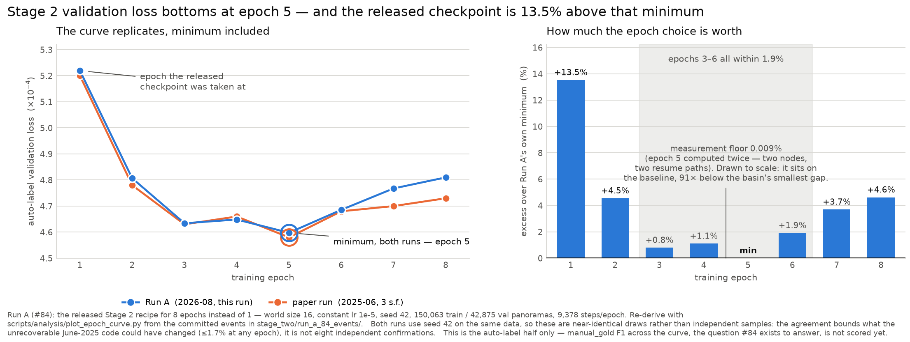

# Run A: the Stage 2 epoch curve (#84)

**Status: training COMPLETE 2026-08-16. The auto-label half of the curve is below and replicates the
paper run, minimum included. The `manual_gold` half — the question this run exists to answer — is
not scored yet.**

## What this run is

One question: **does `manual_gold` F1 peak before, at, or after epoch 5?**

The paper run's auto-label validation loss — the signal `train.py` selects on — bottoms at epoch 5
and rises monotonically through epoch 11 (measured from the rescued TensorBoard events, #104). So we
already have the machine-label half of the curve. What we do not have is the human half: the
epoch-N weights were deleted in a 2025-07-11 cleanup, so `manual_gold` cannot be scored across the
curve from the original run. Run A regenerates exactly those checkpoints.

The three readings were pre-registered in [#84](https://github.com/ProjectSidewalk/RampNet/issues/84)
before launch:

| if `manual_gold` peaks | then |
| :--- | :--- |
| **earlier than 5** | the Stage 1 label ceiling is real and binds early; the auto-val gain from epochs 1→5 is the model fitting Stage 1's errors. A #59 result: quality binds before quantity. |
| **at ~5** | the selection rule is fine and the released model is simply undertrained — a free ~12% val-loss improvement was left on the table. |
| **later than 5** | auto-val is the wrong selection signal outright. |

Two things the pre-registration fixes, and which the analysis must honour:

- **Tie bar 0.01 F1.** `manual_labels/` holds 3,919 instances over 1,000 panos, so counting noise
  alone is ≈0.008 s.e. on recall. A peak must clear the bar *and* be supported by its neighbours; a
  one-epoch spike between two ties is noise.
- **Record max-F1 per checkpoint, not only F1@0.30.** Holding conf 0.30 fixed across the curve
  confounds calibration with capability. The protocol headline stays F1@0.30 single-pass (#54) for
  cross-model comparability, but the epoch-peak question is answered on the calibration-free curve.
  If the two curves peak at different epochs, that is itself a finding.

The Run B gate is also evaluated on the calibration-free curve: **Run B runs unless the curve
degrades** — every epoch ≥ 2 below epoch 1 by more than the tie bar. Flat is not a cancellation.

## What is held fixed, and the one thing that is not

Everything in the released recipe is unchanged: 4 nodes × 4 GPUs ⇒ world size 16, and `train.py`
uses `batch_size=1` per rank, so the global batch is **16** exactly as in the paper run. Constant
lr 1e-5 (`--preset scratch`), no scheduler, seed 42, same data, same splits, ImageNet-initialised
backbone.

**The only change is `--epochs 8` instead of 1.**

The world size is load-bearing rather than a speed knob. Because the per-rank batch is 1, changing
the node or GPU count changes the global batch and therefore the optimisation regime — a 1-GPU copy
of this run trains at global batch 1 and is not a slower replicate, it is a different experiment.
This is why the run is on a 16-GPU cluster allocation and not on a single lab A40.

One honest limit on the word "replicate": **the code that produced the 2025 run is not in git.** The
public history starts from a squashed commit already carrying `num_epochs = 1`, so June-2025
run-time values are unrecoverable. Run A replicates the *committed* recipe, and its epoch-1
checkpoint is comparable to the released model modulo seed and dataloader order — the released
`best_model.pth` is byte-identical to that run's `epoch_1_step_9378.pth`.

The *environment* is closer to exact than that, and this was **measured, not assumed**. The env was
built from the committed `environment.yml` and its `conda list --explicit` diffed against
`environment.lock.yml`, the linux-64 lock from the paper machine (407 vs 529 packages — the lock
carries build-time extras):

| package | built 2026-08-15 | paper lock | |
| :--- | :--- | :--- | :--- |
| `pytorch` | `2.6.0=cuda126_mkl_py310_h5ee0071_304` | *identical* | ✅ |
| `libtorch` | `2.6.0=cuda126_mkl_h99b69db_304` | *identical* | ✅ |
| `torchvision` | `0.21.0=cuda126_py310_h4459643_1` | *identical* | ✅ |
| `numpy` | `2.2.6=py310hefbff90_0` | *identical* | ✅ |
| `scipy` | `1.15.2=py310h1d65ade_0` | *identical* | ✅ |
| `timm` | 1.0.28 | 1.0.15 | ⚠️ |
| `pillow` | 12.0.0 | 11.2.1 | ⚠️ |
| `python` | 3.10.20 | 3.10.13 | patch |
| `scikit-image` | 0.25.2 (build `_2`) | 0.25.2 (build `_1`) | build only |
| `cuda-version` | 12.6 | 12.9 | metapackage only — torch is a cuda126 build either way |

The four packages that actually do the arithmetic — torch, libtorch, torchvision, numpy — resolved
to **byte-identical build strings**. That is a much stronger statement than "same version".

**`timm` is the one that mattered, and it was checked rather than waved through:** timm defines the
backbone, so a definition change between 1.0.15 and 1.0.28 would silently invalidate the replicate.
Test: strict-load the paper's own released weights (rescued at
`/gscratch/makelab/jonf/rescue_jsomeara_rampnet/RampNet/stage_two/best_model.pth`) into a
`KeypointModel` built under timm 1.0.28. It loads strict, all 90,050,561 parameters, no missing or
unexpected keys — so the architecture is identical and the drift is confined to timm's library
plumbing. `pillow` 12 vs 11 remains a theoretical JPEG-decode difference; decoding goes through
libjpeg-turbo and is not expected to move pixels, but it is unverified and recorded here as such.

(In passing: `CLAUDE.md` describes this env as "Linux + CUDA 11.8". That is stale — the lock file
says `cuda-version=12.9` with cuda126 builds of torch. Worth fixing there separately.)

## Where it runs, and why

**Training on klone `ckpt-all`, 16 GPUs, free.** The 8.24 h preemption slice ceiling that gave the
#51 YOLO tiles arms zero completed epochs does not bite here: `train.py` writes
`latest_checkpoint.pth` every 1,000 steps (~22 min of state at risk) and resume takes precedence
over `--init-weights`, so preemption costs the measured ×1.67 calendar factor and nothing else.

At the measured 1.341 s/step (rank 0 median, n = 119,902) and 9,378 steps/epoch: **3.49 h/epoch,
~56 GPU-h/epoch ⇒ ~28 h compute, ~47 h calendar for 8 epochs.**

Tillicum was ruled out. The step time is I/O-bound, not compute-bound — the p25–p75 spread is 6 ms
across 119,902 samples, roughly **3% MFU** — so paying $0.90/GPU-h × 16 for H200s that spend 97% of
their cycles waiting on the dataloader buys nothing.

**Evaluation on makelab2.** Scoring the 8 checkpoints has no batch-regime constraint, the A40
handles it, and it keeps the sweep off the queue-contended cluster.

## Exact commands, in order

Prerequisites verified before launch on 2026-08-15:

- Staged dataset at `/gscratch/scrubbed/jfroehli/rampnet_dataset` is **intact**, 465 GB —
  150,063 train / 42,875 val / 21,438 test panorama+JSON pairs. 150,063 with `drop_last=True` at
  world size 16 is 9,378 steps/epoch, matching the paper run's step count exactly. The directory
  mtime (2026-07-24) is older than `/gscratch/scrubbed`'s ~21-day purge window, so this was checked
  by counting and reading files, not by stat'ing the directory.
- Per-epoch checkpoints go to `/gscratch/makelab` — **purchased and never purged** — not to
  `scrubbed`. They are the entire product of ~28 GPU-h and a silent quota-exhausted write on a
  shared pool is what corrupted `y26_pano`'s `last.pt` in the #51 grid.

```bash
# 0. Sync the repo to klone (code only; the dataset already lives on scratch).
rsync -av --exclude .venv --exclude .model_cache --exclude 'benchmark/*/panos' \
      --exclude 'benchmark/*/gallery' --exclude view_dump --exclude dataset \
      --exclude runs --exclude '*.pt' RampNet/ klone:~/RampNet/

# 1. One-time: build the sidewalkcv2 conda env from the committed environment.yml.
#    As a batch job, not on a login node -- klone reaps heavy login processes and
#    that reap also kills the SSH control master.
cd ~/RampNet && mkdir -p logs
export RAMPNET_REPO=$HOME/RampNet
export RAMPNET_ENV=/gscratch/scrubbed/jfroehli/envs/sidewalkcv2
export RAMPNET_CONDA_PKGS=/gscratch/scrubbed/jfroehli/conda_pkgs   # NOT ~/.conda/pkgs: klone
                                                                   # homes are capped at 10 GB and
                                                                   # pytorch+CUDA alone is ~5 GB
sbatch --export=ALL,RAMPNET_REPO,RAMPNET_ENV,RAMPNET_CONDA_PKGS \
       stage_two/run_build_env.slurm

# 1b. Pre-warm the timm backbone cache. --preset scratch builds the model with
#     pretrained_backbone=True, so without this all 16 ranks race to download
#     convnextv2_base.fcmae_ft_in22k_in1k_384 into a cold shared cache at once.
#     Compute nodes do have outbound network, so it works either way -- this just
#     removes the race. Takes about a minute.
"$RAMPNET_ENV/bin/python" -c "
import timm
timm.create_model('convnextv2_base.fcmae_ft_in22k_in1k_384', pretrained=True, num_classes=0)
print('backbone cached')"

# 2. Launch Run A. --chdir puts every working-directory artefact train.py writes
#    (latest_checkpoint.pth, best_model.pth, runs/, peek_training/, logs/) on the
#    durable volume alongside the checkpoints.
export RUN_DIR=/gscratch/makelab/jonf/rampnet_run_a_84
mkdir -p "$RUN_DIR"/{checkpoints,logs}
export RAMPNET_DATA=/gscratch/scrubbed/jfroehli/rampnet_dataset
export RAMPNET_EPOCHS=8
sbatch --chdir="$RUN_DIR" \
       --export=ALL,RAMPNET_REPO,RAMPNET_ENV,RAMPNET_DATA,RAMPNET_EPOCHS \
       $HOME/RampNet/stage_two/run_train_epoch_curve.slurm
```

Both launchers are committed: `stage_two/run_build_env.slurm` and
`stage_two/run_train_epoch_curve.slurm`. Neither hardcodes a path — repo, env, data root and epoch
count all come from the environment, with defaults documented in the file headers.

### Artefacts

```
/gscratch/makelab/jonf/rampnet_run_a_84/
├── checkpoints/epoch_N_step_S.pth   # the product: 8 files, ~1.07 GB each
├── latest_checkpoint.pth            # resume state, rewritten every 1,000 steps
├── best_model.pth                   # auto-val-selected, i.e. what the committed rule would ship
├── runs/experiment_1/               # tensorboard: train step loss + per-epoch val loss
├── peek_training/                   # per-epoch heatmap overlay on a random val pano
└── logs/run_a_84_<jobid>.{out,err}
```

Each checkpoint carries `model_state_dict` + Adam state + `current_val_loss`, so the auto-label arm
of the curve is readable from the checkpoints themselves as well as from TensorBoard.

**`runs/experiment_1/` is now committed** at `stage_two/run_a_84_events/` — six files, 4.0 MB. It is
the only part of this run small enough to live in the repo, and it carries the entire auto-label
result, so committing it is what makes the curve below reproducible by someone without cluster
access. The checkpoints themselves (8.6 GB) stay on `/gscratch/makelab`.

Budget note: ~10 GB total. `/gscratch/makelab` was at 88% (905 GB / 1 TB, 119 GB free) at launch.
That is fine for Run A but **Run B at 30–60 epochs would want 32–64 GB**, which needs checking
against the quota before it is submitted, not after.

## Scoring the curve

Evaluation runs on makelab2, not on the cluster: it has no batch-regime constraint, the A40 handles
it, and it keeps the sweep off the queue-contended partition.

`stage_two/evaluate.py` already does everything the pre-registration asks for, with **no code
change**. One run per checkpoint produces both required numbers:

```bash
python evaluate.py --checkpoint <run_dir>/checkpoints/epoch_N_step_S.pth \
                   --dataset manual --threshold 0.0 --no-tta \
                   --results-dir evaluation_results/run_a_84/epoch_N
```

- `--threshold 0.0` keeps every peak, so the full curve is swept.
  `pr_rc_vs_c_data_manual_r0.022_pt0.0.csv` gives precision and recall at every unique confidence —
  **F1@0.30 and max-F1 both fall out of that one file**, which is exactly the pairing the amendment
  requires.
- `--no-tta` is deliberate and is **not** the script default. The default is flip-TTA "as in the
  paper", but #78 measured it as not worth 2× GPU (+0.9 R / −2.4 P after the operating-point drop,
  F1 down on 4 of 5 US splits) and the #54 protocol headline is single-pass. Leaving the default on
  would silently score a different protocol than every number it will be compared against.

**Gotcha to respect: use a separate `--results-dir` per epoch.** The heatmap cache is keyed by
checkpoint fingerprint (the #24 fix), so caching is safe — but the *output* filenames are keyed by
dataset and params only, not by checkpoint. Eight epochs into one results dir silently overwrite
each other and leave one epoch's numbers wearing the whole run's name.

## Launch record

| | job | outcome |
| :--- | :--- | :--- |
| env build | `38541302` | **failed in 2 s** — `set -u` vs klone's lmod init (see below) |
| env build | `38541308` | **COMPLETED**, 50:52. 18 GB env at `/gscratch/scrubbed/jfroehli/envs/sidewalkcv2` |
| Run A | `38541865` | launched 2026-08-15, `ckpt-all`, 4 nodes `g[3054,3071-3072,3075]`, world size 16, fresh start. Requeued twice; the last incarnation died in `torchrun` rendezvous (`RendezvousConnectionError` on the C10d store) after epoch 5 |
| env build | `38566410` | **COMPLETED**, 15:38. Env rebuilt on `/gscratch/makelab` after the scratch copy was in doubt |
| **Run A** | **`38566413`** | **COMPLETED** 2026-08-16 19:50 PDT, `g[3045-3047,3057]`. Resumed from `latest_checkpoint.pth` and carried epochs 5–8 |

Nothing was lost to the requeues — `latest_checkpoint.pth` is rewritten every 1,000 steps and resume
takes precedence over `--init-weights`, exactly as the cost model assumed. **Read the requeue history
from the run's own logs, not from `sacct`**: `sacct -X` shows only the final incarnation of a
requeued job, so it reports `38541865` as a single 2h47m FAILED run and silently hides the two
earlier incarnations that produced epochs 1–5.

Timing came in **under** budget. Checkpoint mtimes give a steady **3.75 h per clean epoch** against
the 3.49 h/epoch projection (+7%), the requeue around epoch 5 cost about 3 h, and the whole 8 epochs
finished in **~34 h calendar against the ~47 h estimate** — the ×1.67 preemption factor was
pessimistic for this run.

Four things bit during launch and are written down so the next person does not rediscover them:

1. **`set -u` breaks `module load` on klone.** lmod's init dereferences an unbound
   `LD_LIBRARY_PATH`, so a `set -euo pipefail` script dies before conda exists. Both committed
   launchers use `set -eo pipefail` with explicit `${VAR:-default}` instead.
2. **The conda package cache must be moved off `$HOME`.** klone homes are capped at 10 GB (6 GB
   already used, 4 GB free) and the pytorch/CUDA download alone is ~5 GB. The default
   `~/.conda/pkgs` blows the quota mid-solve.
3. **Pre-warm the timm backbone.** `convnextv2_base.fcmae_ft_in22k_in1k_384` was not cached, so all
   16 ranks would have raced to download it at step 0.
4. **Expect a slow first step.** `EquiHeatmapDataset.__init__` does an `os.path.exists` per JSON
   alongside `sorted(os.listdir(...))` — roughly 2.4M GPFS stat calls across 16 ranks before the
   first step. This is the committed code and the paper run paid it too; it is not a hang.

### Confirmed at launch: the step rate reproduces the paper run

Two minutes into epoch 1, on A40s:

```
Epoch 1/8:  1%| | 72/9378 [01:52<3:27:07, 1.34s/it, loss=0.00376, step=72]
```

**1.34 s/it against the paper run's measured 1.341 s median** (p25 1.339 / p75 1.345, n = 119,902),
**9,378 steps/epoch**, and a 3:27 epoch ETA against the measured 3.49 h. The cost model in this
issue holds, and the run is behaving as a replicate of the released recipe rather than merely a
re-run of the same script.

**One risk left open deliberately.** The job uses **40,883 MiB of an A40's 46,068 MiB — 89% of the
card.** The committed constraint is `l40s|l40|a40|a100`; the first three are all 48 GB, but Slurm on
klone does not distinguish 40 GB from 80 GB A100s (`Gres=gpu:a100:8`, no memory in the feature
list), so a requeue onto 40 GB hardware would OOM. This is left as-is rather than narrowed, because
the paper run itself allocated A100s in exactly this 4×4 shape (`gres/gpu:a100=4` and `=12` in
`sacct`) without OOM, and the A100 nodes carry 1 TB of host RAM with `hugemem`/`ultramem` features,
consistent with 80 GB cards. **If the run ever crash-loops with CUDA OOM after a preemption, the fix
is to narrow the constraint to `l40s|l40|a40` and resubmit** — the resume file makes that cost
nothing but the requeue.

## Results

**Auto-label half: complete.** `manual_gold` columns are still empty — those are scored separately
and have not been run. That gap is the remaining work, not an omission.

| epoch | auto-label val loss | paper run | delta | vs. Run A min | `manual_gold` F1@0.30 | `manual_gold` max-F1 |
| ---: | ---: | ---: | ---: | ---: | ---: | ---: |
| 1 | 0.00052194 | .000520 | +0.37% | +13.5% | | |
| 2 | 0.00048067 | .000478 | +0.56% | +4.5% | | |
| 3 | 0.00046341 | .000463 | +0.09% | +0.8% | | |
| 4 | 0.00046485 | .000466 | −0.25% | +1.1% | | |
| **5** | **0.00045976** | **.000458** | **+0.38%** | **min** | | |
| 6 | 0.00046855 | .000468 | +0.12% | +1.9% | | |
| 7 | 0.00047676 | .000470 | +1.44% | +3.7% | | |
| 8 | 0.00048100 | .000473 | +1.69% | +4.6% | | |



Reproduce from a clean clone — the event files are committed, so this needs no cluster access and no
tensorboard install:

```bash
python scripts/analysis/stage2_epoch_curve.py \
    --events-dir stage_two/run_a_84_events \
    --out-csv docs/data/stage2_epoch_curve_84.csv
python scripts/analysis/plot_epoch_curve.py      # -> docs/figures/stage2_epoch_curve_84.png
```

The right-hand panel is the one to read for the decision. It plots each epoch's excess over Run A's
*own* minimum, so it does not depend on the paper run at all: epochs 3–6 are a shallow basin, and
epoch 1 — the epoch the released checkpoint was taken at — sits far outside it. The measured noise
floor is drawn on the same axis rather than on a broken one, which is why it is invisible; that it
is invisible is the finding.

### The selection epoch replicates

**Run A's auto-label validation loss bottoms at epoch 5, exactly as the paper run does.** That was
the pre-registered expectation and it held. The whole curve replicates, not just the minimum: the
largest per-epoch delta is **1.69%**, the mean absolute delta is **0.61%**, and the *shape* matches
turn for turn — down steeply through epoch 3, a small bump up at epoch 4, the minimum at 5, then
monotone up through 8.

**Do not read the eight deltas as eight independent confirmations.** Both runs use seed 42 on the
same data, so if the code is unchanged the dataloader order is the same and the curves are near-
identical draws rather than independent samples. The correct reading is the one the issue asked for:
whatever differs in the unrecoverable June-2025 code did not move this curve by more than ~1.7% at
any epoch, so the *rest* of Run A can be read as a replicate rather than as a qualified re-run. The
epoch-4 bump reproducing is evidence about the code, not evidence that the bump is a robust feature
of the optimisation.

### The basin is shallow, and that is a caveat on "epoch 5"

Epochs 3, 4, 5 and 6 all sit within **1.9%** of each other. So epoch 5 replicates as a *rank*, but
val loss does not determine the selection sharply — a slightly different run could plausibly hand
the minimum to 3, 4 or 6. What is unambiguous is the far end of the curve: **epoch 1 is 13.5% above
the minimum**, and epochs 7–8 have clearly turned back up.

That 13.5% is the pre-registered "free ~12% val-loss improvement left on the table" by shipping an
epoch-1 checkpoint, now measured rather than estimated. Whether it is worth anything *in F1* is
precisely what the empty columns above will answer.

### A free noise floor, from a requeue

Epoch 5 was computed **twice**, by two different job incarnations on two different nodes, because a
requeue landed mid-epoch and the resumed job re-ran the tail of it from `latest_checkpoint.pth`:

| incarnation | node | epoch-5 val loss |
| :--- | :--- | ---: |
| `38541865` (died in rendezvous) | `g3047` | 0.00045980 |
| `38566413` (carried on to epochs 6–8) | `g3045` | **0.00045976** |

They agree to **0.009%**. This is not pure evaluation determinism — the two reconstructions of the
end-of-epoch-5 state ran different numbers of steps from different resume points, so the figure
bounds resume-path nondeterminism *and* evaluation together. Either way it is roughly **100× smaller
than the 0.8–1.9% spread across the epoch 3–6 basin**, which says the ordering inside the basin is
real structure rather than measurement jitter, even though it is too tight to select on confidently.

The table reports the second value, from the incarnation that actually continued into epochs 6–8.
`scripts/analysis/stage2_epoch_curve.py` resolves duplicate steps last-writer-wins for that reason.

### What is not answered yet

The pre-registered question — **does `manual_gold` F1 peak before, at, or after epoch 5?** — is
untouched. Nothing in this section bears on it: the auto-label curve is the machine-label half, and
the entire point of the run is that the human half can disagree with it. The 8 checkpoints exist at
`/gscratch/makelab/jonf/rampnet_run_a_84/checkpoints/` (~1.07 GB each) and the scoring commands are
in **Scoring the curve** above; no eval has been run.

**The Run B gate is therefore also unevaluated.** It reads on the calibration-free `manual_gold`
curve, not on validation loss — "Run B runs unless every epoch ≥ 2 is below epoch 1 by more than the
tie bar". Nothing in the auto-label curve can trip or clear it, and Run B has not been submitted.

One consequence worth stating before the numbers arrive rather than after: **if the outcome is
"select on human F1", then selecting on `manual_gold` stops it being a clean benchmark.** The fix
needs a held-out human split for selection. Noting the constraint here so it is not discovered
downstream.

## Provenance of the numbers in this doc

- **Run A's curve** is re-derivable from this repo alone. The six TensorBoard event files the run
  wrote are committed at `stage_two/run_a_84_events/` (4.0 MB total), and
  `scripts/analysis/stage2_epoch_curve.py` extracts the curve from them with the standard library
  only — it parses the TFRecord framing and the two protobuf messages directly rather than importing
  tensorboard. Its output was cross-checked against
  `tensorboard.backend.event_processing.EventAccumulator` on klone on 2026-08-17; both readers give
  the same eight values to full float32 precision. The derived table is committed as
  `docs/data/stage2_epoch_curve_84.csv`, and the script prints a sha256 for each event file it reads
  so a regenerated copy can be proven identical.
- **The paper run's column is not re-derivable from this repo**, and that is a real gap rather than
  an oversight. Those values were transcribed in #104 from the surviving events of the June-2025 run
  (the epoch-N weights were deleted in a 2025-07-11 cleanup); the raw events are not committed here,
  so the column carries only the 3 significant figures at which it was transcribed. What would
  unblock it: committing those rescued event files the same way Run A's are committed above.
- **The `manual_gold` columns do not exist yet.** No eval has been run against any Run A checkpoint.

One consequence worth stating before the numbers arrive rather than after: **if the outcome is
"select on human F1", then selecting on `manual_gold` stops it being a clean benchmark.** The fix
needs a held-out human split for selection. Noting the constraint here so it is not discovered
downstream.
