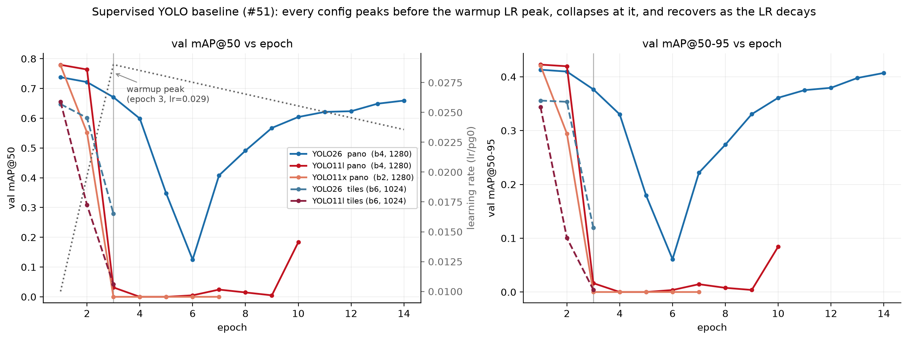
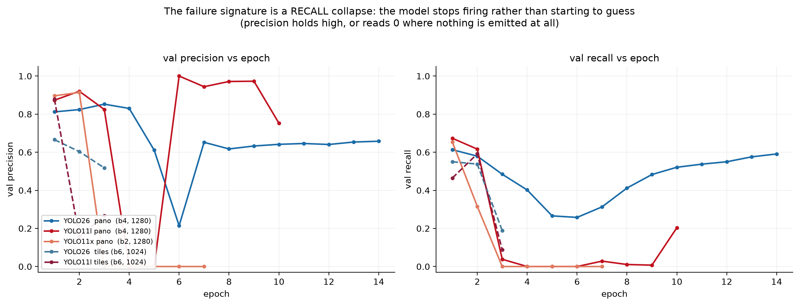

# Supervised YOLO baseline — training record (issue #51)

This directory is the **preserved record** of the supervised-YOLO baseline runs
trained on the RampNet dataset on Hyak (klone). It exists so the experiment survives
`/gscratch/scrubbed`'s ~21-day auto-purge and is reproducible/defensible for the paper.

> **Status:** the runs are in-flight (issue #51); live status is tracked there and the
> finding is summarized in `docs/model_comparison.md`. The training code lives at its
> canonical paths — `scripts/model_comparison/run_yolo_train.slurm` and the repo-root
> `hyak_yolo_runbook.sh` — merged in PR #76. (This record briefly carried as-run
> snapshots of both; the only drift from the canonical copies was a display-only
> pano-count bug, documented in #76's description, and the snapshots remain in this
> branch's history.)

**What's here (small, text, committed):**

- `runs/<config>/results.csv` — per-epoch training curves (the primary evidence).
- `runs/<config>/args.yaml` — the exact resolved config for each run.
- `plot_training_curves.py` — regenerates every figure below from those CSVs alone
  (CPU-only, no network, no checkpoints): `python plot_training_curves.py`.
- `figures/*.png` — the generated diagnostics, committed so the finding is legible
  without re-running anything.

**What's deliberately NOT here** (see the repo `.gitignore` philosophy — curated record
in git, bulk/binary/regenerable out):

- **Model weights** (`best.pt`/`last.pt`) — binaries; they belong in durable external
  storage, not git history. See "Where the weights live" below.
- **Slurm logs** (`*.out`/`*.err`) — 30 MB of progress-bar spam, already gitignored;
  the few relevant lines are quoted below.
- **Benchmark-city eval numbers** — these `results.csv` values are the **internal YOLO
  val-split proxy** used to judge *training health*, **not** the reported baseline. The
  reported numbers come from local `compare.py` benchmark eval on each `best.pt`, under
  the pre-registered protocol below.

## Config grid

Six configs = {YOLO11l, YOLO11x, YOLO26l} × {tiles @1024, pano @1280}. One dropped.

| Config       | Model    | Input        | Base ckpt     | Batch |
|--------------|----------|--------------|---------------|-------|
| `y11l_tiles` | YOLO11l  | tiles @1024  | `yolo11l.pt`  | 6     |
| `y11x_tiles` | YOLO11x  | tiles @1024  | `yolo11x.pt`  | 3→12  |
| `y26_tiles`  | YOLO26l  | tiles @1024  | `yolo26l.pt`  | 6     |
| `y11l_pano`  | YOLO11l  | pano @1280   | `yolo11l.pt`  | 4     |
| `y11x_pano`  | YOLO11x  | pano @1280   | `yolo11x.pt`  | 2     |
| `y26_pano`   | YOLO26l  | pano @1280   | `yolo26l.pt`  | 4     |

Batches are the as-run values from each run's committed `args.yaml`. `y11x_tiles` was
submitted at batch 3, then resubmitted at batch 12 trying to finish an epoch inside the
ckpt scheduling slice (its `args.yaml` is the batch-12 attempt); neither completed one.

## Status & findings (snapshot: 2026-07-28, training in progress)

Val-split proxy mAP50 from `results.csv`. **Every config peaks at epoch 1, collapses at
epoch 3, and recovers as the learning rate decays.** The instability is universal, not
per-config — see the figures.

| Config       | Epochs | best (ep) | Current mAP50 | Assessment |
|--------------|--------|-----------|---------------|------------|
| `y26_pano`   | 14     | 0.738 (1) | **0.659 ↑**   | ✅ fully round-tripped: 0.738 → 0.125 @ep6 → 0.659 @ep14, climbing |
| `y11l_pano`  | 10     | 0.779 (1) | **0.183 ↑**   | 🟡 recovering — 7 epochs near 0, then 0.005 → 0.183 @ep10 |
| `y26_tiles`  | 3      | 0.647 (1) | 0.280 ↓       | 🟡 in the dip, too early to call |
| `y11l_tiles` | 3      | 0.655 (1) | 0.042 ↓       | 🟡 in the dip, too early to call |
| `y11x_pano`  | 7      | 0.777 (1) | **0.000**     | ❌ five straight epochs at literal 0; no recovery yet |
| `y11x_tiles` | 0      | —         | —             | ⏹ dropped 2026-07-27 (GPU-saturated: epoch ~10 h > ckpt slice) |

### The instability: collapse tracks the warmup LR peak



The `lr/pg0` column ramps **~3× during warmup** — 0.0100 (ep1) → 0.0197 (ep2) → **0.0290
(ep3)** — then decays linearly. `warmup_epochs=3.0`. Every config's validation collapse
begins at that peak, and every recovery so far tracks the decay.

What the evidence rules **in** and **out**:

- **Not a crash.** No NaN/Inf, no AMP failure anywhere in the logs; training loss keeps
  falling straight through the collapse while val `cls_loss` explodes 1.2 → 8.2
  (`figures/fig3_loss_divergence.png`). A textbook optimization instability.
- **Not the preemptions.** ckpt requeues are scattered across epochs 2–13 and do not line
  up with the collapses (`figures/fig4_per_config.png`, purple vs grey lines). `resume=True`
  restores the full training state; `y26_pano` climbed straight through five of them.
- **Not small physical batch.** `y11l_pano` (batch 4, imgsz 1280) and `y26_pano`
  (**batch 4, imgsz 1280** — identical) both collapsed, and both recovered. Batch spans
  2/4/6 and imgsz 1024/1280 across the grid with no separation. This **refutes** the
  BatchNorm/small-batch hypothesis this record previously carried.
- **Not architecture.** Both YOLO11 and YOLO26 collapse; both have now begun recovering.
  Only the *rate* differs (`y26_pano` recovered by ep9; `y11l_pano` took until ep10).
- **Not a data fault.** A broken dataset would depress train loss too, and would not
  recover on an LR schedule.

**Hypothesis (untested):** the effective peak LR at the end of warmup is too high for this
task — 150k single-class, small-object images, fine-tuned from COCO weights. `optimizer=auto`
resolves to **`MuSGD(lr=0.01, momentum=0.9)`** in every job (from the Slurm logs), Ultralytics'
Muon-family optimizer. The clean test is a rerun with a lower peak LR / longer warmup, **not**
a larger batch.

### Failure signature: recall collapse, not false-positive flood



The model **stops firing** rather than starting to guess: `y11l_pano` holds precision at
0.94–1.00 while recall sits at 0.007–0.03, and `y11x_pano` emits no boxes at all (its
precision reads 0 by the 0/0 convention, not from false positives). This matters for
interpretation — the instability suppresses detections, so a checkpoint caught inside the
dip understates recall catastrophically and would badly misrepresent the baseline.

### What is reportable today

Epoch 1–2 are **not** a "pretrained artifact" — an earlier version of this record said so
and that was wrong. By epoch 1 the model has trained on all 150k images; the score is real,
and it is high because the LR was still in the low part of the warmup ramp. Each run's
`best.pt` therefore holds a **genuine, selectable checkpoint** under the best-val protocol.

The honest caveat: these checkpoints are **undertrained** relative to a stable schedule, so
any benchmark number from them is a **lower bound** on supervised-YOLO performance, and must
be reported as such.

## Pre-registered evaluation & checkpoint-selection protocol (issue #71)

Fixed in writing 2026-07-28, **before any benchmark evaluation of any YOLO
checkpoint**. As of the commit adding this section, no YOLO checkpoint has been scored
on any benchmark bundle (city or `manual_gold`); the only numbers observed are the
internal val-split curves above (`runs/*/results.csv`, mirrored in #51's status
comments). The point is to make the baseline defensible against the standard
"you sandbagged / cherry-picked the baseline" review: every selection decision is made
on validation data, under rules written down first, applied identically to the
stabilized rerun (#70) when it lands.

1. **Checkpoint selection — best-val, never test.** Each config's reported checkpoint
   is its `best.pt` exactly as Ultralytics saves it: highest **fitness** (default
   weighting, 0.1·mAP50 + 0.9·mAP50-95) on that config's own YOLO val split, with
   `patience=20`. This refines #71's draft wording ("best val mAP50"): `best.pt` is
   the only per-epoch artifact the runs keep, so re-ranking `results.csv` by raw mAP50
   would mean a second, hand-rolled selector — and on every curve committed so far the
   two rules choose the same epoch anyway (all five configs: epoch 1, checked
   2026-07-28). RampNet's published checkpoint was selected by the same principle:
   best **validation loss** on the dataset's val split (`stage_two/train.py`), never a
   benchmark number.
2. **Config selection — on val, and it controls emphasis only.** Which config
   headlines each family (YOLO11 vs YOLO26) in the main text is decided by the same
   internal val fitness at `best.pt`. Stated caveat: tiles and pano configs have
   different val sets (perspective crops vs whole equirects), so the cross-geometry
   comparison is a judgment call on non-identical data — which is why this choice is
   only about emphasis. **Every trained config's benchmark row goes in the appendix /
   full table regardless; selection drops nothing.** Test is touched once, at the end,
   after these choices are fixed.
3. **Benchmark eval — the identical path as every roster model.** `compare.py`'s
   `yolo` provider: boxes → box centers → the `rampnet/detection_eval.py` matcher at
   radius 0.022, on the same bundles and the same GT as the rest of the roster,
   detections cached at the 0.05 floor (`--yolo-conf 0.05`). Tiles configs are scored
   through the same perspective rig as the VLMs (`--tiling perspective`,
   `--yolo-imgsz 1024`); pano configs whole-pano (`--tiling none --yolo-imgsz 1280`) —
   each model in its training geometry.
4. **Operating point — fixed in advance, not tuned on test.** The headline metric is
   **F1 at confidence 0.25**, Ultralytics' default predict confidence — the
   "configure the baseline the way its authors recommend" choice, fixed here while no
   test number exists. The full threshold sweep is still reported, with its best-F1
   row flagged as tune-on-test, exactly as the harness already does for every
   confidence-carrying model.
5. **AP, with the truncation caveat.** AP/PR come from the full cached range (0.05
   floor). They are **not** directly comparable to RampNet's committed AP, whose
   detections were extracted at the 0.5 peak threshold (a truncated curve — see
   `docs/model_comparison.md`); the low-floor RampNet extraction is the #54/#78 line
   of work.
6. **Reporting an unstable run.** A checkpoint from inside the collapse dip would
   understate recall catastrophically (see the failure signature above); best-val
   selection avoids the dip by construction. A `best.pt` from an instability-affected
   run **is** reportable, but only with the standing caveat: it is a **lower bound**
   on supervised-YOLO performance, superseded when the #70 stabilized rerun lands —
   which will be selected, evaluated, and reported under this same protocol,
   unchanged.
7. **Seeds (aspirational).** All runs are `seed=0`. If ckpt capacity allows, ≥3 seeds
   of the headline configs → mean ± std, which makes single-run instability commentary
   moot. Not a blocker for reporting the lower-bound numbers.

The paper's "Baseline protocol" appendix paragraph is this section, condensed.
`docs/model_comparison.md` links here from its baseline-in-progress note, and the
protocol governs the results that will replace that note.

## Provenance

- **Training code:** `scripts/model_comparison/run_yolo_train.slurm` + the repo-root
  `hyak_yolo_runbook.sh` (PR #76). (The Hyak runs used an rsync of the working tree;
  the committed launcher is byte-identical to the as-run copy.)
- **Dataset:** `projectsidewalk/rampnet-dataset` (HF), pulled onto the cluster via
  `download_dataset.py`. Prep: `prepare_yolo_dataset.py` via `run_yolo_prep.slurm` —
  `--box-size pitch --ramp-size-m 1.8 --bg-keep-frac 0.15` per that launcher's as-run
  defaults (its header records that `fixed:0.03` was rejected as too small and that
  `gps` fell back to pitch on ~85% of panos). Tiles rendered at 1024 (train imgsz
  1024); pano at 2048×1024 (train imgsz 1280).
  **Confirmed** from the run notes (2026-07-25, prep job 37677130, ~2h48m): box-size
  `pitch` + ramp 1.8 m was chosen after eyeballing the overlay QA — `fixed:0.03` was
  too small and `gps` fell back to pitch on 169/200 smoke panos. Output verified on
  scratch: tiles 557,413 train / 161,002 val images; pano 150,063 / 42,875. (An
  earlier draft of this record said `fixed:0.03` — that was the runbook's old
  default, not what ran.)
- **Toolchain:** Ultralytics 8.4.105 · Python 3.11.15 · torch 2.13.0+cu126.
- **Hardware:** NVIDIA L40 (45 GB), 1 GPU/job, Hyak `ckpt-g2` (preemptable/requeue).
- **Hyperparameters (resolved):** `epochs=60`, `patience=20`, `optimizer=auto`,
  `lr0=0.01`, `lrf=0.01`, `momentum=0.937`, `weight_decay=0.0005`, `warmup_epochs=3.0`,
  `close_mosaic=10`, `amp=true`, `seed=0`. Per-run detail in each `runs/<config>/args.yaml`.
  **`optimizer=auto` resolved to `MuSGD(lr=0.01, momentum=0.9)`** in all six jobs, which
  overrides the passed `lr0`/`momentum` (the Slurm logs say so explicitly). The realized
  schedule peaks at `lr/pg0 = 0.029` at the end of warmup — recorded per-epoch in the
  `lr/pg*` columns of every `results.csv`, and the subject of the instability above.
- **Slurm job IDs:** y11l_tiles 37745358 · y11x_tiles 37745359 (batch-3 original;
  batch-12 resubmit 37809205, scancel'd 2026-07-27) · y26_tiles 37745360 · y11l_pano
  37745361 · y11x_pano 37745362 · y26_pano 37745363. The job↔config map was read off
  the `yolo_train_<jobid>.out` log headers during the 2026-07-27 preemption check.
  Dataset-download job 37649635; prep job 37677130.
- **Run dates:** 2026-07-26 → in progress as of 2026-07-28.

## Where the weights live

`best.pt` files are **not** in git. Durable homes:

_TODO — stage to Hugging Face (`projectsidewalk/…`) or lab storage and record the URL here._

Keep **every** run's `best.pt`, including the ones that collapsed. An earlier version of
this record called those non-reportable epoch-1 artifacts and proposed letting them expire;
that was wrong on both counts (see "What is reportable today"). Each is a real best-val
checkpoint and the only supervised-YOLO baseline available until a stable schedule lands.

## Reproducing

On klone, via the repo-root runbook (each stage is idempotent; the multi-hour `data` /
`prep` stages have compute-node sbatch wrappers, `run_yolo_data.slurm` /
`run_yolo_prep.slurm` — login nodes reap heavy processes):

```bash
bash hyak_yolo_runbook.sh env      # lean venv on scratch (ultralytics + cu126 torch)
bash hyak_yolo_runbook.sh data     # pull RampNet dataset from HF (hours)
bash hyak_yolo_runbook.sh prep     # build tiles/ and pano/ YOLO datasets
bash hyak_yolo_runbook.sh train    # sbatch the 6 configs concurrently
bash hyak_yolo_runbook.sh collect  # rsync best.pt back; eval locally with compare.py
```
